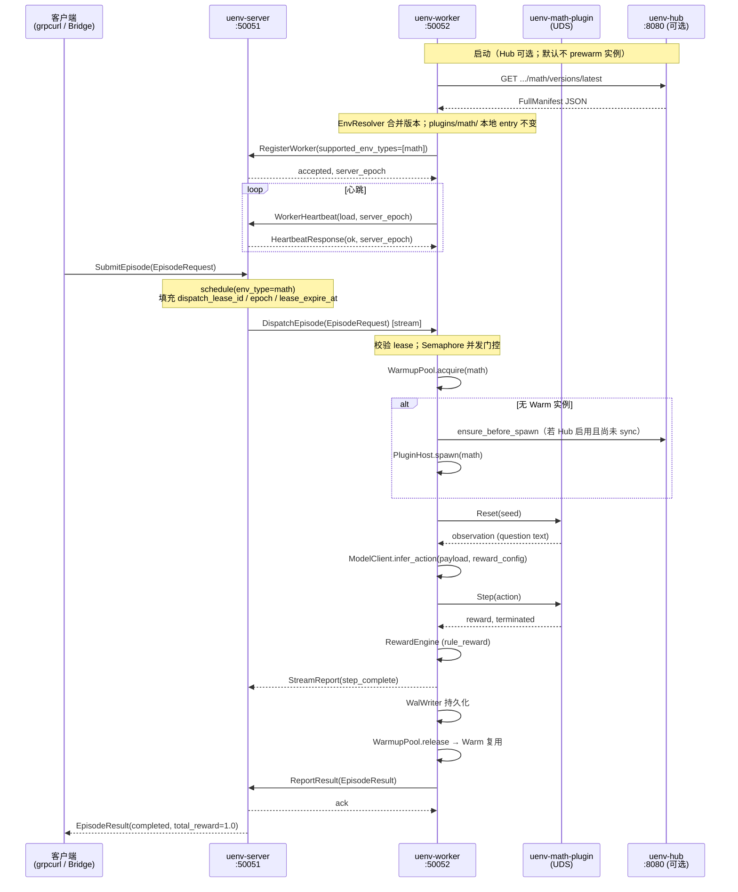

# Worker ↔ Server ↔ Hub 协议对接与端到端通信说明

> **版本**：2026-05-31  
> **范围**：Layer 2 Worker 与 Layer 1 Server（含 Mock Scheduler）、UEnvHub 之间的**已落地**协议、数据结构、代码映射与一次 Episode 完整时序。  
> **权威规范**：[PROTOCOL.md](../PROTOCOL.md)、[proto/README.md](../proto/README.md)、[worker-pool-layer-design.md](./worker-pool-layer-design.md) §2.4 / §7  
> **缺口对照**：[260530-full-stack-integration-gaps.md](./260530-full-stack-integration-gaps.md)

---

## 0. 当前对接状态（摘要）

| 关系 | 传输 | 协议/数据结构 | 代码状态 | 热路径 |
|------|------|---------------|----------|--------|
| **Worker ↔ Server** | gRPC + Protobuf | L1 共享 `proto/uenv/v1/` | ✅ 已统一；M7 实机验收 | ✅ Episode 执行 |
| **Worker ↔ Mock Scheduler** | 同上 | 与 Server 同 proto | ✅ 本机/混沌测试 | ✅ 开发默认 |
| **Worker ↔ Hub** | HTTP + JSON | Hub `FullManifest` DTO | ✅ M-5+ 启动/按需 manifest；缺实例时 Hub→spawn | ✅ 驱动实例创建（非制品下载） |
| **Worker ↔ 插件** | Protobuf over UDS | L2 `plugin_proto/` | ✅ `plugins/math/` | ✅ 本地执行 |

Phase 0 跨层语义（2026-05-31 冻结）：

- L1 **`env_type=math`**（MathEnv 调度键）
- GSM8K benchmark：**`payload` JSON 内 `"dataset": "gsm8k"`**，不再作为独立 `env_type`

---

## 1. 协议分层设计

UEnv Worker Pool 内存在 **三套边界**，互不泄漏：

```text
                    ┌─────────────────────────────────────────┐
  L1 控制面 gRPC    │  Server/Mock  ◄──►  Worker             │
  (proto/)          │  EpisodeRequest / EpisodeResult         │
                    └──────────────────┬──────────────────────┘
                                       │ Server 主动 DispatchEpisode
                    ┌──────────────────▼──────────────────────┐
  L2 插件 IPC       │  Worker  ◄──UDS──►  plugins/math/      │
  (plugin_proto/)   │  reset / step / close                   │
                    └─────────────────────────────────────────┘

  Hub 元数据 HTTP   │  Hub  ──REST──►  Worker（可选 M-5）     │
  (JSON DTO)        │  非 Episode 热路径；本地 manifest 兜底   │
                    └─────────────────────────────────────────┘
```

**冻结原则**（PRD §4.1 / design §2.4）：

1. Scheduler **主动**调用 Worker `DispatchEpisode`；Worker **禁止**拉取任务队列。
2. L1 proto **不得**出现 UDS 路径、插件 PID、L2 message 类型。
3. Episode 热路径 **不用 JSON 序列化 gRPC 消息**；`payload` / `reward_config` 为 proto `bytes` 承载 UTF-8 JSON。
4. Hub 为环境**注册与元数据**；Episode 热路径由 Worker **本地预热池**持有进程级实例。缺 Warm 实例时：`EnvResolver` 从 Hub 拉 manifest（或合并本地 `plugins/{env_type}/`），再 `PluginHost.spawn`；**不在 Episode 结束后销毁回「待预热队列」**，而是 `reset` 后回到 **Warm** 复用（见 §3.5 / §5.2）。

---

## 2. Proto 权威文件与 Package

### 2.1 L1 共享（Worker 与 Server 同构）

| 文件 | Package | 核心内容 |
|------|---------|----------|
| [`proto/uenv/v1/episode.proto`](../proto/uenv/v1/episode.proto) | `uenv.v1` | `EpisodeRequest`、`EpisodeResult`、`StreamReport`、`Trajectory` |
| [`proto/uenv/v1/scheduler.proto`](../proto/uenv/v1/scheduler.proto) | `uenv.scheduler.v1` | `ControlPlaneService` 及注册/心跳/上报消息 |
| [`proto/uenv/v1/server.proto`](../proto/uenv/v1/server.proto) | `uenv.v1` | `UEnvService`、`AdminService`（Bridge/客户端 → Server） |
| [`proto/uenv/v1/common.proto`](../proto/uenv/v1/common.proto) | `uenv.v1` | `ErrorCode`、`ResourceSpec`、`ExecutionMode` |
| [`proto/uenv/v1/wal.proto`](../proto/uenv/v1/wal.proto) | `uenv.v1` | `WalRecord`（Worker 断连重放） |

### 2.2 Worker gRPC Server 定义

| 文件 | Package | Service |
|------|---------|---------|
| [`uenv-worker/proto/worker_service.proto`](../uenv-worker/proto/worker_service.proto) | `uenv.worker.v1` | `WorkerGrpcService`：`DispatchEpisode`、`HealthCheck` |

### 2.3 L2 插件（仅 Worker 内部）

| 文件 | Package | Service |
|------|---------|---------|
| [`plugin_proto/uenv/plugin/v1/plugin.proto`](../plugin_proto/uenv/plugin/v1/plugin.proto) | `uenv.plugin.v1` | `PluginService`：`Reset`、`Step`、`Close`、`HealthCheck` |

### 2.4 Hub（HTTP REST，非 Protobuf）

| 类型定义 | 路由实现 | 说明 |
|----------|----------|------|
| [`uenv-hub/uenv-hub-types/src/lib.rs`](../uenv-hub/uenv-hub-types/src/lib.rs) | [`uenv-hub/uenv-hub-server/src/routes.rs`](../uenv-hub/uenv-hub-server/src/routes.rs) | `FullManifest`、`EnvDetail` 等 JSON DTO |
| [`uenv-hub/uenv-hub-core/src/seed.rs`](../uenv-hub/uenv-hub-core/src/seed.rs) | — | 启动种子：`math` / `code` / `agent` |

---

## 3. gRPC Service 与代码实现对照

### 3.1 Worker → Server：`ControlPlaneService`（Worker 为 Client）

| RPC | Proto 定义 | Worker 实现 | Server 实现 | Mock 实现 |
|-----|------------|-------------|-------------|-----------|
| `RegisterWorker` | `scheduler.proto` | [`uenv-worker/src/control_plane/client.rs`](../uenv-worker/src/control_plane/client.rs) | [`uenv-server/src/control_plane.rs`](../uenv-server/src/control_plane.rs) | [`uenv-mock-scheduler/src/service.rs`](../uenv-mock-scheduler/src/service.rs) |
| `WorkerHeartbeat` | 双向流 | 同上 | 同上 | 同上 |
| `ReportResult` | unary | 同上 + WAL 重放 | 唤醒 `SubmitEpisode` 等待 | 同上 |
| `ListWorkers` | 查询 | —（Worker 不调用） | 同上 | 同上 |

**Worker 启动入口**：[`uenv-worker/src/runtime.rs`](../uenv-worker/src/runtime.rs) → 创建 `SchedulerControlPlaneClient`，连接 `config.server.endpoint`（`UENV_SERVER_ENDPOINT`）。

**Server 监听入口**：[`uenv-server/src/main.rs`](../uenv-server/src/main.rs) → `ControlPlaneServiceServer` 与 `UEnvService` 同端口。

**Proto 编译**：

- Server：[`uenv-server/build.rs`](../uenv-server/build.rs)（`server.proto` + `scheduler.proto` + `worker_service.proto`）
- Worker：Makefile / `scripts/proto-gen.sh` → `uenv-worker/src/gen/`

### 3.2 Server → Worker：`WorkerGrpcService`（Server 为 Client）

| RPC | Proto 定义 | Server 调用方 | Worker 实现 |
|-----|------------|---------------|-------------|
| `DispatchEpisode` | `worker_service.proto` | [`uenv-server/src/service.rs`](../uenv-server/src/service.rs) `dispatch_to_worker()` | [`uenv-worker/src/grpc_server/worker_service.rs`](../uenv-worker/src/grpc_server/worker_service.rs) |
| `HealthCheck` | unary | — | 同上 |

Mock Scheduler 派发逻辑：[`uenv-mock-scheduler/src/service.rs`](../uenv-mock-scheduler/src/service.rs)（从 `fixtures/math/` 读 `EpisodeRequest` 或内存队列）。

### 3.3 客户端 → Server：`UEnvService`（可选，Bridge / grpcurl）

| RPC | 实现 | 说明 |
|-----|------|------|
| `SubmitEpisode` | [`uenv-server/src/service.rs`](../uenv-server/src/service.rs) | 调度 Worker → 等待 `ReportResult` → 返回 `EpisodeResult` |
| 其他批量/异步 RPC | `unimplemented` | Phase 2+ |

E2E 脚本（不经 Bridge）：[`Docs/discussions/a100-server-worker-e2e/scripts/submit-episode-grpcurl.sh`](../discussions/a100-server-worker-e2e/scripts/submit-episode-grpcurl.sh)

### 3.4 Worker → Hub：HTTP REST（M-5+，manifest + 按需 spawn）

| HTTP | Hub 路由 | Worker 实现 | 当前行为 |
|------|----------|-------------|----------|
| `GET /api/v1/envs/{env_type}/versions/latest` | [`routes.rs`](../uenv-hub/uenv-hub-server/src/routes.rs) `get_version` | [`uenv-worker/src/hub/mod.rs`](../uenv-worker/src/hub/mod.rs) + [`env_resolver.rs`](../uenv-worker/src/hub/env_resolver.rs) | **启动**：对 `UENV_ENV_TYPES` pull 并合并版本；**Episode 路径**：`WarmupPool.acquire` / `fill_pool` 在 spawn 前 `EnvResolver.ensure_before_spawn`（本地 manifest 优先，Hub 补元数据） |
| 配置 | — | [`uenv-worker/src/config/mod.rs`](../uenv-worker/src/config/mod.rs) | `hub.enabled` / `UENV_HUB_ENDPOINT`；`pool.prewarm_on_startup` / `UENV_PREWARM_ON_STARTUP`（默认 **false**：首条 Episode 再拉起实例） |

**仍属 P2-2（未做）**：从 Hub 下载制品包、替换 `plugins/` 目录、按 Hub `interface` schema 校验 L1 `payload`。当前 spawn 仍要求本地存在 `plugins/{env_type}/`（如 `plugins/math/run.sh`）。

### 3.5 Worker 内部：Episode 执行链

**预热池语义（2026-06-01 冻结）**：

| 步骤 | 行为 |
|------|------|
| 派发到达 | `DispatchEpisode` → `EpisodeExecutor` |
| 取实例 | `WarmupPool.acquire(env_type)`：优先出 **Warm** 队列；池空则 `ensure_before_spawn` → `PluginHost.spawn` |
| 执行 | 该进程级实例上 `reset` → `step`（单 Episode 独占，no double allocation） |
| 归还 | `release`：`reset` + `health_check` 通过后状态 **Warm**，`push_back` 到 `warm_queues`；**不**重新进入 Creating/待预热任务队列 |
| 水位 | `fill_pool` 异步补齐至 `UENV_WARMUP_POOL_SIZE`（可在后台补 Warm，不阻塞当前 Episode） |

| 阶段 | 模块 | 文件 |
|------|------|------|
| Hub manifest 解析 | `EnvResolver` | [`uenv-worker/src/hub/env_resolver.rs`](../uenv-worker/src/hub/env_resolver.rs) |
| 预热池租约 | `WarmupPool` | [`uenv-worker/src/pool/warmup_pool.rs`](../uenv-worker/src/pool/warmup_pool.rs) |
| 插件宿主 | `PluginHost` | [`uenv-worker/src/plugin/host.rs`](../uenv-worker/src/plugin/host.rs) |
| L2 UDS | `arpc` | [`uenv-worker/src/plugin/arpc/mod.rs`](../uenv-worker/src/plugin/arpc/mod.rs) |
| 单轮执行 | `EpisodeExecutor` | [`uenv-worker/src/episode/executor.rs`](../uenv-worker/src/episode/executor.rs) |
| 规则奖励 | `RewardEngine` | [`uenv-worker/src/episode/reward_engine.rs`](../uenv-worker/src/episode/reward_engine.rs) |
| 模型回调 Mock | `ModelClient` | [`uenv-worker/src/episode/model_client.rs`](../uenv-worker/src/episode/model_client.rs) |
| 插件子进程 | `uenv-math-plugin` | [`uenv-worker/src/bin/uenv-math-plugin.rs`](../uenv-worker/src/bin/uenv-math-plugin.rs) + [`plugins/math/run.sh`](../plugins/math/run.sh) |

---

## 4. 核心数据结构

### 4.1 L1：`EpisodeRequest`（Server → Worker 派发载体）

Proto 定义见 [`episode.proto`](../proto/uenv/v1/episode.proto)。Phase 0 MathEnv 示例（与 [`gen_math_fixture.rs`](../uenv-mock-scheduler/examples/gen_math_fixture.rs) 一致）：

| 字段 | 类型 | Phase 0 示例 / 说明 |
|------|------|---------------------|
| `episode_id` | `string` | `"math-e2e-001"` |
| `attempt_id` | `uint32` | `1`（重试时递增） |
| `env_type` | `string` | **`"math"`** |
| `payload` | `bytes` (JSON) | `{"question":"...","dataset":"gsm8k","request_id":"..."}` |
| `reward_config` | `bytes` (JSON) | `{"type":"rule_reward","target":"20"}` |
| `mode` | `ExecutionMode` | `MODE_SINGLE` |
| `max_steps` | `int32` | `8` |
| `correlation_id` | `string` | trace / 日志关联 |
| `timeout_seconds` | `int32` | `120` |
| `dispatch_lease_id` | `string` | Server **派发前填充** |
| `lease_expire_at` | `Timestamp` | Server **派发前填充** |
| `scheduler_epoch` | `uint64` | Server **派发前填充** |
| `dispatch_token` | `bytes` | 可选；MVP 可占位 |
| `resource_spec` | `ResourceSpec` | 可选；Worker 注册时亦未完整填充 |

**`payload` JSON 语义**（Worker 侧消费，非 proto 字段）：

```json
{
  "question": "If 3 books cost $12, what is the cost of 5 books?",
  "dataset": "gsm8k",
  "request_id": "req-math-001"
}
```

**`reward_config` JSON 语义**：

```json
{
  "type": "rule_reward",
  "target": "20"
}
```

### 4.2 L1：`RegisterWorkerRequest`（Worker → Server）

| 字段 | Worker 来源 | Phase 0 值 |
|------|-------------|------------|
| `worker_id` | `config.worker.id` / `UENV_WORKER_ID` | `"auto"` 或显式 ID |
| `supported_env_types` | `config.env.types` | `["math"]` |
| `endpoint` | `config.worker.listen` 对外可达地址 | 如 `10.10.20.142:50052` |
| `max_concurrent` | `config.worker.max_concurrent` | `4` |
| `resource` | `ResourceSpec` | MVP 常为空/默认 |

配置样例：[`config/uenv-worker.yaml`](../config/uenv-worker.yaml)

### 4.3 L1：`EpisodeResult`（Worker → Server 权威结果）

| 字段 | 说明 |
|------|------|
| `status` | `"completed"` \| `"failed"` \| `"timeout"` |
| `trajectory` | `StepRecord` 列表（observation/action/reward/terminated） |
| `summary` | `total_reward`、`total_steps`、`total_duration_ms` |
| `trajectory_checksum` | SHA-256 hex |
| `integrity_verified` | `true` 当 checksum 校验通过 |

幂等键（`ReportResultRequest.idempotency_key`）：`{episode_id}:{attempt_id}:{worker_id}`

### 4.4 L1：`StreamReport`（Worker → Server 流式进度）

`DispatchEpisode` 为 **server stream**；Worker 在执行中推送至少 1 条 `StreamReport`（MVP 常用 `phase="step_complete"`）。Server 在 [`dispatch_to_worker()`](../uenv-server/src/service.rs) 中消费流日志，**不以流作为最终 ACK**；权威结果以 `ReportResult` 为准。

### 4.5 Hub：`FullManifest`（JSON，与 L1 局部对齐）

Hub 完整 DTO 见 [`uenv-hub-types/src/lib.rs`](../uenv-hub/uenv-hub-types/src/lib.rs) `FullManifest`。

Worker M-5 **仅反序列化子集**（[`hub/mod.rs`](../uenv-worker/src/hub/mod.rs)）：

```rust
pub struct HubEnvManifest {
    pub env_type: String,           // 期望 "math"
    pub version: String,
    pub supported_backends: Vec<String>,
}
```

本地插件 manifest（[`plugins/math/manifest.yaml`](../plugins/math/manifest.yaml)）为 **YAML**，字段与 Hub `FullManifest` **结构不同**，当前由 `PluginHost` 直接加载，不经 Hub 同步。

| 来源 | 格式 | 用途 |
|------|------|------|
| Hub `FullManifest` | JSON REST | 元数据注册、CLI publish、M-5 启动探测 |
| `plugins/math/manifest.yaml` | YAML | Worker 运行时 spawn 插件 |
| L1 `EpisodeRequest.payload` | JSON in `bytes` | 单次 Episode 题目与 dataset |

---

## 5. 端到端一次 Episode 完整通信流程

以下以 **`uenv-server` + `uenv-worker` + `plugins/math`** 为准（Mock Scheduler 路径相同，仅「谁发起 Submit/Dispatch」不同）。

### 5.1 时序图



### 5.2 分阶段说明

#### 阶段 A：Worker 启动与注册

1. **`uenv-worker serve`**（[`runtime.rs`](../uenv-worker/src/runtime.rs)）
2. `PluginHost::load_from_dir(plugins/)` 加载本地 `math` manifest
3. 可选 **Hub pull**（`hub.enabled` + `UENV_HUB_ENDPOINT`）→ `EnvResolver.apply_hub_summary`
4. `WarmupPool` 创建；仅当 `prewarm_on_startup=true` 时 `prewarm(["math"])`（默认 **false**，首条 Episode 再 spawn）
5. 启动 gRPC Server：`WorkerGrpcService` @ `UENV_WORKER_LISTEN`
6. `ControlPlane::register()` → `RegisterWorker`
7. 后台 `spawn_heartbeat_loop()`、`spawn_replay_loop()`（WAL）

#### 阶段 B：客户端提交 Episode

1. 客户端调用 `UEnvService.SubmitEpisode`（或 grpcurl 等价调用）
2. Server [`submit_episode()`](../uenv-server/src/service.rs)：
   - 补全 `episode_id` / `attempt_id`
   - `scheduler.schedule(&req)` 按 `env_type=math` 选 Worker
   - 注册 `pending_results` 等待 channel
   - 填充租约字段
3. Server 作为 gRPC Client 连接 Worker `endpoint`，调用 `DispatchEpisode`

#### 阶段 C：Worker 执行

1. [`worker_service.rs`](../uenv-worker/src/grpc_server/worker_service.rs) 校验 lease、幂等、并发
2. [`EpisodeExecutor::execute_single_round()`](../uenv-worker/src/episode/executor.rs)：
   - `warmup_pool.acquire("math")`
   - `plugin_host.reset` → L2 UDS
   - `model_client.infer_action`（读 `reward_config.target` 或 payload）
   - `plugin_host.step`
   - `reward_engine` 计算最终 reward
3. 发送 `StreamReport` 到 Dispatch 流
4. 先 **WAL 落盘**，再 **`ReportResult`**

#### 阶段 D：Server 返回客户端

1. [`control_plane.rs`](../uenv-server/src/control_plane.rs) `report_result` 收到结果
2. 通过 `pending_results` channel 唤醒 `SubmitEpisode`
3. 返回 `EpisodeResult` 给客户端

### 5.3 Mock Scheduler 路径差异

| 步骤 | uenv-server | uenv-mock-scheduler |
|------|-------------|---------------------|
| Episode 来源 | 外部 `SubmitEpisode` | fixture 队列 / 主动派发 |
| 调度 | `scheduler/mod.rs` | `service.rs` 内存 Worker 表 |
| 控制面 proto | 相同 `ControlPlaneService` | 相同 |
| Worker 侧 | **无差异** | **无差异** |

Fixture 二进制：[`fixtures/math/episode_001.pb`](../fixtures/math/)（由 `gen_math_fixture` 生成）。

---

## 6. 配置与环境变量速查

| 变量 / 配置项 | 作用 | 默认 / 示例 |
|---------------|------|-------------|
| `UENV_SERVER_ENDPOINT` | Worker → Server ControlPlane | `192.168.56.1:50051` |
| `UENV_WORKER_LISTEN` | Server → Worker Dispatch 回连 | `0.0.0.0:50052` |
| `UENV_ENV_TYPES` | `RegisterWorker.supported_env_types` | `math` |
| `UENV_PLUGIN_DIR` | 本地插件根目录 | `./plugins` |
| `UENV_MATH_PLUGIN_BIN` | math 插件二进制 | `target/release/uenv-math-plugin` |
| `UENV_HUB_ENDPOINT` | Hub HTTP 基址 | `http://127.0.0.1:8080` |
| `hub.enabled` | 是否启动 Hub pull | `false` |
| `UENV_PREWARM_ON_STARTUP` / `pool.prewarm_on_startup` | 启动时是否预创建 Warm 实例 | `false` |

**本阶段验收（MathEnv 按需拉起）**：

```bash
# 1. Hub（可选）+ Server + Worker
UENV_HUB_ENDPOINT=http://127.0.0.1:8080 UENV_ENV_TYPES=math UENV_PREWARM_ON_STARTUP=false \
  cargo run -p uenv-worker -- serve

# 2. 提交 math Episode（池空时 Worker 自行 spawn；结束后实例留在 Warm 池）
bash Docs/discussions/a100-server-worker-e2e/scripts/submit-episode-grpcurl.sh 127.0.0.1:50051
```

---

## 7. 已知边界与后续项

| 项 | 现状 | 跟踪 |
|----|------|------|
| Hub 深度集成 | M-5+ 已驱动 manifest/按需 spawn；未下载制品替换 `plugins/` | P2-2 |
| `env_type=math` A100 复验 | M7 历史为 `gsm8k` | Step 1b 待实机 |
| 心跳 `load` / `DrainCommand` | Worker load 恒 0；Drain 未完整处理 | Y3、Y5 |
| `StreamReport.report_type` | 未填充 | Y7 |
| Bridge 三联调 | 映射就绪，端到端未验收 | P0-8 |

---

## 8. 相关文档

| 文档 | 用途 |
|------|------|
| [PROTOCOL.md](../PROTOCOL.md) | L1 规范 v1.1 |
| [260530-full-stack-integration-gaps.md](./260530-full-stack-integration-gaps.md) | 全栈缺口与验收顺序 |
| [worker-pool-layer-design.md §9](./worker-pool-layer-design.md) | MathEnv 与 M-1～M-6 |
| [a100-server-worker-e2e/README.md](./discussions/a100-server-worker-e2e/README.md) | 跨机联调步骤 |
| [uenv-hub/docs/api.md](../uenv-hub/docs/api.md) | Hub REST 完整 API |

---

## 变更记录

| 日期 | 变更 |
|------|------|
| 2026-05-31 | 初版：Worker/Server/Hub 协议映射、数据结构、端到端时序 |
| 2026-06-01 | Worker 预热池按需 spawn + Hub `EnvResolver`；Episode 结束归还 Warm；`prewarm_on_startup` 配置 |
