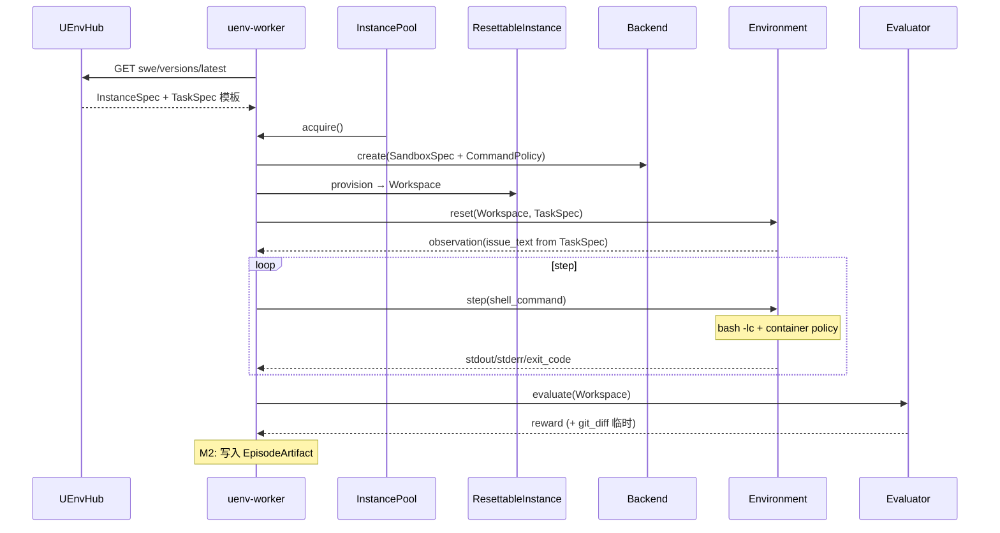

# SWE-bench 环境镜像与 Worker 实例化规划

> **文档版本**：v1.5  
> **创建时间**：2026-06-18  
> **v1.5 变更**：M4 之后新增 **M5 外部接入层**（OpenHands Remote Runtime Gateway）、**M6 SWE-bench Pro 变体**（Hub/Worker 与 Verified 区分）；明确对接层在 Worker 中的分层位置；OpenReward 走官方托管对照轨。  
> **v1.4 变更**：Hub `default_config` **平级分离** `instance_specs` / `task_specs`（禁止 TaskSpec 嵌套进 InstanceSpec）；支持同 repo+commit 多 task。  
> **v1.3 变更**：CommandPolicy 容器 capability；Workspace 瘦 + TaskSpec 胖；EpisodeArtifact（M2+）。  
> **v1.2 变更**：Workspace、InstanceSpec、ResettableInstance、CommandPolicy。  
> **定位**：Hub 元数据/镜像索引 + Worker 实例拉起/预热池/Episode 执行 + **外部 Agent 运行时接入**；面向 SWE-bench Verified → Pro 与 OpenHands 评测路径的分级演进。  
> **依据**：[worker-pool-layer-design.md](./worker-pool-layer-design.md)、[260609-worker-full-chain-integration-summary.md](./260609-worker-full-chain-integration-summary.md)、[OpenEnv](https://github.com/meta-pytorch/OpenEnv)、[SWE-bench Harness](https://www.swebench.com/SWE-bench/reference/harness/)

---

## 0. 目标陈述

| 角色 | 职责 | 本阶段目标 |
|------|------|------------|
| **Hub** | Registry / Index：`InstanceSpec`、`TaskSpec` 模板、可选镜像缓存 | 发布 `swe` 元数据；**不存镜像字节** |
| **Worker** | Runtime：Backend → **ResettableInstance 池** → Episode | `PodmanBackend` + 核心类型 |
| **Workspace** | **运行态**工作区（瘦） | repo_path、commit、`issue_ref`、evaluation_spec |
| **TaskSpec** | **任务内容**（可胖） | issue_text、attachments、logs |
| **Environment** | `reset/step` + **CommandPolicy 约束的 shell** | Step 内不评测 |
| **Evaluator** | episode_end 评测 | 读 Workspace + 产出写入 EpisodeArtifact |

**MVP 类型闭包**（足够开工，无更多架构阻塞项）：

```text
Workspace
InstanceSpec
TaskSpec
ResettableInstance
CommandPolicy
PodmanBackend
```

**成功标准（M1）**：

```text
Hub InstanceSpec + TaskSpec
  → acquire ResettableInstance（Workspace）
  → reset（observation 来自 TaskSpec）
  → 多步 step（bash -lc + RestrictedShell 容器策略）
  → episode_end → Evaluator → reward
```

**冻结原则**：`1 episode = 1 未污染沙箱`。

---

## 1. 核心类型系统

### 1.1 Workspace — 仅运行态（瘦）

**Workspace** 是 Environment、Evaluator、Snapshot、Agent 共享的 **运行时上下文**；**不承载大体积任务正文**，避免随 attachments/logs 膨胀。

```rust
/// 运行态工作区 — 保持瘦
struct Workspace {
    instance_id: String,
    repo_path: PathBuf,
    base_commit: String,

    issue_id: Option<String>,
    /// 指向 TaskSpec 的引用（Hub dataset 行 ID、对象存储 URI、episode 内联句柄等）
    issue_ref: IssueRef,

    evaluation_spec: EvaluationSpec,
}

enum IssueRef {
    /// Hub `task_specs[task_id]` 或 `tasks[task_id]`
    TaskId(String),
    DatasetRow { dataset: String, row_id: String },
    InlineHandle(String),       // Episode 级缓存句柄
    Uri(String),                // 未来：s3://... / hf://...
}
```

**Reset observation** 中的 `issue_text` 来自 **TaskSpec**（经 `issue_ref` 加载），不从 Workspace 字段直读。

### 1.2 TaskSpec — 任务内容（可胖）

与 Workspace 分离；Issue 可能很大，未来还有 attachments、logs、screenshots。

```rust
struct TaskSpec {
    task_id: String,
    issue_id: Option<String>,
    issue_text: String,
    /// M2+ 扩展
    attachments: Vec<AttachmentRef>,
    logs: Option<String>,
    screenshots: Vec<AttachmentRef>,
}

struct AttachmentRef {
    uri: String,
    mime: Option<String>,
}
```

| 类型 | 职责 | 典型字段 |
|------|------|----------|
| **InstanceSpec** | 如何 provision 环境 | repo、commit、setup、evaluation_spec |
| **TaskSpec** | Agent 要解决什么 | issue_text、attachments |
| **Workspace** | Episode 执行时绑定了哪份任务、仓库在哪 | repo_path、issue_ref |

**Hub 配置布局（冻结：平级分离，禁止嵌套）**：

`InstanceSpec` 与 `TaskSpec` 在类型层分离，Hub `default_config` **必须同样分离**，不得在 `instances[*]` 内嵌 `task` 对象。

```json
{
  "instance_specs": {
    "sympy__sympy-20590": {
      "repo_url": "...",
      "base_commit": "...",
      "task_ref": "task_20590"
    }
  },
  "task_specs": {
    "task_20590": {
      "issue_text": "..."
    }
  }
}
```

等价短名（实现可二选一解析）：`instances` + `tasks`。文档与 Hub seed 以 **`instance_specs` / `task_specs`** 为准。

**为何分离**：同一 `repo_url` + `base_commit` 可对应多个任务（CodeArena、内部 SWE 极常见）：

```text
sympy@commit_abc  + task_20590  → issue A
sympy@commit_abc  + task_20800  → issue B（同仓库同快照，不同 issue / evaluation_spec）
```

嵌套配置会迫使每个 instance 行重复 repo/commit，或把多 issue 塞进同一 instance 键，与类型设计矛盾。

**数据流**：

```text
Hub default_config
  ├── instance_specs[*]  → InstanceSpec（含 task_ref 字符串）
  └── task_specs[*]      → TaskSpec（独立字典）

Dispatch payload: { instance_id }  或  { instance_id, task_id }
  → resolve InstanceSpec + TaskSpec（task_ref → task_specs[task_id]）
  → provision → Workspace（issue_ref = TaskId(task_ref)）
  → reset: load TaskSpec → observation.issue_text
```

Worker 也可从 HuggingFace dataset 行加载 TaskSpec，再与 Hub `instance_specs` 合并；Hub 侧仍保持两表结构。

### 1.3 InstanceSpec — 统一实例规格

```rust
struct InstanceSpec {
    instance_id: String,
    repo_url: String,
    base_commit: String,

    /// 外键：Hub `task_specs` / `tasks` 中的键，如 "task_20590"
    task_ref: String,

    setup_script: Option<String>,
    evaluation_spec: EvaluationSpec,

    dataset: Option<String>,
    image_cache_key: Option<String>,
}

struct EvaluationSpec {
    test_cmd: Option<String>,
    test_patch: Option<String>,
    grader: Option<String>,
}
```

`issue_text` **只在 TaskSpec**；InstanceSpec 通过 `task_ref` 关联任务内容。

### 1.4 CommandPolicy — 模式枚举 + 容器能力策略

**Shell-First ≠ 字符串黑名单**。子串匹配可被轻易绕过：

```bash
python -c "import os; os.system('curl ...')"
/bin/curl
bash -c 'eval ...'
```

**长期正确路径**：

```text
step(shell_command)
  ↓
bash -lc "<command>"    # 统一入口
  ↓
容器级 capability policy
  ├── seccomp（限制 syscall：connect、clone、mount…）
  ├── AppArmor / SELinux profile
  └── Podman/Docker security_opt、cap_drop、network=none（RestrictedShell）
```

**策略枚举**（架构层仅此两种；不扩展为越来越长的 deny 列表）：

```rust
enum CommandPolicy {
    /// Runtime / RL 默认：受限能力容器 + 可选网络隔离
    RestrictedShell,
    /// SWE-bench 对标：宽容容器策略（仍隔离，能力更宽）
    FullShell,
}

struct CommandPolicyConfig {
    mode: CommandPolicy,
    timeout_sec: u32,
    max_output_bytes: usize,

    /// ⚠️ MVP 过渡 only — 不作为长期安全边界
    deny_patterns: Option<Vec<String>>,
}
```

| 维度 | RestrictedShell | FullShell |
|------|-----------------|-----------|
| 网络 | 默认 `network=none` 或 egress 限制 | 允许（对标 harness） |
| seccomp | 严格 profile | 宽松 / harness 对齐 |
| MVP `deny_patterns` | 可启用作 **辅助**，非主防线 | 通常关闭 |

> **文档冻结**：`deny_patterns` **仅为 MVP 过渡策略**；长期必须迁移到 **sandbox capability policy**（seccomp + AppArmor + 容器 flags）。禁止在架构上依赖黑名单持续增长。

**执行栈（目标形态）**：

```text
Environment.step
  → 解析 CommandPolicy.mode
  → Backend 已为该 mode 创建带对应 security profile 的容器
  → bash -lc "$shell_command"
  → 超时 / 输出截断（timeout_sec, max_output_bytes）
```

MVP 若尚未落地 seccomp profile，可临时启用 `deny_patterns` + 文档标注技术债。

### 1.5 ResettableInstance — 池抽象

```rust
trait ResettableInstance: Send {
    fn id(&self) -> InstanceId;
    fn workspace(&self) -> &Workspace;

    fn reset_for_episode(
        &self,
        instance: &InstanceSpec,
        task: &TaskSpec,
    ) -> Result<(), Error>;

    fn health_check(&self) -> bool;
    fn destroy(&self) -> Result<(), Error>;
}
```

- M0–M2：`PodmanResettableInstance`
- M3+：`SnapshotResettableInstance`（`Backend::restore`）

### 1.6 Backend — 与 Workspace 解耦

```rust
trait Backend {
    fn create(&self, spec: &SandboxSpec) -> Result<BackendHandle, Error>;
    fn destroy(&self, handle: &BackendHandle) -> Result<(), Error>;
    fn snapshot(&self, handle: &BackendHandle) -> Result<SnapshotId, Error>;
    fn restore(&self, snapshot: &SnapshotId) -> Result<BackendHandle, Error>;
}

struct SandboxSpec {
    base_image: String,
    optional_image_cache: Option<ImageRef>,
    resources: ResourceLimits,
    uds_path: PathBuf,
    entrypoint: String,
    command_policy: CommandPolicy,  // 决定容器 security profile
}
```

`SandboxSpec` **不含** repo/issue/task 正文；provision 后填充瘦 `Workspace`。

### 1.7 EpisodeArtifact — Episode 产物（M2+，非 MVP 阻塞）

Environment → Episode → Evaluator 中间会产生大量产物；不宜用临时字段传递 `git_diff`、`reward`。

```rust
/// M2+ 统一 Episode 产物模型
struct EpisodeArtifact {
    episode_id: String,
    instance_id: String,

    patch: Option<String>,
    git_diff: Option<String>,

    /// 按 step 索引或聚合
    stdout_log: Vec<String>,
    stderr_log: Vec<String>,

    test_results: Option<TestResults>,
    reward: Option<f64>,

    /// 可选：落盘 URI（WAL / 对象存储）
    artifact_uri: Option<String>,
}

struct TestResults {
    passed: bool,
    raw_output: String,
    per_test: Vec<(String, bool)>,
}
```

| 阶段 | 行为 |
|------|------|
| MVP (M1) | Evaluator 返回 reward；git_diff 临时在 Evaluator 内 |
| M2 | `EpisodeExecutor` 组装 `EpisodeArtifact`；WAL / ReportResult 扩展 |
| M3+ | RL 训练消费 artifact（轨迹、replay、离线评测） |

### 1.8 架构总览（v1.3）

```text
              Hub: instance_specs + task_specs（平级）
                        │
                        ▼
┌──────────────────────────────────────────────────────────┐
│ uenv-worker                                               │
│  InstancePool ← ResettableInstance                         │
│       │                                                   │
│       ├── BackendHandle（Podman + CommandPolicy profile） │
│       └── Workspace（瘦：repo_path, issue_ref, eval_spec） │
│                │              │                           │
│         TaskSpec ──reset──► Environment                   │
│         (issue_text…)       step: bash -lc + policy       │
│                │              │                           │
│                └──────► Evaluator (episode_end)           │
│                              │                           │
│                              ▼                           │
│                    EpisodeArtifact (M2+)                 │
└──────────────────────────────────────────────────────────┘
```

---

## 2. 设计原则（累积）

| 原则 | 说明 |
|------|------|
| Workspace 瘦、TaskSpec 胖 | 运行态 vs 任务内容分离 |
| CommandPolicy = mode + 容器能力 | 非字符串黑名单；`deny_patterns` MVP only |
| InstanceSpec 统一多 benchmark | SWE-bench / CodeArena / 内部 bugfix |
| **Hub 配置平级分离** | `instance_specs` + `task_specs`；禁止嵌套 `task` |
| 同 repo+commit 多 task | `task_ref` 指向独立 `task_specs` 条目 |
| ResettableInstance 池抽象 | Container → Snapshot 演进 |
| EpisodeArtifact 统一产物 | M2+；MVP 可临时传递 |
| Hub 只存索引 | 镜像字节与 TB 级缓存在 Worker |

---

## 3. SWE-bench 需求摘要

### 3.1 MVP 必需

```text
1. PodmanBackend（+ CommandPolicy 对应 security profile）
2. Shell via bash -lc
3. Workspace + TaskSpec + InstanceSpec
4. ResettableInstance / InstancePool
5. Evaluator @ episode_end
```

### 3.2 非 MVP

```text
EpisodeArtifact 持久化（M2）
seccomp/AppArmor 完整 profile（M1 可 stub + deny_patterns 过渡）
Snapshot Pool（M3）
TaskSpec attachments / screenshots
```

---

## 4. 技术路径

### 4.1 数据流



### 4.2 Environment 插件

```text
plugins/swe/
  server/
    environment.py      # Workspace + TaskSpec；bash -lc
    command_policy.py   # mode → 容器 profile 元数据（MVP: deny_patterns 过渡）
    sandbox_profiles/   # M2: seccomp.json, apparmor（占位）
  evaluator/
    swe_evaluator.py
```

**Reset Observation**（`issue_text` 来自 **TaskSpec**）：

```json
{
  "instance_id": "sympy__sympy-20590",
  "issue_id": "20590",
  "issue_text": "...",
  "repo_path": "/testbed",
  "base_commit": "abc123..."
}
```

**Step Observation**（MVP 无 `policy_rejected` 若已纯靠容器拒绝——或保留表示 bash 未启动）：

```json
{
  "stdout": "...",
  "stderr": "...",
  "exit_code": 127,
  "truncated": false
}
```

### 4.3 CommandPolicy 与 Podman 联动（目标）

```text
RestrictedShell:
  podman run --cap-drop=ALL --security-opt seccomp=restricted.json
             --network=none ...

FullShell:
  podman run --security-opt seccomp=full.json
             --network=bridge（或 harness 对齐）
```

MVP：`RestrictedShell` 容器 + 可选 `deny_patterns`；文档登记迁移至 profile。

---

## 5. MVP 分级

| 级别 | 目标 |
|------|------|
| **M0** | 类型定义；Podman create/destroy；CommandPolicy enum |
| **M1** | **MVP E2E**：gold patch → reward=1.0 |
| **M2** | InstancePool warmup；**EpisodeArtifact**；seccomp profile 初版 |
| **M3** | SnapshotResettableInstance；RL AgentLoop |
| **M4** | 镜像缓存工厂；批量 Lite |
| **M5** | **External Runtime Gateway**；OpenHands Remote Runtime 适配；`plugins/swe` 实装 |
| **M6** | **SWE-bench Pro 变体**（Hub catalog + Pro grader + Pro 镜像索引；与 Verified 同框架） |

### M1 验收

- [ ] Hub `default_config` 为 `instance_specs` + `task_specs` 平级（无嵌套 `task`）
- [ ] `Workspace` 无 `issue_text`；reset 从 `task_specs[task_ref]` 加载
- [ ] `CommandPolicy` 为 enum；`deny_patterns` 标注 MVP-only
- [ ] `bash -lc` 为统一执行入口
- [ ] Evaluator episode_end only；reward 与 gold 一致
- [ ] `ResettableInstance` acquire/release

### 关键路径

```text
Workspace / TaskSpec / InstanceSpec / CommandPolicy 类型
  → PodmanBackend（CommandPolicy → run flags）
  → ResettableInstance
  → Environment + Evaluator
  → M1 E2E
  → M2: EpisodeArtifact + seccomp profiles
  → M3: Snapshot pool
  → M4: ImageCacheFactory
  → M5: RuntimeGateway + OpenHands
  → M6: benchmark_variant=pro
```

---

## 5.1 M5–M6 总览（M4 之后）

| 级别 | 一句话 | 依赖 |
|------|--------|------|
| **M5** | 外部 Agent（OpenHands）经 Gateway 使用 UEnv 提供的 SWE 沙箱 | M2 池 + M4 pull + Evaluator |
| **M6** | Hub/Worker 同时支持 Verified 与 Pro 两套 catalog/grader/镜像索引 | M4 + M5（推荐） |

**OpenReward 策略（冻结）**：继续用 **官方托管**（`openreward.ai`）作为独立对照轨；**不在 UEnv Worker 内实现 OpenReward API**。需要 OpenReward 评测时，Agent 直连 OpenReward；需要 UEnv 提供环境时，走 **OpenHands → Runtime Gateway**。

---

## 5.2 Worker 分层：对接层处于什么位置？

对接层 **既不是** WarmupPool/PluginHost 的「进程级实例」，**也不是** ResettableInstance 本身；而是盖在 InstancePool 之上的 **External Access Layer（外部接入层）**。

```text
┌─────────────────────────────────────────────────────────────────────┐
│  External clients                                                    │
│    OpenHands agent (Remote Runtime)    UEnv native (DispatchEpisode) │
└───────────────┬───────────────────────────────┬─────────────────────┘
                │ HTTP/gRPC                      │ gRPC WorkerGrpcService
                ▼                                ▼
┌─────────────────────────── uenv-worker ───────────────────────────────┐
│  L4  External Runtime Gateway  ← M5 新增；固有配套设施，非 env 实例    │
│       SessionManager / ExecBridge / SubmitBridge                       │
│       1 external session = lease 1 ResettableInstance                 │
├───────────────────────────────────────────────────────────────────────┤
│  L3  EpisodeExecutor / plugins/swe Environment + Evaluator            │
│       （native 路径；OpenHands 路径 episode_end 也复用 Evaluator）      │
├───────────────────────────────────────────────────────────────────────┤
│  L2  SweInstancePool（ResettableInstance 池；与 math WarmupPool 并列）  │
├───────────────────────────────────────────────────────────────────────┤
│  L1  PodmanBackend + ImageCacheFactory（M4）                           │
└───────────────────────────────────────────────────────────────────────┘
                ▲
                │ catalog / instance_specs / image_cache_key
┌───────────────┴───────────────┐
│  uenv-hub（L0 元数据目录）      │
│  swe-verified | swe-pro 变体   │  ← M6
└───────────────────────────────┘
```

| 概念 | 层级 | 说明 |
|------|------|------|
| **ResettableInstance** | L2 | 真实 SWE 沙箱（容器 + 瘦 Workspace） |
| **PluginHost / math WarmupPool** | L2（并行域） | 进程级插件实例；**与 SWE 容器池无关** |
| **Runtime Gateway** | **L4 配套设施** | 把外部 RPC 翻译成 acquire/exec/submit/release |
| **OpenHands Runtime 适配** | **L4 客户端侧** | 仓库外：`integrations/openhands/` 或独立 crate |

**冻结原则**：

- Gateway **不**持有容器生命周期语义；lease 的 owner 仍是 L2 `SweInstancePool`。
- 同一 Worker 上 native `DispatchEpisode(env_type=swe)` 与 OpenHands session **共享** L2 池与 L1 Backend，由 `benchmark_variant` 区分 catalog。
- OpenReward **不**进入 L4；最多作为 **M5 验收时的外部对照**（同一 patch 可选提交 OpenReward 官方端点）。

---

## 5.3 M5 — External Runtime Gateway + OpenHands

### 5.3.1 目标

OpenHands agent 在 SWE 任务上跑通：**provision → 多步 bash/编辑 → submit → reward**，其中 **容器/镜像/reset/exec/grading 由 UEnv Worker 提供**。

### 5.3.2 Runtime Gateway API（Worker 侧，建议 HTTP + 可选 gRPC）

| RPC / 路由 | 功能 | 映射到内部 |
|------------|------|------------|
| `POST /runtime/v1/sessions` | 创建 session | `SweInstancePool.acquire(instance_id, variant)` + `reset_for_episode` |
| `POST /runtime/v1/sessions/{id}/exec` | 容器内 bash | `PodmanResettableInstance::exec` / `bash -lc` |
| `POST /runtime/v1/sessions/{id}/read` | 读文件 | container exec `cat` / 后续可优化 |
| `POST /runtime/v1/sessions/{id}/write` | 写/补丁 | container exec / patch apply |
| `POST /runtime/v1/sessions/{id}/submit` | 提交评测 | `Evaluator.evaluate` → reward + artifact |
| `DELETE /runtime/v1/sessions/{id}` | 释放 | `release` 或 `destroy`（按池策略） |

Session 创建请求体（示例）：

```json
{
  "instance_id": "scikit-learn__scikit-learn-14141",
  "benchmark_variant": "verified",
  "command_mode": "FullShell"
}
```

### 5.3.3 OpenHands 侧适配（仓库外或 `integrations/openhands/`）

| 交付物 | 说明 |
|--------|------|
| `UEnvRuntime` | 实现 OpenHands `Runtime` 接口：`run`/`read`/`write`/`copy` 转发至 Gateway |
| 配置 | `UENV_RUNTIME_GATEWAY_URL=http://worker:28999` |
| SWE 评测入口 | 使用 OpenHands `benchmarks/swebench` 驱动，Runtime 指向 UEnv |

OpenHands 适配 **不** 进入 `PluginHost`；它是 **L4 的客户端**，与 `uenv-math-plugin` 无拓扑关系。

### 5.3.4 同步实装：`plugins/swe/`（native 路径，M5 一并交付）

规划 §4.2 的 OpenEnv 风格插件与 Gateway **共用 L2/L3**：

```text
plugins/swe/server/environment.py   # reset/step → 经 Gateway 内部 API 或 in-process 调 pool
plugins/swe/evaluator/swe_evaluator.py
```

native `DispatchEpisode` 与 OpenHands 路径在 **Evaluator + MAP_REPO_VERSION_TO_SPECS** 上收敛，避免两套 grader。

### 5.3.5 M5 验收

- [ ] OpenHands 跑 1 个 Verified 实例：多步 bash → submit → reward 0/1
- [ ] 同一 instance gold patch：OpenHands 路径 reward=1.0（与 CLI `swe-run` 一致）
- [ ] Gateway session 泄漏测试：submit/timeout 后容器释放
- [ ] `plugins/swe` 单测 + 1 条 native DispatchEpisode E2E

---

## 5.4 M6 — SWE-bench Pro 变体（Hub + Worker，框架不变）

### 5.4.1 设计原则

- **不新增** `env_type` 分裂为多个 top-level 类型；沿用 `env_type=swe`，用 **`benchmark_variant`** 区分。
- Hub `default_config` 仍 **平级** `instance_specs` + `task_specs`；Verified 与 Pro **分 catalog 发布**（不同 Hub env version 或同 version 内分表）。

### 5.4.2 类型扩展（最小）

```rust
enum BenchmarkVariant {
    Verified,   // princeton-nlp/SWE-bench_Verified
    Lite,       // SWE-bench Lite
    Pro,        // SWE-bench Pro public set
}

struct InstanceSpec {
    // ... 既有字段 ...
    benchmark_variant: BenchmarkVariant,
    evaluation_spec: EvaluationSpec,  // grader: "swebench" | "swebench_pro"
    image_cache_key: Option<String>,   // Verified: swebench/sweb.eval.*
                                      // Pro: Pro 专用镜像引用（Scale/OpenHands 索引）
}
```

### 5.4.3 Hub 协调（uenv-hub）

| 项 | Verified | Pro |
|----|----------|-----|
| Hub env 名 | `swe-verified`（或 `swe` + tag） | `swe-pro` |
| Catalog 端点 | `GET /api/v1/swe/verified/instances` | `GET /api/v1/swe/pro/instances` |
| `default_config` | `instance_specs` + `task_specs` | 同结构，不同 seed |
| `image_cache_key` 示例 | `swebench/sweb.eval.x86_64.*` | Pro registry 引用（与 Verified 分列） |
| `evaluation_spec.grader` | `swebench` | `swebench_pro` |

Worker 启动 pull catalog 时按配置加载一个或多个 variant：

```yaml
env:
  types: ["swe"]
swe:
  variants: ["verified"]           # M1–M4 默认
  # variants: ["verified", "pro"]  # M6
  hub:
    verified_catalog: "/api/v1/swe/verified/instances"
    pro_catalog: "/api/v1/swe/pro/instances"
```

### 5.4.4 Worker / Grader 差异（Pro 增量）

| 能力 | Verified（已有/规划） | Pro 增量 |
|------|----------------------|----------|
| 语言 | Python 为主 | + Go / TS / JS |
| 测试 runner | pytest + MAP_REPO_VERSION_TO_SPECS | + Pro `run_scripts` / 多语言 log parser |
| Evaluator | `swebench` harness | 委托 **SWE-Pro 官方 eval** 或同源 Python 模块 |
| 镜像工厂 M4 | pull `sweb.eval.*` | 另建 Pro image index + pull |
| OpenHands | `benchmarks/swebench` | `benchmarks/swebenchpro` + 同一 Gateway |

**框架结构不变**：仍是 Hub 索引 → M4 pull → L2 池 → L3 Evaluator；仅 catalog、镜像命名、grader 模块按 variant 分支。

### 5.4.5 M6 验收

- [ ] Hub 分别 seed/publish Verified 与 Pro catalog
- [ ] Worker `benchmark_variant=pro` 跑通 1 个 Pro public 实例 gold → reward
- [ ] OpenHands `swebenchpro` + UEnv Gateway 跑通 1 实例 submit
- [ ] Verified 与 Pro 实例 **不可** 混用错误 `image_cache_key`（启动校验）

---

## 5.5 OpenReward 对照轨（非 UEnv 实现范围）

| 场景 | 路径 | UEnv 角色 |
|------|------|-----------|
| Agent 在 OpenReward 上测 SWE | Agent → `openreward.ai` | **无**（官方托管全套） |
| Agent 在 OpenHands 上测，UEnv 提供环境 | OpenHands → Runtime Gateway → Worker | **环境提供方** |
| 可选交叉对照 | 导出 patch → OpenReward **与** UEnv submit 各跑一遍 | 人工/脚本；**不追 parity** |

不在 M5/M6 实现 OpenReward 兼容 API；若未来需要，单独立项 **M7: OpenReward-compatible Gateway**（当前 **Out of Scope**）。

---

## 5.6 M5–M6 交付物

| 模块 | 级别 | 内容 |
|------|------|------|
| `uenv-worker/src/runtime_gateway/` | M5 | SessionManager、HTTP server、exec/submit bridge |
| `uenv-worker/src/swe/instance_pool.rs` | M2/M5 | SWE 专用池（从 harness 直 run 演进） |
| `uenv-worker/src/swe/grader/` | M5/M6 | `swebench` + `swebench_pro` trait 实现 |
| `integrations/openhands/uenv_runtime/` | M5 | OpenHands Remote Runtime 客户端 |
| `plugins/swe/` | M5 | environment.py + evaluator |
| `uenv-hub` routes + seed | M6 | `/api/v1/swe/{verified,pro}/instances` |
| `config/swe-pro-default-config.json` | M6 | Pro seed 示例 |
| `uenv-worker/src/swe/variant.rs` | M6 | `BenchmarkVariant` 解析 |

---

## 5.7 M5–M6 关键路径（实施顺序）

```text
M4 ImageCacheFactory（Verified）
  → M2 SweInstancePool + harness 迁入 PodmanBackend
  → M5 Runtime Gateway + plugins/swe + OpenHands UEnvRuntime
  → M5 MAP_REPO_VERSION_TO_SPECS + Evaluator 收敛
  → M6 Hub Pro catalog + Pro grader + M4 Pro pull
  → M6 OpenHands swebenchpro E2E
```

---

## 6. Hub 配置示例

### 6.1 `default_config` 布局（`instance_specs` + `task_specs` 平级）

```json
{
  "default_command_policy": {
    "mode": "RestrictedShell",
    "timeout_sec": 120,
    "max_output_bytes": 65536,
    "deny_patterns": ["curl", "wget", "ssh"]
  },

  "instance_specs": {
    "sympy__sympy-20590": {
      "instance_id": "sympy__sympy-20590",
      "repo_url": "https://github.com/sympy/sympy",
      "base_commit": "<from SWE-bench dataset>",
      "task_ref": "task_sympy_20590",
      "setup_script": "pip install -e .",
      "evaluation_spec": {
        "test_cmd": "pytest ...",
        "grader": "swebench"
      },
      "dataset": "princeton-nlp/SWE-bench_Lite"
    },
    "sympy__sympy-20800": {
      "instance_id": "sympy__sympy-20800",
      "repo_url": "https://github.com/sympy/sympy",
      "base_commit": "<same or different commit>",
      "task_ref": "task_sympy_20800",
      "setup_script": "pip install -e .",
      "evaluation_spec": {
        "test_cmd": "pytest ...",
        "grader": "swebench"
      },
      "dataset": "princeton-nlp/SWE-bench_Lite"
    }
  },

  "task_specs": {
    "task_sympy_20590": {
      "task_id": "task_sympy_20590",
      "issue_id": "20590",
      "issue_text": "<problem_statement from dataset>"
    },
    "task_sympy_20800": {
      "task_id": "task_sympy_20800",
      "issue_id": "20800",
      "issue_text": "<another problem_statement>"
    }
  }
}
```

**命名别名**（解析器可兼容，seed 优先用 canonical 名）：

| Canonical | 别名 |
|-----------|------|
| `instance_specs` | `instances` |
| `task_specs` | `tasks` |

**禁止**：在 `instance_specs[*]` 内嵌 `"task": { "issue_text": ... }`——与类型层分离矛盾。

**同 repo + commit、多 issue**（CodeArena / 内部 SWE）：新增 `task_specs` 条目 + 新 `instance_specs` 行共享 `repo_url`/`base_commit`，仅 `task_ref` 与 `evaluation_spec` 不同：

```json
{
  "instance_specs": {
    "internal_sympy_20590_a": {
      "repo_url": "https://github.com/sympy/sympy",
      "base_commit": "abc123",
      "task_ref": "task_internal_a"
    },
    "internal_sympy_20590_b": {
      "repo_url": "https://github.com/sympy/sympy",
      "base_commit": "abc123",
      "task_ref": "task_internal_b"
    }
  },
  "task_specs": {
    "task_internal_a": { "issue_text": "Bug variant A ..." },
    "task_internal_b": { "issue_text": "Bug variant B ..." }
  }
}
```

Worker resolve：`instance_specs[instance_id]` → `task_ref` → `task_specs[task_ref]`。

> `deny_patterns` 可选；实现侧视为 **MVP 临时字段**，与 `RestrictedShell` 容器 profile 并存，非长期安全边界。

Episode `payload`：

```json
{
  "instance_id": "sympy__sympy-20590",
  "benchmark_variant": "verified",
  "use_gold_patch": true,
  "command_mode": "FullShell"
}
```

### 6.2 Pro 变体示例（M6，`benchmark_variant=pro`）

Hub env 名：`swe-pro`。结构与 §6.1 相同，字段差异：

```json
{
  "instance_specs": {
    "<pro_instance_id>": {
      "instance_id": "<pro_instance_id>",
      "benchmark_variant": "pro",
      "repo_url": "https://github.com/<org>/<repo>",
      "base_commit": "<from SWE-bench Pro dataset>",
      "task_ref": "task_<pro_instance_id>",
      "evaluation_spec": {
        "test_cmd": "<from Pro run_scripts>",
        "grader": "swebench_pro"
      },
      "dataset": "SWE-bench_Pro/public",
      "image_cache_key": "<pro registry ref, not sweb.eval.*>"
    }
  },
  "task_specs": {
    "task_<pro_instance_id>": {
      "task_id": "task_<pro_instance_id>",
      "issue_text": "<problem_statement from Pro dataset>"
    }
  }
}
```

Verified 与 Pro **禁止**共用同一 `image_cache_key` 命名空间；Hub seed 与 Worker M4 pull 均按 `benchmark_variant` 分桶。

---

## 7. Worker 交付物

| 模块 | 内容 |
|------|------|
| `workspace.rs` | `Workspace`, `TaskSpec`, `InstanceSpec`, `IssueRef` |
| `hub/mod.rs` | 解析 `instance_specs` + `task_specs`；`task_ref` 联结 |
| `command_policy.rs` | `CommandPolicy` enum；`deny_patterns` MVP-only |
| `backend/podman.rs` | `create` 按 `CommandPolicy` 设置 run flags |
| `backend/sandbox_profiles/` | seccomp JSON 占位（M2 实装） |
| `pool/resettable.rs` | `ResettableInstance` |
| `episode/artifact.rs`（M2） | `EpisodeArtifact` |
| `plugins/swe/` | bash -lc；TaskSpec 加载 |
| `runtime_gateway/`（M5） | External Access Layer；OpenHands session bridge |
| `swe/grader/`（M5/M6） | `swebench` / `swebench_pro` |
| `integrations/openhands/`（M5） | OpenHands `UEnvRuntime` 客户端 |
| Hub `swe/pro` routes（M6） | Pro catalog 端点 |

---

## 8. 验证脚本（M1）

```bash
grpcurl -plaintext -d @ localhost:50052 uenv.worker.WorkerService/DispatchEpisode <<'EOF'
{
  "episode_id": "swe-mvp-001",
  "env_type": "swe",
  "max_steps": 20,
  "payload": "{\"instance_id\":\"sympy__sympy-20590\",\"use_gold_patch\":true}",
  "correlation_id": "swe-mvp-trace"
}
EOF
```

M2 起验收 `EpisodeArtifact` 是否随 `ReportResult` 或 WAL 落盘。

---

## 9. 开放问题

| # | 问题 | 默认 |
|---|------|------|
| Q1 | MVP seccomp | stub profile + deny_patterns 过渡 |
| Q2 | TaskSpec 存储 | Hub `task_specs` 平级表；超大 issue 未来 `task_specs` 内 `issue_ref` URI |
| Q3 | EpisodeArtifact 落盘 | M2：WAL 扩展字段 |
| Q4 | Snapshot | M3 |
| Q5 | Runtime Gateway 协议 | M5：HTTP REST 优先；gRPC 可选与 Worker 同端口子路径 |
| Q6 | OpenHands SDK 版本 pin | M5：与 `OpenHands/benchmarks` 当前 swebench 分支对齐 |
| Q7 | Pro grader 实现 | M6：优先 wrap 官方 `swe_bench_pro_eval` Python 子进程，Rust 只做 orchestration |
| Q8 | OpenReward | **官方托管对照轨**；不纳入 M5/M6 实现 |

---

## 10. 总结

| 主题 | v1.5 |
|------|------|
| **Hub 配置** | **`instance_specs` + `task_specs` 平级**；Verified / Pro **分 catalog** |
| **benchmark_variant** | `verified` \| `lite` \| `pro`；`env_type` 仍为 `swe` |
| **Worker 分层** | L4 Runtime Gateway（配套设施）→ L3 Episode/Evaluator → L2 SweInstancePool → L1 Backend |
| **OpenHands** | M5：Remote Runtime → Gateway；**环境由 UEnv 提供** |
| **OpenReward** | **官方托管**；对照轨，不实现 OpenReward API |
| **task_ref** | InstanceSpec 外键 → `task_specs[task_id]` |
| **CommandPolicy** | enum + 容器 capability；`deny_patterns` MVP only |
| **MVP 闭包（M0–M4）** | Workspace, InstanceSpec, TaskSpec, ResettableInstance, CommandPolicy, PodmanBackend, ImageCacheFactory |
| **M5–M6** | Gateway + OpenHands；Pro catalog + grader |

**下一步（M4 完成后）**：先收敛 M2 池 + M4 Verified pull，再落地 **M5 Runtime Gateway + OpenHands UEnvRuntime**；Hub/Worker **M6 Pro 变体**可与 M5 并行设计、Pro pull/grader 后至。
