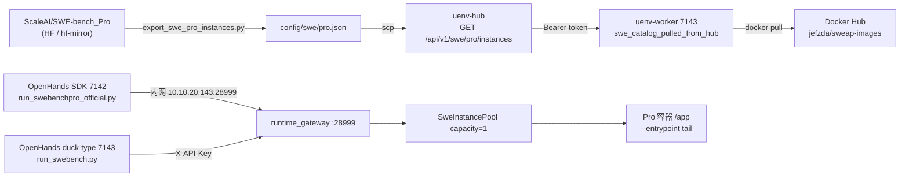

# SWE-bench Pro 7143 联调报告

> **文档版本**：v1.3  
> **日期**：2026-06-25  
> **变更摘要**：v1.0 初版联调；v1.1 NodeBB gold 1.0 + 评测顺序/fix；v1.2 Python qutebrowser gold 1.0 + 镜像多源 pull；**v1.3 轨迹捕获 + OpenHands 官方 SDK（7142→7143 Gateway）实机验收 + §3.9 实机测试结果汇总**。  
> **机器**：A100 **7143**（Worker/Gateway）+ **7142**（OpenHands Agent）+ Hub（`8.130.95.176:8088`）  
> **依据**：`secrets/README.md`（四端拓扑）、`260618-swe-bench-env-hub-worker-plan.md`（M5/M6 Pro 规划）、`260625-openhands-official-integration-plan.md`

---

## 0. 结论（TL;DR）

| 验收项 | 状态 |
|--------|------|
| Hub 拉取 Pro 元数据 | **已完成** |
| Worker 按元数据 pull `jefzda/sweap-images` | **已完成**（默认 mirror 易 429，见 §4.8） |
| 单环境实例 Gateway 联调 | **已完成**（`:28999`，capacity=1） |
| OpenHands gold（JS / NodeBB） | **已完成** reward=1.0（291/291） |
| OpenHands gold（Python / qutebrowser） | **已完成** reward=1.0（56/56） |
| **轨迹捕获（Worker 本地真值）** | **已完成** — `TrajectoryRef` + `GET /trajectories/{id}` |
| **OpenHands 官方 SDK（7142）** | **已完成 gold** reward=1.0（56/56）；**LLM** 多轮 loop 跑通 reward=0（52/56） |
| OpenReward 测试 | **未纳入范围**（官方托管对照轨，见 plan §5.5） |

**核心链路已跑通**：Hub Pro catalog → Worker 拉取 → Gateway 会话 → 第三方镜像 provision → gold patch → 评测提交。JS / Python 两条 **duck-type** OpenHands gold 路径均在 7143 达到 **`resolved=True reward=1.0`**。**v1.3** 起：**7142 部署 OpenHands Software Agent SDK v1.27.0**，经内网 `http://10.10.20.143:28999` 调用 7143 Gateway；step 级轨迹落盘 7143 本机并可 HTTP 回查。

---

## 1. 四端拓扑（实机）

| 组件 | 地址 | 说明 |
|------|------|------|
| **Adapter / OpenHands 7142** | `219.147.100.43:7142`（内网 `10.10.20.142`） | OpenHands SDK + LLM；SSH 私钥 `secrets/*_8.142` |
| Worker 7143 | `219.147.100.43:7143`（内网 `10.10.20.143`） | SSH 私钥 `secrets/*_8.143` |
| Worker gRPC / health | `:28888` / `:28777` | 业务与探活 |
| Runtime Gateway（Pro） | 本机 `:28999`；公网 `:28099` | API Key `swe-pro-secret`；7142 调用 **内网** `10.10.20.143:28999` |
| Hub | `http://8.130.95.176:8088` | 需 `Authorization: Bearer $UENV_HUB_TOKEN` |
| 测试实例（Python smoke） | `instance_qutebrowser__qutebrowser-…-v059c6fdc…` | Pro / qutebrowser |
| 测试实例（JS） | `instance_NodeBB__NodeBB-04998908…-vnan` | JS / NodeBB |
| 第三方镜像 | `jefzda/sweap-images:…` | Docker Hub |

Worker 配置：`config/uenv-worker.deploy-7143-swe-pro.yaml`（`swe.variants: [pro]`，`runtime_gateway.capacity: 1`）。

---

## 2. 架构与数据流



单 episode（Pro）执行步骤：

1. Gateway `create_session` → Worker 从 Hub/本地 catalog 解析实例元数据  
2. `ImageCacheFactory.ensure_image` → docker pull `jefzda/sweap-images:{tag}`（miss 时）  
3. `docker run -d -w /app --entrypoint tail … -f /dev/null`（Pro 专用，规避 ENTRYPOINT=/bin/bash）  
4. `setup_cmd`（`before_repo_set_cmd`：git reset/checkout 测试文件）  
5. Agent 应用 gold patch → `test_patch` → `test_cmd`（如 `npm test -- …`）  
6. `SwebenchProGrader` 解析日志 → `reward`

---

## 3. 部署与联调步骤

### 3.1 代码同步（本机 → 7143）

Windows 无 rsync，使用 tar + scp：

```powershell
tar -czf _deploy7143.tgz --exclude=target --exclude=.git -C D:\code\UEnv .
scp -i secrets/<key> -P 7143 _deploy7143.tgz root@219.147.100.43:/tmp/
ssh -p 7143 root@219.147.100.43 "mkdir -p /root/UEnv && tar -xzf /tmp/uenv-deploy.tgz -C /root/UEnv"
```

7143 上 shell 脚本需去除 CRLF：`sed -i 's/\r$//' scripts/*.sh`

### 3.2 Pro 元数据导出

7143 无法直连 `huggingface.co`，使用镜像站：

```bash
export HF_ENDPOINT=https://hf-mirror.com
python3 -m venv .venv-pro-export && .venv-pro-export/bin/pip install datasets
.venv-pro-export/bin/python scripts/export_swe_pro_instances.py \
  --ids instance_NodeBB__NodeBB-04998908ba6721d64eba79ae3b65a351dcfbc5b5-vnan \
  --out config/swe/pro.json
```

本机同样需设置 `HF_ENDPOINT=https://hf-mirror.com`；`load_dataset` 应写 `split='test'`，勿把 `'test'` 当作 config 名。

### 3.3 Hub seed

```bash
source /root/.uenv-worker.env
sshpass -p 'pku@345' scp config/swe/pro.json root@8.130.95.176:/root/uenv/uenv-hub/config/swe/pro.json
curl -H "Authorization: Bearer $UENV_HUB_TOKEN" \
  http://8.130.95.176:8088/api/v1/swe/pro/instances
# → HTTP 200
```

### 3.4 Worker 启动

```bash
bash scripts/remote-deploy-pro-7143.sh
# 或：
nohup ./target/release/uenv-worker --config config/uenv-worker.deploy-7143-swe-pro.yaml serve \
  >> /var/log/uenv/worker-swe-pro.log 2>&1 &
```

关键日志：

```
swe_catalog_pulled_from_hub variant=pro count=1
runtime_gateway_start gateway_addr=0.0.0.0:28999 catalog=1 auth=x-api-key
```

### 3.5 OpenHands 验收（NodeBB / JS）

```bash
python3 integrations/openhands/run_swebench.py \
  --gateway 127.0.0.1:28999 --api-key swe-pro-secret \
  --instance instance_NodeBB__NodeBB-04998908ba6721d64eba79ae3b65a351dcfbc5b5-vnan \
  --instances config/swe/pro.json --benchmark-variant pro --gold
```

实测输出摘要（v1.1 复验）：

```
[connect] session=... variant=pro
[write  ] ok
[run    ] git apply exit_code=0
[submit ] resolved=True reward=1.0 tests=291/291
```

### 3.6 Python Pro OpenHands 验收（v1.2）

实例：`instance_qutebrowser__qutebrowser-f91ace96223cac8161c16dd061907e138fe85111-v059c6fdc75567943479b23ebca7c07b5e9a7f34c`

```bash
# 导出 + Hub seed + 多镜像源 pull + OpenHands gold
bash /root/UEnv/scripts/deploy-pro-python-openhands-7143.sh

# 或仅 pull（7143 默认 mirror 易 429）
bash /root/UEnv/scripts/pull-pro-image-7143.sh \
  qutebrowser.qutebrowser-qutebrowser__qutebrowser-f91ace96223cac8161c16dd061907e138fe85111-v059c6fdc75567943479b23ebca7c07b5e9a7f
```

实测：

```
[submit ] resolved=True reward=1.0 tests=56/56
```

Worker 可通过 `UENV_SWE_PULL_MIRRORS=dockerproxy.net` 配置 pull 回退（见 §4.8）。

### 3.7 轨迹捕获验收（v1.3）

Worker 本机落盘 + Gateway 查询 API（详见 `260625-swe-pro-trajectory-capture-architecture-discussion.md`）：

| API | 说明 |
|-----|------|
| `POST …/submit` | 返回 `trajectory_ref`（含 `trajectory_id`、`gateway_base_url`、`worker_id`） |
| `GET /runtime/v1/trajectories/{id}` | 完整 `TrajectoryBundle`（含逐步 `StepTrace`） |
| `GET /runtime/v1/trajectories` | 本 Worker 本地列表 |

环境变量：`UENV_SWE_ARTIFACT_DIR`、`UENV_SWE_GATEWAY_PUBLIC_URL`（例 `http://219.147.100.43:28099`）。

qutebrowser gold 实测：`trajectory_id=trj-worker-7143-pro-1782321085352-00001`，`step_count=3`，`reward=1.0`。

### 3.8 OpenHands 官方 SDK 验收（7142 → 7143，v1.3）

**部署**：7142 安装 OpenHands **Software Agent SDK v1.27.0**（benchmarks SHA `82687c83…`）；7142 无法直连 GitHub 时 benchmarks 由本机 tarball 上传，`uv sync` 仅装 `vendor/software-agent-sdk`。

**驱动**：`integrations/openhands/run_swebenchpro_official.py`（官方 `Agent` + `Conversation` + gateway shim）

```bash
# 7142 上
bash /root/UEnv/scripts/run-openhands-pro-7142.sh gold
MAX_ITERATIONS=30 bash /root/UEnv/scripts/run-openhands-pro-7142.sh llm
```

**实测结果**：见 **§3.9.3**。详见：`260625-openhands-official-integration-plan.md`、`260625-openhands-7142-acceptance.md`。

### 3.9 实机测试结果汇总

**测试实例（Python Pro smoke）**：`instance_qutebrowser__qutebrowser-f91ace96223cac8161c16dd061907e138fe85111-v059c6fdc75567943479b23ebca7c07b5e9a7f34c`  
**测试实例（JS Pro）**：`instance_NodeBB__NodeBB-04998908ba6721d64eba79ae3b65a351dcfbc5b5-vnan`

#### 3.9.1 NodeBB / JS（7143 duck-type，v1.1）

| 模式 | reward | tests | 说明 |
|------|--------|-------|------|
| gold | **1.0** | 291/291 | `run_swebench.py --gold`；Redis `pre_test_cmd` + Mocha grader |

#### 3.9.2 qutebrowser / Python（7143 duck-type + 轨迹，v1.3）

| 模式 | 驱动 | reward | tests | trajectory_id | 说明 |
|------|------|--------|-------|---------------|------|
| gold | `run_swebench.py --gold` | **1.0** | 56/56 | — | 既有 Gateway + grader 通路 |
| gold + 轨迹 | `run_pro_agent.py --mode gold` | **1.0** | 56/56 | `trj-worker-7143-pro-1782321085352-00001` | step 级轨迹落盘 + `GET /trajectories/{id}` |
| llm（单轮） | `run_pro_agent.py --mode llm` | 0.0 | 52/56 | （同 session） | LLM 幻觉 patch（`tests/test_log.py` 不存在）、apply `exit_code=2`；**非 Gateway/grader 问题** |

**本机拉回产物（7143 验收）**：`%TEMP%\uenv-pro-acceptance-20260625-011052\`（含 `gold/`、`llm/` 子目录：`trajectory_bundle.json`、`submit_result.json`、`run.log` 等）。

#### 3.9.3 qutebrowser / Python（7142 OpenHands 官方 SDK，v1.3）

**部署**：7142 OpenHands **Software Agent SDK v1.27.0**；Gateway 内网 `http://10.10.20.143:28999`；驱动 `run_swebenchpro_official.py`。

| 模式 | reward | tests | 说明 |
|------|--------|-------|------|
| **gold** | **1.0** | 56/56 | 官方驱动 + Gateway 通路验证 |
| **llm**（deepseek-v4-flash，15 iter） | 0.0 | 52/56 | 官方多轮 AgentLoop 已跑通 |

**LLM 行为**：OpenHands SDK 多轮 tool use 正常（`terminal` / `file_editor` / `finish` 经 Gateway 在 **7143 容器 `/app`** 执行，非 7142 本地）；Agent 在 15 步内主要在 `/home` 搜索，**未改源码** → 4 条 F2P 仍失败（`hide_qt_warning` 未迁移），与 §3.9.2 单轮 LLM 失败模式一致，**非 Gateway/grader 回归**。

| 模式 | trajectory_id | 产物目录（7142） |
|------|---------------|------------------|
| gold | `trj-worker-7143-pro-1782324281766-00003` | `/var/log/uenv/openhands-runs/pro-official-gold-20260625-020425/` |
| llm | `trj-worker-7143-pro-1782324511090-00004` | `/var/log/uenv/openhands-runs/pro-official-llm-20260625-020613/` |

**7143 轨迹正文**（Worker 本机）：`GET http://10.10.20.143:28999/runtime/v1/trajectories/{trajectory_id}`（Header `X-API-Key: swe-pro-secret`）。

---

## 4. 问题与解决方式（汇总）

本节汇总本次 7143 Pro 联调遇到的**全部主要问题**、现象、根因与处理方式，按类别排列。

### 4.0 问题一览表

| # | 类别 | 现象 | 根因 | 解决方式 |
|---|------|------|------|----------|
| 1 | 部署 | Windows 无法 rsync / make | 本机缺工具链 | tar + scp 同步；7143 上 `cargo build` |
| 2 | 部署 | `set: pipefail: invalid option` | `.sh` 为 CRLF | 7143 执行 `sed -i 's/\r$//' scripts/*.sh` |
| 3 | 部署 | `pip install datasets` 失败 | Debian PEP 668 受管环境 | 7143 使用 `.venv-pro-export` + `HF_ENDPOINT` |
| 4 | 元数据 | HF `ConnectionError` / 超时 | 7143/本机无法直连 `huggingface.co` | `HF_ENDPOINT=https://hf-mirror.com`；`load_dataset(..., split='test')` 勿把 `'test'` 当 config |
| 5 | Hub | `GET /swe/pro/instances` → 401 | Pro API 需 Bearer Token | seed/验证时带 `Authorization: Bearer $UENV_HUB_TOKEN` |
| 6 | Hub | 曾出现 migration / catalog 异常 | 误覆盖 `migrations/`、重建 `hub.db` | 恢复 migrations；用 `.admin_token` bootstrap；勿随意删库 |
| 7 | Worker | `swe_catalog` 拉取失败 | Hub 某变体不可用 | `runtime.rs` 变体级回退本地 `config/swe/{variant}.json` |
| 8 | 容器 | HTTP 500 `container is not running` | Pro 镜像 `ENTRYPOINT=/bin/bash`，`sleep infinity` → exit 126 | Pro 使用 `--entrypoint tail -f /dev/null` |
| 9 | 路径 | gold apply 路径错误 | Pro 工作区为 `/app` 非 `/testbed` | `workspace_dir()`；OpenHands 按 variant 选工作区 |
| 10 | 导出 | `test_cmd` 为文件列表 / F2P 仅 1 条 | `repo_language=js` 未识别；F2P 为 Python 字面量字符串 | 导出脚本支持 `js`、`ast.literal_eval`；拆分 `setup_cmd` / `test_cmd` |
| 11 | 评测 | Redis `ECONNREFUSED :6379` | NodeBB 测试依赖 Redis | 导出 `pre_test_cmd: redis-server --daemonize yes`；evaluate 前执行 |
| 12 | 评测 | gold 后 `reward=0`，291 项全 FAIL | **setup 在 evaluate 执行** → `git reset --hard` 清掉 gold patch | **setup 移至 provision**（Agent 编辑前） |
| 13 | 评测 | test_patch 应用后测试仍失败 | `patch` 对已存在 hunks **自动 -R 反转** | `patch --forward`；exit 1 且 hunks 已存在时视为可接受 |
| 14 | 评分 | Mocha 输出无法匹配 F2P | Pro JS 用自定义 reporter + 汇总行 `N passing` | `SwebenchProGrader` 增加 Mocha 行解析 + 无 failing 时汇总 shortcut |
| 15 | 评分 | Python Pro pytest 节点 | 标准 pytest 输出 | 沿用 `parse_pytest_report`（Pro grader 已包含） |
| 16 | 镜像 | `docker pull` → **429** | 7143 默认 mirror `docker.1ms.run` 限流 | `pull-pro-image-7143.sh` 回退 **dockerproxy.net**；Worker `UENV_SWE_PULL_MIRRORS` |
| 17 | 镜像 | daocloud / nju → 403 | 部分 mirror 禁止匿名拉取 | 脚本按序尝试，以 dockerproxy 为主 |
| 18 | 联调 | Server heartbeat/register 失败 | `8.130.86.71:8088` 不可达 | `UENV_WORKER_ALLOW_DEGRADED_START=1`；Gateway 本地联调不受影响 |
| 19 | OpenHands 7142 | 7142 无法 `git clone` GitHub | TLS/网络限制 | 本机 tarball 上传 benchmarks；SDK `uv sync` 在 vendor 目录 |
| 20 | OpenHands SDK | `LocalConversation.run(timeout=…)` 报错 | SDK v1.27 本地 run 无 timeout 参数 | driver 内自实现 fake-user loop |
| 21 | OpenHands LLM | reward=0（52/56） | Agent 未在 `/app` 定位仓库、步数用尽 | 加强 prompt；提高 `MAX_ITERATIONS`；非 Gateway bug |

---

### 4.1 部署与环境

**Windows → 7143 代码同步**

- **问题**：无 `rsync`；PowerShell 不支持 `&&`；heredoc 引号易错。
- **解决**：本机 `tar -czf` + `scp`；7143 `tar -xzf` 解压；复杂命令写成 `.sh` 再上传执行。

**Shell 脚本 CRLF**

- **问题**：`gen-worker-proto.sh` 等报 `pipefail: invalid option`。
- **解决**：同步后在 7143 执行 `find scripts -name '*.sh' -exec sed -i 's/\r$//' {} +`。

**7143 Python 依赖**

- **问题**：系统 Python 禁止 `pip install datasets`（externally-managed-environment）。
- **解决**：`python3 -m venv /root/UEnv/.venv-pro-export`，在 venv 内安装 `datasets` 并跑导出脚本。

**HuggingFace 数据集访问**

- **问题**：7143 / 本机直连 `huggingface.co` 超时。
- **解决**：`export HF_ENDPOINT=https://hf-mirror.com`；调用 `load_dataset('ScaleAI/SWE-bench_Pro', split='test')`（第二个参数不是 config 名 `'test'`）。

---

### 4.2 Hub 与 Worker 元数据

**Hub Pro API 401**

- **问题**：无 Token 访问 `GET /api/v1/swe/pro/instances` 返回 401。
- **解决**：7143 `source /root/.uenv-worker.env` 读取 `UENV_HUB_TOKEN`；seed 与 curl 验证均带 `Authorization: Bearer …`。

**Hub 数据库曾重建**

- **问题**：误覆盖 Hub `migrations/` 导致 `VersionMismatch`；曾删 `hub.db` 重建。
- **解决**：恢复 migrations 与 routes；保留 `.admin_token` bootstrap；**注意** math env registry 等可能需重新 seed。

**Worker Hub 拉取降级**

- **问题**：Hub 某变体或 SWE env manifest 404。
- **解决**：Worker 日志 `hub_pull_failed_using_local_manifest`；Pro catalog 变体级回退 `config/swe/pro.json`。

---

### 4.3 Pro 容器与工作区

**容器启动后立即退出（HTTP 500 reset failed）**

- **现象**：OpenHands create_session 报 `container is not running`。
- **根因**：`jefzda/sweap-images` Pro 镜像 `ENTRYPOINT=/bin/bash`，`docker run … sleep infinity` 变成 `/bin/bash sleep infinity`。
- **修复**：`session.rs` 中 Pro 使用 `docker run -d -w /app --entrypoint tail <image> -f /dev/null`。

**工作区与 gold apply 路径**

- **问题**：OpenHands 硬编码 `/testbed`，Pro 实际在 `/app`。
- **修复**：`SweInstance::workspace_dir()` 返回 `/app`；`run_swebench.py` 按 `--benchmark-variant pro` 选择工作区。

---

### 4.4 元数据导出（`export_swe_pro_instances.py`）

| 问题 | 解决 |
|------|------|
| `dockerhub_tag` 未映射到 Worker 镜像名 | 导出为 `jefzda/sweap-images:{tag}` → `image_cache_key` |
| `before_repo_set_cmd` 误作 `test_cmd` | 拆分为 `setup_cmd` + 独立 `test_cmd`（pytest / `npm test -- …`） |
| `repo_language` 为 `js` 未识别 | 语言表增加 `js` |
| `fail_to_pass` 整段 JSON/Python 字面量变成单元素 | `ast.literal_eval` + `json.loads` 双通道解析 |
| NodeBB 需 Redis | JS 实例增加 `pre_test_cmd: redis-server --daemonize yes` |

---

### 4.5 评测顺序与补丁应用（gold reward=0 的主因）

**错误顺序（v1.0）**

```
evaluate: test_patch → setup_cmd (git reset --hard) → test
         ↑ gold patch 在此被 wipe
```

**正确顺序（v1.1+）**

```
provision: reset → setup_cmd（checkout 测试文件基线）
Agent:     gold patch
evaluate:  test_patch → pre_test_cmd（Redis）→ test_cmd
```

**test_patch 与 `patch` 命令**

- **问题**：checkout 后的测试文件已含 test_patch 内容时，`git apply` 失败；GNU `patch` 默认对已应用 hunks **反转为 -R**。
- **修复**：`apply_patch` 使用 `patch --batch --forward --fuzz=5 -p1`；forward 模式下已存在 hunks 跳过，不再反转。

---

### 4.6 评分器（Grader）

**JS / NodeBB（Mocha）**

- **问题**：F2P 节点 id 形如 `test/foo.js | Suite …::case`；输出为 `291 passing` 汇总行，非 pytest `::` 节点。
- **修复**：`parse_mocha_pro_lines` 解析 `✓ … | …` 行；`parse_mocha_summary` 在无 `N failing` 且 passing 数 ≥ F2P+P2P 时 shortcut 为全通过。

**Python / qutebrowser（pytest）**

- **问题**：无额外依赖；标准 pytest `-v` 输出。
- **结果**：沿用 `parse_pytest_report`，OpenHands gold **56/56 reward=1.0**。

---

### 4.7 OpenHands 接入要点

| 层 | 说明 |
|----|------|
| **7143 duck-type（回归）** | `integrations/openhands/run_swebench.py` — 零依赖 smoke |
| **7142 官方 SDK（主路径）** | `run_swebenchpro_official.py` + `UEnvWorkspace` + gateway terminal/file_editor shim |
| Gateway | 7142→7143：`http://10.10.20.143:28999`；Header `X-API-Key: swe-pro-secret` |
| 变体 | `--benchmark-variant pro` → 服务端 `SwebenchProGrader` |
| 工作区 | Pro 容器内 `/app` |
| Pin | `integrations/openhands/PIN.md` — SDK **v1.27.0** |

---

### 4.10 轨迹捕获（v1.3）

| 项 | 说明 |
|----|------|
| 真值位置 | **7143 Worker 本机** `UENV_SWE_ARTIFACT_DIR` |
| 索引 | `index/by-id/{trajectory_id}.json` |
| 正文 | `bodies/{trajectory_id}.json` |
| 7142/OpenHands | submit 后保存 `trajectory_ref` 即可；step body 向 Gateway GET |
| Server/Hub | **不参与** 轨迹聚合 |

### 4.8 镜像拉取（Docker Hub / 429）

**现象**

```
failed to resolve reference … docker.1ms.run … 429 Too Many Requests
```

7143 `/etc/docker/daemon.json` 配置了多个 registry mirror，**默认首选 `docker.1ms.run` 易限流**；daocloud / nju 对 `jefzda/sweap-images` 曾返回 403。

**解决**

1. **脚本预拉**（推荐）：`scripts/pull-pro-image-7143.sh <tag>`  
   - 依次尝试：`docker.m.daocloud.io` → `docker.nju.edu.cn` → **dockerproxy.net** → direct  
   - 成功后将 `dockerproxy.net/jefzda/…` tag 为 `jefzda/sweap-images:<tag>`

2. **Worker 内置回退**（代码已合入，需重新 `cargo build` 部署）：  
   - `ImageCacheFactory::pull_image_with_mirrors`  
   - 环境变量：`UENV_SWE_PULL_MIRRORS=dockerproxy.net`（逗号分隔）

3. **7143 当前已缓存镜像**（2026-06-24）：NodeBB、qutebrowser、ansible 等；限流缓解后 direct `docker pull` 也可能成功。

**Python Pro 一键验收**：`scripts/deploy-pro-python-openhands-7143.sh`

---

### 4.9 已知未解决 / 刻意不做

| 项 | 说明 |
|----|------|
| OpenReward | plan 冻结为官方托管对照轨，未在 Worker 实现 |
| Server Register | `8.130.86.71:8088` 心跳失败；Gateway 本地联调不依赖 |
| Hub SWE env manifest | `/api/v1/envs/swe/versions/latest` 404 |
| 官方 `swe_bench_pro_eval` 子进程 | 可选 `UENV_SWE_PRO_EVAL_CMD`，当前以 Rust 日志解析为主 |

---

## 5. 代码变更清单

| 文件 | 变更说明 |
|------|----------|
| `uenv-worker/src/swe/session.rs` | Pro entrypoint、setup@provision、pre_test、patch --forward |
| `uenv-worker/src/swe/grader.rs` | Mocha Pro reporter + 汇总行 shortcut |
| `uenv-worker/src/swe/dataset.rs` | `setup_cmd` / `pre_test_cmd`、`workspace_dir()` |
| `uenv-worker/src/swe/image_cache.rs` | warm tag + **mirror 回退 pull** |
| `uenv-worker/src/swe/pro_eval.rs` | Pro 外部 eval 子进程（`UENV_SWE_PRO_EVAL_CMD`） |
| `uenv-worker/src/runtime.rs` | Hub pull 失败时变体级本地回退 |
| `integrations/openhands/run_swebench.py` | `--api-key`、Pro 工作区 `/app`、`--save-ref` / `--fetch-trajectory` |
| `integrations/openhands/run_swebenchpro_official.py` | **官方 SDK** Pro 驱动（7142） |
| `integrations/openhands/uenv_runtime/workspace.py` | `UEnvWorkspace(LocalWorkspace)` → Gateway |
| `integrations/openhands/uenv_runtime/gateway_tools.py` | 官方 terminal/file_editor Gateway shim |
| `integrations/openhands/PIN.md` | OpenHands benchmarks/SDK SHA |
| `uenv-worker/src/swe/trajectory.rs` | `TrajectoryStore`、`StepTrace`、`TrajectoryRef` |
| `uenv-worker/src/runtime_gateway/mod.rs` | submit 返回 `trajectory_ref`；`GET /trajectories` |
| `uenv-worker/src/swe/session.rs` | exec/read/write 记 step；`seal_trajectory` |
| `uenv-worker/src/swe/instance_pool.rs` | submit 落盘；`get_trajectory` / `list_trajectories` |
| `config/uenv-worker.deploy-7143-swe-pro.yaml` | `worker.id: worker-7143-pro` |
| `config/openhands-llm-7142.json.example` | 7142 OpenHands LLM 配置模板 |
| `scripts/run-openhands-pro-7142.sh` | 7142 一键 gold/llm |
| `scripts/deploy-openhands-7142.sh` | 7142 OpenHands 部署 |
| `scripts/gen-openhands-llm-config.py` | 从 `uenv-worker-llm.env` 生成 OpenHands JSON |
| `scripts/export_swe_pro_instances.py` | HF → pro.json 导出 |
| `scripts/remote-deploy-pro-7143.sh` | NodeBB 一键部署 |
| `scripts/deploy-pro-python-openhands-7143.sh` | Python Pro 一键验收 |
| `scripts/pull-pro-image-7143.sh` | 多镜像源 docker pull |
| `scripts/seed-hub-pro-catalog.sh` | Hub catalog 注入 |
| `.gitignore` | 白名单纳入 Pro 交付脚本 |

本地单测：`cargo test -p uenv-worker --lib` → **104 passed**（含 trajectory 相关单测）。

---

## 6. 遗留问题

### 6.1 gold reward=1.0

已达成：NodeBB **291/291**、qutebrowser **56/56**（详见 §4.5、§4.6）。

### 6.2 Docker Hub 拉取限速

见 **§4.8**；脚本与 Worker mirror 回退已缓解，429 仍可能复现，新镜像建议预 pull。

### 6.3 OpenReward

按 plan **冻结策略**：OpenReward 走官方托管（openreward.ai），不在 UEnv Worker 内实现。

### 6.4 其他

| 项 | 说明 |
|----|------|
| Server Register | `8.130.86.71:8088` heartbeat/register 失败，Worker degraded 启动 |
| Hub SWE env manifest | `GET /api/v1/envs/swe/versions/latest` → 404 |
| Hub DB | 历史重建 `hub.db`；math env registry 可能需重新 seed |
| Shell CRLF | Windows 编辑 `.sh` 需在 Linux 上 `sed -i 's/\r$//'` |
| mirror 回退 Worker | 代码已合入本地，7143 需重新 `cargo build` 部署后 session 内 pull 才自动回退 |

### 6.5 OpenHands 官方 LLM 效果

7142 官方 SDK + deepseek-v4-flash（15 iter）：**reward=0，52/56** — 详见 **§3.9.3**；Agent 未产出有效 patch，4 条 F2P 失败原因与 §3.9.2 单轮 LLM 一致（源码未改 `hide_qt_warning`）。Gateway / grader / gold 路径未回归。

**后续**：提高 `MAX_ITERATIONS`、优化 prompt（明确要求 `ls /app`）、或换更强模型。

---

## 7. 复现命令速查

**7143 一键部署（NodeBB）：**

```bash
bash /root/UEnv/scripts/remote-deploy-pro-7143.sh
```

**7143 Python Pro 验收：**

```bash
bash /root/UEnv/scripts/deploy-pro-python-openhands-7143.sh
```

**7142 OpenHands 官方 Pro 验收：**

```bash
bash /root/UEnv/scripts/run-openhands-pro-7142.sh gold
MAX_ITERATIONS=30 bash /root/UEnv/scripts/run-openhands-pro-7142.sh llm
```

**7143 轨迹查询（需 trajectory_id）：**

```bash
curl -sS -H "X-API-Key: swe-pro-secret" \
  http://127.0.0.1:28999/runtime/v1/trajectories/trj-worker-7143-pro-XXXXX
```

**多镜像源 pull：**

```bash
bash /root/UEnv/scripts/pull-pro-image-7143.sh <dockerhub_tag>
```

**本机 HF 导出（需镜像站）：**

```powershell
$env:HF_ENDPOINT="https://hf-mirror.com"
python scripts/export_swe_pro_instances.py --limit 1 --repo-language Python --out config/swe/pro.json
```

**Hub 验证：**

```bash
curl -H "Authorization: Bearer $UENV_HUB_TOKEN" \
  http://8.130.95.176:8088/api/v1/swe/pro/instances
```

---

## 8. 与 plan 里程碑对照

| 里程碑 | 内容 | 本次状态 |
|--------|------|----------|
| M4 | Hub 元数据 + Worker 按 catalog pull 第三方镜像 | 已验证 |
| M5 | OpenHands → Runtime Gateway 全路径 | **已验证**（duck-type gold + **7142 官方 SDK gold**） |
| M5+ | 轨迹捕获 Worker 本地真值 | **已验证**（submit ref + GET bundle） |
| M6 | Pro 变体（命名空间、grader、catalog 分桶） | 已验证 |
| OpenReward | 官方托管对照轨 | Out of Scope |
