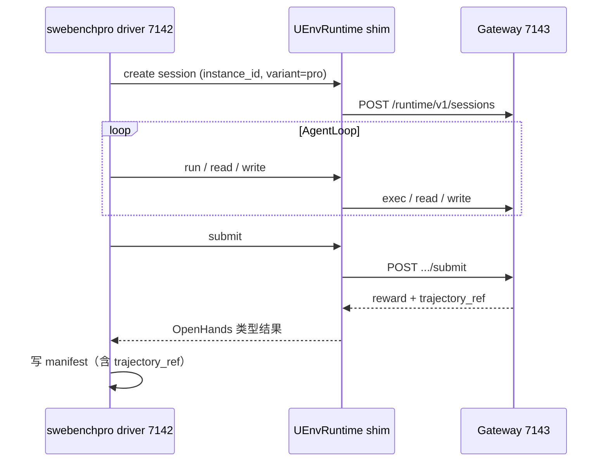

# OpenHands 官方框架接入方案（冻结）

> **文档版本**：v1.1（收束为单一推荐方案）  
> **日期**：2026-06-25  
> **状态**：**方案冻结**，待 7142 实施  
> **关联**：`260618-swe-bench-env-hub-worker-plan.md` §5.3、`260624-swe-bench-pro-7143-联调报告.md`、`260625-swe-pro-trajectory-capture-architecture-discussion.md`、`integrations/openhands/README.md`、`secrets/README.md`

---

## 1. 唯一推荐方案（冻结）

**在 7142 部署 OpenHands 官方 Benchmark + Agent SDK；7143 Worker 只暴露 Runtime Gateway URL；中间用本仓 `UEnvRuntime` shim 对接。**

```text
┌─ 7142（10.10.20.142）────────────────────────────────────────┐
│  OpenHands/benchmarks  →  benchmarks/swebenchpro/  driver     │
│  Software Agent SDK      →  官方 AgentLoop + LLM（OpenRouter）  │
│  integrations/openhands/uenv_runtime/                          │
│    UEnvRuntime(Runtime)  →  UEnvGatewayClient  →  HTTP         │
│  本地仅保存 run manifest（reward + trajectory_ref）             │
└────────────────────────────┬───────────────────────────────────┘
                             │ http://10.10.20.143:28999  X-API-Key
┌────────────────────────────▼───────────────────────────────────┐
│  7143（10.10.20.143）— 已实现，本方案不改 Worker 二进制         │
│  runtime_gateway :28999 → SweInstancePool → Pro grader         │
│                         → TrajectoryStore → GET /trajectories  │
└────────────────────────────────────────────────────────────────┘
         Hub 8.130.95.176：Pro catalog 元数据 only（不下发 OpenHands）
```

| 决策点 | 冻结值 |
|--------|--------|
| OpenHands 装在哪 | **7142** 独立 venv，与 VeRL / Worker **分进程** |
| 沙箱谁提供 | **7143** Gateway（7142 **不** pull Pro 容器、**不** docker exec） |
| Benchmark 入口 | **`OpenHands/benchmarks`** 的 **`benchmarks/swebenchpro/`** |
| Runtime 对接 | 本仓 **`UEnvRuntime` 子类化 SDK `Runtime`**，底层 **`UEnvGatewayClient` 不变** |
| LLM | **7142 云端 API**（OpenRouter 等）；不与 Worker `llm.env` 混用 |
| 轨迹 | 真值在 **7143**；7142 只存 **`TrajectoryRef`**，需要时 GET Worker |
| Hub / Server | **不参与** OpenHands 安装；OpenHands 路径 **不经** `DispatchEpisode` |

**不采用的方案（一笔带过）**：在 7143 Worker 内装 openhands；Hub 下发版本；继续以 `run_pro_agent.py` 作为主 driver；pin `OpenHands/OpenHands` main（app_server / runtime-api 与 UEnv Gateway 契约不一致，需额外协议层）。

---

## 2. 现状与缺口

### 2.1 7143 已就绪（Phase 0 完成）

- Gateway 全生命周期 + Pro grader：gold **reward=1.0**（JS / Python）
- TrajectoryStore + `GET /runtime/v1/trajectories/{id}`
- `UEnvGatewayClient` + duck-type `UEnvRuntime`（零 `import openhands`）

### 2.2 唯一缺口

7142 **没有**官方 OpenHands 进程 → 无法用 **官方 swebenchpro driver + 多轮 AgentLoop** 跑 Pro；当前 `run_pro_agent.py` / `run_swebench.py` 仅为 UEnv 自写 smoke，**不作为生产评测路径**。

### 2.3 本方案不动的代码

| 位置 | 策略 |
|------|------|
| `uenv-worker/runtime_gateway/` | **不改** |
| `uenv-worker/swe/*`（pool / grader / trajectory） | **不改** |
| `uenv_runtime/client.py` | **保留** |
| `run_swebench.py` | 保留为 **无 OpenHands 依赖** 的 CI 回归 |
| `run_pro_agent.py` | **废弃**（由官方 driver 替代） |

**唯一代码增量**：`integrations/openhands/uenv_runtime/runtime_official.py`（SDK `Runtime` 子类 → 委托 `UEnvGatewayClient`）。

---

## 3. Pin 版本（冻结）

只 pin **一条**依赖链，实施时写入 `integrations/openhands/PIN.md`：

| 组件 | Pin | 获取方式 |
|------|-----|----------|
| Benchmark | [`OpenHands/benchmarks`](https://github.com/OpenHands/benchmarks) | clone **`main`**，记录 **git SHA**；若有 release tag 带 SDK SHA 则优先用 tag |
| Agent SDK | benchmarks 仓库 **锁定的 Software Agent SDK 版本** | 读 benchmarks 根目录 `pyproject.toml` / README / CI 中的 **SDK SHA**，pip 或 git 安装 **同一 SHA** |
| UEnv 适配 | 本仓 `integrations/openhands/` | `UEnvGatewayClient` + 新增 `UEnvRuntime` shim |
| Gateway URL | `http://10.10.20.143:28999` | 7142→7143 **内网**；`TrajectoryRef` 对外 URL 仍用 7143 已配置的 `UENV_SWE_GATEWAY_PUBLIC_URL`（公网 `28099`） |

**为何选这条链**：OpenHands 已将 SWE-bench / **SWE-bench Pro** 迁到独立 benchmarks 仓并对接 Software Agent SDK；Pro 与社区 leaderboard 口径一致；UEnv Gateway 语义等价于 SDK 所需的 **external / remote runtime**，只需 shim，**无需**改 Worker 协议，也**无需** pin 经典 monolith（`evaluation/benchmarks/swe_bench`）或新版 app_server main。

升级 OpenHands 时：更新 SHA → 跑 **1 条 Pro gold** + **1 条 Pro LLM smoke** → 对比 reward 与 trajectory step 数。

---

## 4. 网络与配置

### 4.1 地址

| 用途 | URL |
|------|-----|
| 7142 调用 Gateway（**主路径**） | `http://10.10.20.143:28999` |
| 外网 / TrajectoryRef 回查 | `http://219.147.100.43:28099`（映射本机 28999） |
| Hub catalog（可选） | `http://8.130.95.176:8088` |

7142 与 7143 同宿主机双 VM，**内网优先**。

### 4.2 7142 环境变量

| 变量 | 值 |
|------|-----|
| `UENV_GATEWAY` | `http://10.10.20.143:28999` |
| `UENV_GATEWAY_API_KEY` | 与 7143 Pro Gateway 一致（见 deploy yaml，勿入仓） |
| `UENV_BENCHMARK_VARIANT` | `pro` |
| LLM | 7142 独立配置（如 `OPENROUTER_API_KEY` + model name） |
| 实例 catalog | `config/swe/pro-python-smoke.json` 或 Hub 导出 |

### 4.3 7143 Worker（已有，仅确认）

- `runtime_gateway.listen: 0.0.0.0:28999`
- `UENV_SWE_ARTIFACT_DIR`、`UENV_SWE_GATEWAY_PUBLIC_URL`、`UENV_SWE_EXTRA_CATALOG`
- **不**安装 `openhands` 包

---

## 5. 运行时行为



**Gateway 契约**（7142 对接面，**不变**）：

- `POST /runtime/v1/sessions` — create
- `POST .../exec|read|write` — Agent 步
- `POST .../submit` — 评测，返回 `trajectory_ref`
- `GET /runtime/v1/trajectories/{id}` — 逐步轨迹（真值在 7143）

Pro 工作区 **`/app`** 由 Gateway / grader 侧决定；shim **不**硬编码 `/testbed`。

**轨迹**：7142 在 run 结束保存 ref 三字段即可（`trajectory_id`、`gateway_base_url`、`worker_id`）；step 级 body 一律向 7143 GET。

---

## 6. 实施步骤

| 步骤 | 位置 | 内容 | 验收 |
|------|------|------|------|
| **1** | 7142 | venv + clone `OpenHands/benchmarks` @ SHA + 安装锁定 SDK | `pip list` 与 `PIN.md` 一致 |
| **2** | 本仓 | 实现 `runtime_official.py`：`UEnvRuntime(Runtime)` → `UEnvGatewayClient` | 单测 + mock Runtime 接口 |
| **3** | 7142 | 配置 `UENV_GATEWAY` / API key / LLM；注册 shim 为 swebenchpro 的 runtime | — |
| **4** | 7142→7143 | 跑 **1 条 Pro gold**（官方 driver） | reward=1.0 |
| **5** | 7142→7143 | 跑 **1 条 Pro LLM**（官方 AgentLoop） | 有效 `trajectory_ref`；GET 轨迹 step 完整 |
| **6** | 7142 | `scripts/deploy-openhands-7142.sh` + run 输出 `/var/log/uenv/openhands-runs/` | 可重复部署 |
| **7** | 文档 | 更新 `260624-swe-bench-pro-7143-联调报告.md` §7142 官方 OpenHands | — |

7143 Worker **无需发版**；步骤 1–5 可并行准备 7142 与本仓 shim。

---

## 7. 验收标准

1. 7142 仅通过 **HTTP** 使用 7143 沙箱，无本地容器 exec 路径。
2. **官方** `benchmarks/swebenchpro` driver + **官方** AgentLoop 跑通 Pro smoke 实例。
3. Pro gold → **reward=1.0**；LLM run → submit 成功 + **trajectory_ref** 可 GET。
4. `PIN.md` 记录 benchmarks SHA + SDK SHA + Gateway URL。
5. `run_swebench.py` duck-type 回归仍通过（CI 不依赖 OpenHands 包）。

---

## 8. 边界

| 主题 | 策略 |
|------|------|
| VeRL 训练 | 7142 adapter → 8.130.86.71 → 7143 gRPC；与 Gateway **并行** |
| OpenReward | 官方托管；Worker **不**实现 |
| Hub | catalog only |
| 镜像 | **7143** pull；7142 不 pull Pro 镜像 |
| GPU | LLM 走云端；避免与 VeRL 争卡 |

---

## 9. 风险

| 风险 | 缓解 |
|------|------|
| benchmarks ↔ SDK 版本漂移 | 双 SHA pin；升级必跑 gold 回归 |
| SDK Runtime API 与 Gateway 字段差异 | 全部收敛在 `runtime_official.py` |
| LLM patch 质量 | 模型/Agent 配置问题；官方多轮 loop 可修复；与 Gateway 无关 |

---

## 10. 相关文档

| 文档 | 内容 |
|------|------|
| 本文 | OpenHands 官方接入 **唯一推荐方案** |
| `260625-swe-pro-trajectory-capture-architecture-discussion.md` | 轨迹 Worker 本地真值 |
| `260624-swe-bench-pro-7143-联调报告.md` | 7143 Gateway 联调证据 |
| `integrations/openhands/README.md` | 当前 duck-type 说明（shim 落地后更新） |

---

## 11. 变更记录

| 版本 | 日期 | 说明 |
|------|------|------|
| v1.0 | 2026-06-25 | 初版：7142 部署 + 多路线讨论 |
| v1.1 | 2026-06-25 | **收束**：删除 A/B/C 并列；冻结 benchmarks+SDK 单链 + UEnvRuntime shim + 7143 URL |
