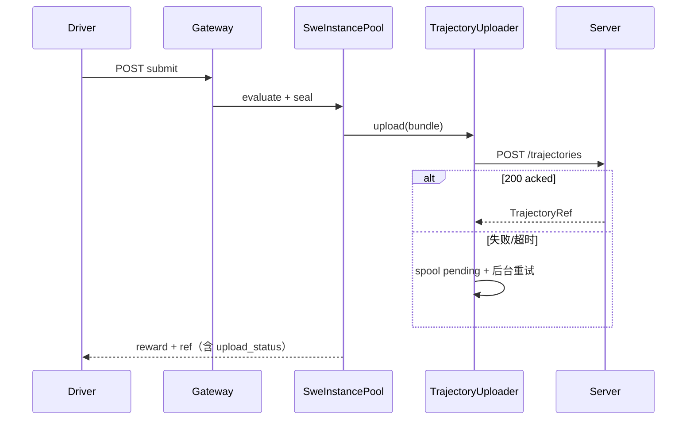

# SWE 轨迹存储 — Server 统一聚合方案（冻结）

> **文档版本**：v2.2（最终版）  
> **日期**：2026-06-25  
> **状态**：**方案冻结**，待实施  
> **取代**：`260625-swe-pro-trajectory-capture-architecture-discussion.md` 中「Worker 本地真值 / Server 不参与」的存储层决策  
> **关联**：`260625-openhands-official-integration-plan.md`、`260624-swe-bench-pro-7143-联调报告.md`、`260618-swe-bench-env-hub-worker-plan.md`、`secrets/README.md`

---

## 1. 冻结决策总览

| 决策点 | 冻结值 |
|--------|--------|
| 轨迹 canonical 存储 | **混合**：**SQLite 索引** + **本机文件 body** |
| body 存放 | `${data_dir}/bodies/{trajectory_id}.json`（大 JSON **不落库**） |
| 索引库 | **独立** `trajectory.db`（与可视化 `events.db` **不共库**） |
| 写入顺序 | **先 blob 落地 → 再 INSERT 索引**（避免 DB 有行、文件缺失） |
| 查询 API | **仅 Server**；`upload_status=acked` 且 `body_present=1` 方可 GET body |
| 上传时机 | submit **尝试同步上传**；失败 **不阻断 reward**；spool 重试 + drain |
| Worker 本地 | upload ack 后删 spool；**不**长期保留 body |
| 评测作业聚合 | `run_id` / `batch_id` / `correlation_id` 写入索引（OpenHands 路径必填 `run_id`） |
| 传输 | HTTP REST；可选 **`Content-Encoding: gzip`** |
| 进程部署 | **合入 `uenv-adapter-core`**；gRPC `:8088` + HTTP `:8077` |
| 鉴权 | 默认共用 `X-Trajectory-Token`；**预留** upload / read 分 token |
| ReportResult | ack 后写 `episode_results`；`trajectory_id` 来自 `EpisodeResult` 字段 |
| Worker WAL | Worker 本地直至 ack；**不上传** `.wal` 到 Server |
| rollout | `trajectory_upload.enabled=false` 保留旧路径（7143 过渡） |
| 并发设计目标 | Server **≤ 32 并发 upload**（SQLite WAL + 单写连接池） |

```text
┌─ OpenHands driver ──────────────────────────────────────────────┐
│  启动生成 run_id → 注入 session/bundle                            │
│  manifest 存 TrajectoryRef；GET body 只连 Server :8077            │
└────────────────────────────┬────────────────────────────────────┘
                             │ POST TrajectoryBundle (+ gzip 可选)
┌────────────────────────────▼────────────────────────────────────┐
│  Worker（ephemeral）                                               │
│  submit → evaluate → seal → upload（失败仍返回 reward + pending ref）│
└────────────────────────────┬────────────────────────────────────┘
                             │
┌────────────────────────────▼────────────────────────────────────┐
│  Server — uenv-adapter-core                                       │
│  trajectory.db（索引） + bodies/*.json（正文）                     │
│  ReportResult ack → episode_results（摘要 + trajectory_id）       │
└───────────────────────────────────────────────────────────────────┘
```

---

## 2. 存储架构（SQLite + 文件）

### 2.1 设计原则

| 层级 | 技术 | 存什么 |
|------|------|--------|
| **索引层** | `trajectory.db`（SQLite WAL） | 元数据、过滤字段、`body_path`、checksum、`upload_status`、`body_present` |
| **正文层** | `bodies/*.json` | 完整 `TrajectoryBundle` |
| **控制面摘要** | 同库 `episode_results` | `ReportResult` ack 摘要 + `trajectory_id` 指针 |
| **可视化事件** | **独立** `events.db` | 仅逻辑关联 `correlation_id` / `trajectory_id`，**不** ingest step body |
| **Worker WAL** | Worker 本地 `.wal` | 投递缓冲；不进 Server |

### 2.2 目录与磁盘布局（Server）

**数据目录单独挂载**（推荐独立云盘 → `/var/lib/uenv/trajectories`；与系统盘分离，便于快照）：

```text
${trajectory.data_dir}/
  trajectory.db              # SQLite（+ -wal / -shm）
  bodies/{trajectory_id}.json
  tmp/{trajectory_id}.json.partial
  quarantine/                # reconcile 移入的孤儿 blob
```

### 2.3 SQLite 表结构

#### `trajectories`

| 列 | 类型 | 说明 |
|----|------|------|
| `trajectory_id` | TEXT PK | |
| `worker_id` | TEXT NOT NULL | |
| `instance_id` | TEXT NOT NULL | |
| `benchmark_variant` | TEXT NOT NULL | |
| `session_id` | TEXT NOT NULL | |
| `episode_id` | TEXT NULL | native 路径；OpenHands 通常为 NULL |
| `run_id` | TEXT NOT NULL | **一次 benchmark / 评测作业 ID**（driver 生成） |
| `batch_id` | TEXT NULL | VeRL batch；OpenHands 可 NULL |
| `correlation_id` | TEXT NULL | 与训练 run / 可视化对齐 |
| `gateway_base_url` | TEXT NOT NULL | 溯源 |
| `step_count` | INTEGER NOT NULL | |
| `reward` | REAL NOT NULL | |
| `resolved` | INTEGER NOT NULL | 0/1 |
| `sealed_at_ms` | INTEGER NOT NULL | |
| `body_path` | TEXT NOT NULL | 相对 `data_dir` |
| `body_sha256` | TEXT NOT NULL | |
| `body_bytes` | INTEGER NOT NULL | |
| `upload_status` | TEXT NOT NULL | `acked` \| `failed`（Server 侧仅入库 acked；failed 供 reconcile 标记） |
| `body_present` | INTEGER NOT NULL | 0/1；GET 要求 =1 |
| `created_at_ms` | INTEGER NOT NULL | |

```sql
CREATE INDEX idx_trajectories_run      ON trajectories(run_id, sealed_at_ms DESC);
CREATE INDEX idx_trajectories_instance ON trajectories(instance_id, sealed_at_ms DESC);
CREATE INDEX idx_trajectories_worker   ON trajectories(worker_id, sealed_at_ms DESC);
CREATE INDEX idx_trajectories_episode  ON trajectories(episode_id) WHERE episode_id IS NOT NULL;
CREATE INDEX idx_trajectories_batch    ON trajectories(batch_id) WHERE batch_id IS NOT NULL;
CREATE INDEX idx_trajectories_corr     ON trajectories(correlation_id) WHERE correlation_id IS NOT NULL;
```

#### `episode_results`

| 列 | 类型 | 说明 |
|----|------|------|
| `episode_id` | TEXT NOT NULL | |
| `attempt_id` | INTEGER NOT NULL | |
| `worker_id` | TEXT NOT NULL | |
| `status` | TEXT NOT NULL | |
| `total_reward` | REAL | |
| `total_steps` | INTEGER | |
| `trajectory_id` | TEXT NULL | 逻辑 FK → `trajectories` |
| `trajectory_storage_url` | TEXT NULL | |
| `result_checksum` | TEXT NOT NULL | |
| `acked_at_ms` | INTEGER NOT NULL | |

```sql
PRIMARY KEY (episode_id, attempt_id, worker_id)
```

### 2.4 TrajectoryBundle 扩展字段（`uenv-common`）

在原有 bundle 上 **增加**（不影响 steps / artifact）：

```json
{
  "trajectory_id": "...",
  "run_id": "run-20260625-pro-smoke-001",
  "batch_id": null,
  "correlation_id": null,
  "episode_id": null,
  "session_id": "...",
  "instance_id": "...",
  "steps": [ ... ],
  "artifact": { ... }
}
```

| 字段 | 谁填 | 必填 |
|------|------|------|
| `run_id` | OpenHands driver / Worker executor | **是** |
| `batch_id` | VeRL adapter | native 路径建议填 |
| `correlation_id` | VeRL / Server dispatch | 可选 |
| `episode_id` | Worker（native DispatchEpisode 上下文） | native 路径 **建议填** |

### 2.5 TrajectoryRef（API 响应）

```json
{
  "trajectory_id": "trj-...",
  "worker_id": "worker-wlcb-01-pro",
  "gateway_base_url": "http://10.x.x.x:28999",
  "storage_url": "http://10.x.x.x:8077",
  "storage_kind": "server",
  "run_id": "run-20260625-pro-smoke-001",
  "instance_id": "...",
  "benchmark_variant": "pro",
  "session_id": "sess-...",
  "step_count": 42,
  "reward": 1.0,
  "resolved": true,
  "sealed_at_ms": 1719300123456,
  "upload_status": "acked"
}
```

`upload_status` 在 Worker submit 响应中：`acked` | `pending` | `failed`（Worker 侧 spool 状态；Server 入库成功即 acked）。

### 2.6 Worker 本地 spool

```text
${UENV_SWE_ARTIFACT_DIR}/spool/
  pending/{trajectory_id}.json
  failed/{trajectory_id}.json
```

---

## 3. 双路径关联与写入顺序（冻结）

### 3.1 OpenHands / Gateway 路径

```text
driver 生成 run_id
  → create_session（run_id 存入 SweSession 上下文）
  → exec/read/write/submit
  → seal TrajectoryBundle（含 run_id）
  → POST Server
  → SubmitResp：reward + trajectory_ref（upload_status）
  → driver manifest 写 ref
```

**无** `episode_id`、**无** `ReportResult`、**无** `episode_results` 行。

### 3.2 VeRL / DispatchEpisode 路径

```text
Server 分配 episode_id（+ batch_id / correlation_id 随 EpisodeRequest）
  → Worker 执行 → submit/upload trajectory（bundle.episode_id 填入）
  → trajectory POST Server 成功 → Worker 得到 trajectory_id
  → EpisodeResult 填充 trajectory_id + trajectory_storage_url
  → ReportResult → Server ack
  → episode_results UPSERT（含 trajectory_id）
```

**顺序冻结**：**先 trajectory upload 成功（或 spool pending），再 ReportResult**。WAL 重放时若 trajectory 已 acked，ReportResult 仍带同一 `trajectory_id`。

### 3.3 跨路径查询

| 查询意图 | SQL 维度 |
|----------|----------|
| 某次 OpenHands 评测全部轨迹 | `WHERE run_id = ?` |
| 某 VeRL batch | `WHERE batch_id = ?` |
| 单 instance 历史 | `WHERE instance_id = ?` |
| episode 控制面 + 轨迹 | `episode_results` JOIN `trajectories` ON `trajectory_id` |

---

## 4. Server 写入与读取

### 4.1 POST 上传（blob 优先，修正 orphan）

```text
1. 解析 TrajectoryBundle（支持 Content-Encoding: gzip）
2. 校验 max_body_bytes、必填 run_id
3. 流式写 tmp/{id}.json.partial → fsync
4. 计算 body_sha256、body_bytes
5. atomic rename tmp → bodies/{id}.json
6. BEGIN TRANSACTION
7.   INSERT INTO trajectories (..., upload_status='acked', body_present=1)
      — PK 冲突：比较 body_sha256 → 相同 duplicate / 不同 409；ROLLBACK 不删已存在 body
8. COMMIT
9. 若 INSERT 失败（非 duplicate）：DELETE bodies/{id}.json
```

**对外可见性**：仅 `upload_status='acked' AND body_present=1` 的轨迹可 GET/LIST 出正文。

**幂等**：同 `trajectory_id` + 同 `body_sha256` → `duplicate: true`；不同 hash → **409**。

### 4.2 GET / LIST

| 操作 | 规则 |
|------|------|
| GET `/{id}` | SQL → 校验 `body_present` → 读文件；缺文件 → 500 + 触发 reconcile 指标 |
| LIST | SQL 过滤 + `run_id` / `batch_id` / `instance_id` / `worker_id` / `since_ms`；**仅返回 acked 行** |
| HEAD | PK 存在且 acked |

### 4.3 gzip

| 方向 | 支持 |
|------|------|
| POST | 客户端 `Content-Encoding: gzip`；Server 解压后按 §4.1 写盘 |
| GET | 客户端 `Accept-Encoding: gzip` 可选压缩响应 |

### 4.4 留存删除（`retention_days > 0`）

定时任务（或启动时 daily tick）：

```text
SELECT trajectory_id, body_path FROM trajectories
  WHERE sealed_at_ms < cutoff AND upload_status='acked'
→ DELETE 对应 bodies 文件
→ DELETE FROM trajectories WHERE trajectory_id IN (...)
```

`retention_days: 0` = 不自动删除。删除 **先文件后 SQL**，文件删失败则跳过该行并告警。

### 4.5 一致性修复（reconcile）

| 触发 | 动作 |
|------|------|
| 进程启动 | 扫描 `bodies/` 无索引 → 移入 `quarantine/` 或补 INSERT（运维配置） |
| 定时（如 1h） | 索引 `body_present=1` 但文件缺失 → `body_present=0` + 告警；或删幽灵行 |
| Admin | `POST /control/v1/trajectories/reconcile`（需 read token 或 admin token）→ 返回修复计数 |

---

## 5. Server API（冻结）

HTTP **`:8077`**。

| 方法 | 路径 | 鉴权 | 行为 |
|------|------|------|------|
| POST | `/control/v1/trajectories` | upload token | §4.1 |
| GET | `/control/v1/trajectories/{id}` | read token | §4.2 |
| GET | `/control/v1/trajectories` | read token | Query：`run_id`、`batch_id`、`instance_id`、`worker_id`、`episode_id`、`since_ms`、`limit` |
| GET | `/control/v1/episodes/{episode_id}/results` | read token | `episode_results` + LEFT JOIN `trajectories` |
| HEAD | `/control/v1/trajectories/{id}` | read token | |
| POST | `/control/v1/trajectories/reconcile` | admin token | §4.5 |
| GET | `/control/v1/trajectories/health` | 无 | `db`、`data_dir`、磁盘可用空间 |

**鉴权配置**：

```yaml
trajectory:
  auth_token_env: "UENV_TRAJECTORY_TOKEN"           # 默认：upload+read 共用
  upload_token_env: "UENV_TRAJECTORY_UPLOAD_TOKEN"  # 可选；未设则回退共用 token
  read_token_env: "UENV_TRAJECTORY_READ_TOKEN"
  admin_token_env: "UENV_TRAJECTORY_ADMIN_TOKEN"    # reconcile
```

---

## 6. Worker 运行时行为

### 6.1 submit 与 upload 解耦

```text
evaluate 成功 → seal bundle → 尝试 upload
  ├─ upload 成功 → upload_status=acked，删 spool
  └─ upload 失败 → upload_status=pending，写 spool，后台重试
→ 始终返回 SubmitResp（reward / resolved / per_test 不受 upload 影响）
→ trajectory_ref 始终包含 storage_url + trajectory_id（即使 pending）
```

**超时**：`trajectory_upload.timeout_sec` 默认 **120**（可配至 600）；超时视为失败 → pending，**不**让 submit HTTP 504（除非 evaluate 本身超时）。

### 6.2 drain

SIGTERM / `DrainCommand`：停新 session → 重试 spool/pending → grace 超时后退出（failed 留盘告警）。

### 6.3 Gateway 与 rollout

| `trajectory_upload.enabled` | 行为 |
|-----------------------------|------|
| `false` | **过渡**：本地 TrajectoryStore + Gateway GET（7143 现状） |
| `true` | POST Server；**移除** Gateway GET；ref 必含 `storage_url` |

### 6.4 序列图



---

## 7. 代码调整清单

### 7.1 新建

| 路径 | 内容 |
|------|------|
| `uenv-common/src/trajectory.rs` | 类型 + `run_id` 等扩展字段 |
| `uenv-server/src/trajectory/{mod,db,blob,http,reconcile,retention}.rs` | 存储、API、修复、留存 |
| `uenv-server/src/trajectory/migrate.sql` | §2.3 schema |
| `uenv-server/src/episode_results.rs` | ReportResult upsert |
| `uenv-worker/src/swe/trajectory_upload.rs` | gzip、spool、drain、超时 |
| `uenv-worker/src/swe/run_context.rs` | session 级 `run_id` / `episode_id` 上下文 |
| `scripts/deploy-trajectory-server.sh` | 数据盘挂载检查、init DB |
| 测试 | `trajectory_db.rs`、`trajectory_http.rs`、`trajectory_orphan.rs`、`trajectory_upload.rs` |

### 7.2 修改

| 路径 | 调整 |
|------|------|
| `uenv-server/src/control_plane.rs` | ack → `episode_results::upsert` |
| `uenv-worker/src/swe/session.rs` | 携带 `run_id`；bundle 扩展字段 |
| `uenv-worker/src/swe/instance_pool.rs` | submit 不阻塞于 upload 失败 |
| `uenv-worker/src/runtime_gateway/mod.rs` | `enabled=true` 时删 GET |
| `uenv-worker/src/episode/executor.rs` | native 路径填 `episode_id` + upload + ReportResult 字段 |
| `uenv-bridge/core/src/main.rs` | HTTP :8077、metrics |
| `proto/uenv/v1/episode.proto` | `trajectory_id`、`trajectory_storage_url` |
| `integrations/openhands/run_swebenchpro_official.py` | 生成 `run_id`、manifest、Server GET |
| `integrations/openhands/uenv_runtime/client.py` | `TrajectoryClient` + gzip |

### 7.3 观测指标（Prometheus）

| 指标 | 说明 |
|------|------|
| `uenv_trajectory_upload_total{status}` | Server POST 计数 |
| `uenv_trajectory_body_bytes` | histogram |
| `uenv_trajectory_spool_pending` | Worker gauge |
| `uenv_trajectory_orphan_total` | reconcile 修复计数 |
| `uenv_trajectory_get_errors_total{reason}` | 含 `body_missing` |

---

## 8. 配置

### 8.1 Server（`config/uenv-server.deploy-wlcb.yaml`）

```yaml
trajectory:
  enabled: true
  http_listen: "0.0.0.0:8077"
  data_dir: "/var/lib/uenv/trajectories"      # 建议独立数据盘挂载点
  db_path: "/var/lib/uenv/trajectories/trajectory.db"
  max_body_bytes: 16777216
  retention_days: 0
  reconcile_interval_sec: 3600
  public_url: "http://<server-internal-ip>:8077"   # Worker 上传用内网
  public_url_external: "http://<optional-nat>:8077" # driver 外网 GET（可选）
  sqlite_wal: true
  auth_token_env: "UENV_TRAJECTORY_TOKEN"
  upload_token_env: "UENV_TRAJECTORY_UPLOAD_TOKEN"
  read_token_env: "UENV_TRAJECTORY_READ_TOKEN"
  admin_token_env: "UENV_TRAJECTORY_ADMIN_TOKEN"
```

### 8.2 Worker（`config/uenv-worker.deploy-wlcb-swe-pro.yaml`）

```yaml
trajectory_upload:
  enabled: true
  endpoint: "http://<server-internal-ip>:8077"
  token_env: "UENV_TRAJECTORY_UPLOAD_TOKEN"    # 未设则用 UENV_TRAJECTORY_TOKEN
  spool_dir: "/var/lib/uenv/trajectory-spool"
  delete_local_after_ack: true
  max_retries: 10
  retry_base_ms: 1000
  timeout_sec: 120
  gzip: true

runtime_gateway:
  enabled: true
  listen: "0.0.0.0:28999"
  capacity: 4
  api_key: "<gateway-secret>"

worker:
  id: "worker-wlcb-01-pro"
  # run_id 默认由 driver HTTP Header X-UEnv-Run-Id 传入；缺省则 Worker 拒绝 submit 上传
```

| 环境变量 | 说明 |
|----------|------|
| `UENV_TRAJECTORY_TOKEN` / `UPLOAD` / `READ` | 见 §5 |
| `UENV_SWE_ARTIFACT_DIR` | Worker spool 根目录 |
| `UENV_SWE_GATEWAY_PUBLIC_URL` | 写入 ref.gateway_base_url |

**OpenHands driver** 需在请求链路注入：

```bash
export UENV_RUN_ID="run-$(date +%Y%m%d-%H%M%S)-pro-smoke"
# 或在 run_swebenchpro_official.py 内 uuid 生成，经 create_session 传到 Worker
```

---

## 9. 部署与硬件（冻结）

| 角色 | 规格 | 存储 |
|------|------|------|
| **Server 轨迹中心** | 32 vCPU / 64 GB / **512 GB 数据盘** / 20 Mbps | `trajectory.db` + `bodies/` 同盘；**≥ 300 GiB** 给 bodies |
| **Worker 测试** | 8 vCPU / 32 GB / 256 GB / 20 Mbps | 镜像 + spool；ack 后无轨迹 body |

**备份**：对 **数据盘** 做快照（DB + bodies 一致）。**SQLite 并发**：设计目标 ≤32 并行 POST；超出需水平分片（后续，不在本版）。

---

## 10. 边界

| 主题 | 策略 |
|------|------|
| 大 JSON | 仅 `bodies/`；禁止 SQLite BLOB |
| Worker WAL | 不上传；Server 只存 `episode_results` 摘要 |
| 可视化 | **独立** `events.db`；逻辑引用 `trajectory_id` / `run_id` |
| Hub | catalog only |
| OSS | 后续 `body_path` 可改 `oss://`；索引列不变 |

---

## 11. 验收标准

1. POST：DB 行与 `bodies/{id}.json` 同时存在；**无**「有行无文件」。
2. LIST 按 `run_id` 聚合 OpenHands 一次评测的全部轨迹。
3. upload 失败：submit 仍返回 **reward=1.0**（gold）+ `upload_status=pending`；spool 恢复后 ack。
4. 删 Worker 本地全部文件后 Server GET 仍成功。
5. duplicate / 409 行为符合 §4.1。
6. native 路径：`episode_results.trajectory_id` 与 `trajectories` 一致。
7. reconcile 可修复「文件在、行无」与「行在、文件无」。
8. gzip POST/GET 往返 bundle 一致。
9. `enabled=false` 时 7143 旧 Gateway GET 仍可用。
10. 并发 capacity=4：4 路 upload + 4 路 GET 无丢数。

---

## 12. 相关文档

| 文档 | 关系 |
|------|------|
| `260625-swe-pro-trajectory-capture-architecture-discussion.md` | step 模型有效；存储层由本文取代 |
| `260625-openhands-official-integration-plan.md` | 轨迹真值改 Server；需补 `run_id` |
| `UEnv可视化实现规划v1.0.md` | **独立** events.db |

---

## 13. 变更记录

| 版本 | 日期 | 说明 |
|------|------|------|
| v1.0 | 2026-06-25 | 评估稿 |
| v2.0 | 2026-06-25 | Server canonical、纯目录 |
| v2.1 | 2026-06-25 | SQLite + 文件 body |
| v2.2 | 2026-06-25 | **补漏洞**：blob 优先写入、`run_id`、双路径顺序、upload 与 submit 解耦、reconcile/retention/gzip、分 token、rollout 开关、独立 events.db、Worker 配置全文、metrics |
