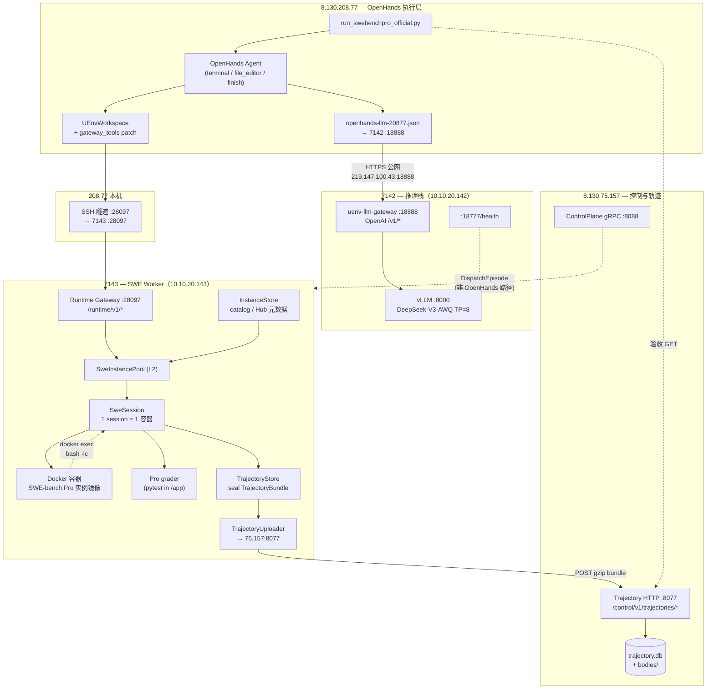
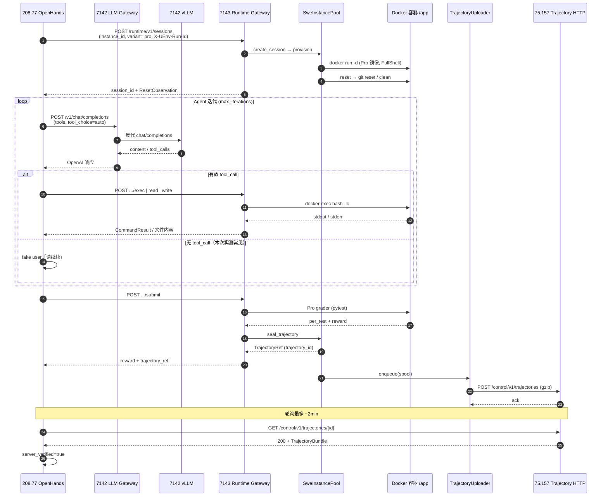
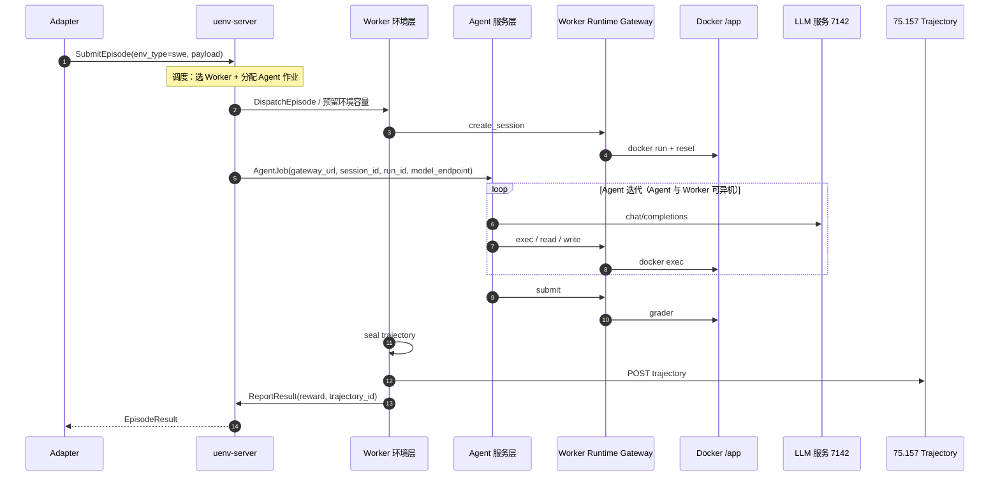

# 本地 vLLM DeepSeek-V3 + OpenHands SWE 测试报告

> **日期**：2026-06-28  
> **范围**：7142 本地 `DeepSeek-V3-0324-AWQ` 推理栈 + 208.77 OpenHands SWE-bench Pro + 7143 Gateway + 75.157 轨迹 Server  
> **关联**：`Docs/260626-deepseek-v3-fp8-7142-deployment-plan.md`、`Docs/260627-openhands-swe-trajectory-chain-audit.md`  
> **结论摘要**：**推理基础设施与全链路轨迹已打通**；**LLM Agent 解题能力未达标**（reward=0，tool call 质量差），需后续调优。

---

## 1. 测试目标

| 层级 | 目标 | 判定标准 |
|------|------|----------|
| **L1 推理** | 7142 上 vLLM 加载 AWQ 模型，支持 chat + tool_calls | Gateway 冒烟 `PASS: tool_calls present` |
| **L2 网关** | `uenv-llm-gateway :18888` 正确反代 vLLM | health OK；`base_url` 无 `/v1/v1/` 双前缀 |
| **L3 执行** | 208.77 OpenHands **llm 模式**调用 7142 LLM，经 7143 跑 Pro smoke | 任务跑完并 submit |
| **L4 轨迹** | Worker seal → 上传 75.157 → Server GET 可读 | `server_verified=true` |

---

## 2. 测试环境与拓扑

本节说明本次联调涉及的**完整系统结构**（静态架构）与 **llm 模式一次评测** 的**执行顺序**（动态时序）。推理（7142）与 SWE 执行（7143）是**两条独立 HTTP 通道**，在 208.77 的 OpenHands 进程内汇合。  
> 相对目标架构（Adapter → Server → Worker 派发、OpenHands 仅作 Agent 服务）的差异与调整项见 **§8**。

### 2.1 节点清单

| 节点 | 访问方式 | 角色 |
|------|----------|------|
| **7142** | `ssh -p 7142 root@219.147.100.43` | vLLM 推理后端 + `uenv-llm-gateway`（`:18888` / `:18777`） |
| **7143** | `ssh -p 7143 root@219.147.100.43` | `uenv-worker` Runtime Gateway（`:28097`）、SWE 容器池、轨迹 seal/上传 |
| **208.77** | jump：`ssh -J root@219.147.100.43:7142 root@8.130.208.77` | OpenHands 官方 SDK 执行机；LLM 走公网 `:18888`，Runtime 走本地隧道 `:28097` |
| **75.157** | 内网 `8.130.75.157` | 轨迹聚合 HTTP（`:8077`）；ControlPlane gRPC（`:8088`） |
| **95.176 Hub** | 内网（可选） | Pro catalog **元数据**；不参与轨迹存储、不跑 grader |

**模型**：`cognitivecomputations/DeepSeek-V3-0324-AWQ`（7142 `/data/models/DeepSeek-V3-0324-AWQ`）  
**评测实例**：qutebrowser Pro smoke（`instance_qutebrowser__qutebrowser-…`；workspace **`/app`**）

### 2.2 完整系统架构（静态结构）

下图按**职责分层**描述当前联调态下的组件与依赖。OpenHands **不在本机起 SWE 容器**；7142 **不参与** SWE grader 与轨迹 seal。



**分层对照（与仓库代码一致）**：

| 层 | 组件 | 说明 |
|----|------|------|
| **Agent** | OpenHands SDK on 208.77 | 多轮 tool loop；LLM 经 LiteLLM → 7142 |
| **L4 Gateway** | `runtime_gateway/mod.rs` | HTTP：`/runtime/v1/sessions/{id}/exec|read|write|submit` |
| **L2 Pool** | `SweInstancePool` | `session_id → SweSession`；与 native gRPC 路径共享 |
| **L1 容器** | `SweSession` + Docker | `docker run` 起 Pro 镜像；`docker exec` 执行命令 |
| **轨迹** | seal + uploader | `submit` 后封存；异步 POST Server；OpenHands 侧 GET 验收 |

### 2.3 链路执行时序（llm 模式一次评测 · **联调态**）

> **说明**：本时序以 **208.77 OpenHands 为发起点**，用于本次 7142 LLM + 轨迹 E2E 验收。目标生产态控制面时序见 **§8.4**。

以下时序对应 **`run-openhands-pro-20877.sh llm`** 成功路径（第三次 E2E：`run-oh-20260628-204306-pro-llm-vllm`）。**gold 模式**跳过 LLM 循环，直接 `git apply` gold patch 后 `submit`。



**阶段摘要**：

| 阶段 | 关键路径 | 耗时特征（本次） |
|------|----------|------------------|
| Provision | 7143 `docker run` + reset | 秒级（镜像已缓存） |
| Agent loop | 208.77 ↔ **7142** LLM | **主导耗时**；单次可达数百秒 |
| Tool 执行 | 208.77 ↔ **7143** `exec` | 每次秒级（若 model 产出 tool_call） |
| Submit + grader | 7143 容器内 pytest | 数十秒 |
| 轨迹 | seal → upload → GET 验收 | upload 异步；GET 轮询 5s 间隔 |

### 2.4 双通道与端口对照

| 通道 | 208.77 配置 | 对端 | 协议 | 用途 |
|------|-------------|------|------|------|
| **LLM** | `openhands-llm-20877.json` → `219.147.100.43:18888/v1` | 7142 | OpenAI HTTP | chat / tool_calls；**不经过 7143** |
| **Runtime** | `UENV_GATEWAY=http://127.0.0.1:28097` | 7143（隧道） | UEnv Gateway HTTP | session / exec / submit / 轨迹 ref |
| **轨迹验收** | `UENV_TRAJECTORY_ENDPOINT=http://8.130.75.157:8077` | 75.157 | Trajectory HTTP | Driver GET bundle（非 Agent 推理） |

7143 的 **Runtime Gateway（:28097）** 与 7142 的 **LLM Gateway（:18888）** 职责分离：前者管**环境实例与评测**，后者管**模型推理**；与规划文档「7143 环境 / 7142 模型」对称设计一致。

---

## 3. SWE 沙箱实现（补充）

**结论**：本次联调**未使用 OpenHands 自带 Docker/Remote Sandbox**；SWE 环境由 **7143 Worker 上的 Docker 容器**封装，OpenHands 通过 **`UEnvWorkspace` + Runtime Gateway** 远程操作容器内 `/app`。

| 项 | 本次联调取值 |
|----|--------------|
| 沙箱归属 | **UEnv Worker**（`uenv-worker/src/swe/session.rs`），非 OpenHands runtime |
| 容器引擎 | **Docker**（`UENV_SWE_RUNTIME` 默认 `docker`；7143 预置镜像在 docker 存储） |
| 实例来源 | SWE-bench **Pro 预构建镜像** + catalog（`config/swe/pro-python-smoke.json`） |
| 工作目录 | 容器内 **`/app`**（Pro variant） |
| 命令策略 | **FullShell**（`--network=bridge`）；OpenHands Pro 联调常用 |
| OpenHands 侧 | `integrations/openhands/uenv_runtime/workspace.py`：`create_session` → `exec`/`read`/`write` |
| Podman | 代码支持 `UENV_SWE_RUNTIME=podman`，与 docker **二选一**；Worker 进程级单 runtime，镜像 store **不自动互通** |

容器生命周期：`POST /sessions` → `docker run -d` → reset →（Agent `exec` 循环）→ `submit` + grader → `DELETE /sessions` 或池回收。轨迹在 **`submit` 时 seal**，与容器是否立即销毁无关。

---

## 4. 测试方法与工具

### 4.1 vLLM 版本矩阵试装

采用「单版本试装 + 批量试装」策略，在 7142 上隔离 venv 逐版本验证：

| 脚本 | 作用 |
|------|------|
| `scripts/uenv-llm-gateway/try-vllm-deepseekv3-7142.sh` | 安装指定 vLLM 版本 → 启服 → tool call 验收 |
| `scripts/uenv-llm-gateway/try-vllm-batch-7142.sh` | 批量试 0.8.3 / 0.9.0 / 0.10.2 / 0.11.0 |
| `scripts/_launch_vllm_batch.py` | 从本地上传并在 7142 后台跑 batch |

**验收项**：模型加载、`/v1/models`、简单 chat、`tool_choice=auto` 时 `tool_calls` 非空。

**安装策略（实测有效）**：

```bash
pip install vllm==0.9.0
pip install transformers==4.48.0   # 后置 pin，有依赖冲突 warning 但可运行
```

**vLLM 启动关键参数**：

```bash
VLLM_USE_V1=0
--enable-auto-tool-choice --tool-call-parser deepseek_v3
--chat-template /opt/vllm-dsv3-awq/etc/tool_chat_template_deepseekv3.jinja
--tensor-parallel-size 8 --max-model-len 32768
```

### 4.2 Gateway 冒烟与修复

| 脚本 | 作用 |
|------|------|
| `scripts/uenv-llm-gateway/smoke-test-7142.sh` | health + chat + tool call 三联测 |
| `scripts/uenv-llm-gateway/fix-gateway-baseurl-7142.sh` | 修正 `backend.base_url` 为 `http://127.0.0.1:8000` |
| `scripts/uenv-llm-gateway/test-tool-call-7142.sh` | 单独 tool call 测试 |

**修复点**：原 `base_url` 含 `/v1` 后缀导致 readiness/chat 路径变成 `/v1/v1/models` → 404；改为根 URL + `readiness_path: /v1/models`。

### 4.3 OpenHands + 轨迹 E2E

| 脚本 | 作用 |
|------|------|
| `scripts/run-openhands-pro-20877.sh llm\|gold` | 208.77 上启动官方 SDK 评测 |
| `scripts/_e2e_openhands_trajectory.py` | 远程编排：7142 冒烟 → 208.77 llm 跑数 → Server 验收 |
| `scripts/_fast_llm_trajectory.py` | 调参后快速 llm 轨迹验证（低 max_tokens + 少 iter） |
| `integrations/openhands/run_swebenchpro_official.py` | 核心驱动；内置 `_verify_server_trajectory()` |

**LLM 配置**（208.77 `/root/UEnv/config/openhands-llm-20877.json`）：

```json
{
  "model": "openai/deepseek-v3-0324-awq",
  "base_url": "http://219.147.100.43:18888/v1",
  "temperature": 0.2,
  "max_output_tokens": 512,
  "timeout": 1200,
  "request_timeout": 1200
}
```

**运行参数**：`MAX_ITERATIONS=3~8`，`UENV_GATEWAY=http://127.0.0.1:28097`，`UENV_RUN_ID=run-oh-<stamp>-pro-llm-vllm`。

### 4.4 监控与诊断

通过 Paramiko SSH（7142 jump → 208.77）远程执行：

- `pgrep` / `tail /tmp/oh-llm-vllm.log` — 任务进度
- `journalctl -u vllm-dsv3-awq` / `uenv-llm-gateway` — 延迟与 GPU 吞吐
- `nvidia-smi` — GPU 利用率
- 208.77 → 7142 直连 curl — 网络与 latency 基线

---

## 5. 测试阶段与结果

### 5.1 vLLM 版本试装

| 版本 | transformers | 结果 | 主要现象 |
|------|--------------|------|----------|
| **0.23** | 默认 | ❌ 失败 | chat template 路径缺失；AWQ `fused_qkv_a_proj` 混合量化报错 |
| **0.8.2** | 4.48.0 | ⚠️ 半通 | 模型可加载、chat OK；**无 `deepseek_v3` tool parser** → OpenHands llm 第一步 BadRequest |
| **0.8.5** | — | ❌ 未采用 | pip 依赖冲突，未稳定跑通 |
| **0.9.0** | **4.48.0**（后置 pin） | ✅ **采用** | `MODEL_READY`；`TOOL_CALL_OK`；batch 日志 `SUCCESS with vllm 0.9.0` |
| **0.10.2** | 5.x | ❌ 失败 | tokenizer `all_special_tokens_extended` 报错 |
| **0.11.0** | — | 未完整验证 | batch 在 0.9.0 成功后停止 |

### 5.2 Gateway 冒烟（vLLM 0.9.0）

| 项 | 结果 |
|----|------|
| `:18777/health` | OK |
| `:18888/v1/chat/completions` 简单 chat | OK（~1.1s） |
| tool call（`tool_choice=auto`） | **PASS: tool_calls present** |
| 208.77 → 公网 `:18888` 连通 | OK |

### 5.3 Gold 模式（轨迹基线，2026-06-28）

在切换本地 LLM 之前/并行验证 SWE + 轨迹链路（不经过 7142 vLLM）：

| 字段 | 值 |
|------|-----|
| `run_id` | `run-oh-20260628-181821-pro-gold` |
| `trajectory_id` | `trj-worker-7143-pro-1782641912622-00004` |
| `reward` | **1.0**（56/56） |
| `server_verified` | **true** |

**结论**：7143 Gateway、轨迹上传、75.157 Server 三跳在 gold 路径下已通。

### 5.4 LLM 模式（本地 DeepSeek-V3-AWQ）

#### 第一次尝试（失败）

| 字段 | 值 |
|------|-----|
| `run_id` | `run-oh-20260628-193808-pro-llm-vllm` |
| 配置 | 默认 timeout；`max_output_tokens=4096`；`MAX_ITERATIONS=8` |
| 现象 | 首次 LLM 调用后出现 `litellm.APITimeoutError`；进程休眠 ~30min 无新日志 |
| 根因 | 单次 Gateway 延迟 **~418s**（大 prompt + 4096 max_tokens）；默认 timeout 不足 |

#### 第二次尝试（进行中后中止）

| 字段 | 值 |
|------|-----|
| `run_id` | `run-oh-20260628-200902-pro-llm-vllm` |
| 配置 | timeout=600/1200；仍 `max_output_tokens=4096` |
| 现象 | LLM 有响应但输出为 `\| \| \|` 表格乱码，未调用 terminal/file_editor；迭代极慢 |

#### 第三次尝试（**E2E 通过**）

| 字段 | 值 |
|------|-----|
| `run_id` | `run-oh-20260628-204306-pro-llm-vllm` |
| 配置 | `max_output_tokens=512`；`timeout/request_timeout=1200`；`MAX_ITERATIONS=3` |
| 耗时 | **~309s** |
| `trajectory_id` | `trj-worker-7143-pro-1782650896170-00005` |
| `reward` | **0.0**（52/56 测试通过，4 个 qtlog 相关用例失败） |
| `server_verified` | **true** |
| 产物目录 | `/var/log/uenv/openhands-runs/pro-official-llm-20260628-204306/` |

**最终 JSON 摘要**：

```json
{
  "resolved": false,
  "reward": 0.0,
  "tests_passed": 52,
  "tests_total": 56,
  "run_id": "run-oh-20260628-204306-pro-llm-vllm",
  "trajectory_id": "trj-worker-7143-pro-1782650896170-00005",
  "server_verified": true
}
```

---

## 6. 结果汇总

| 能力 | 状态 | 证据 |
|------|------|------|
| AWQ 模型下载与加载 | ✅ | `/data/models/DeepSeek-V3-0324-AWQ`，8 卡 TP=8 |
| vLLM 0.9.0 + deepseek_v3 parser | ✅ | batch SUCCESS；smoke tool_calls |
| uenv-llm-gateway :18888 | ✅ | 冒烟通过；latency 日志可查 |
| 208.77 → 7142 LLM 连通 | ✅ | 公网 curl + OpenHands 实测 |
| 208.77 → 7143 SWE Gateway | ✅ | gold + llm 均完成 submit |
| Gold 轨迹 + Server 验证 | ✅ | reward=1.0；server_verified=true |
| **LLM 轨迹 + Server 验证** | ✅ | run-204306；server_verified=true |
| **LLM Agent 解题（resolve）** | ❌ | reward=0.0；未改源码 |

---

## 7. 分析与结论

### 7.1 基础设施层 — 已达标

1. **vLLM 0.9.0 + transformers 4.48.0** 是当前 7142 AWQ 的可运行组合；更高版本存在 tokenizer / 量化兼容问题。
2. **Gateway 配置**必须保证 `backend.base_url` 不含 `/v1` 后缀，readiness 走 `/v1/models`。
3. **Tool calling 冒烟**（短 prompt、简单 function）在 0.9.0 下正常，说明 vLLM parser + chat template 基本可用。

### 7.2 全链路层 — 已达标

208.77 OpenHands **llm 模式**完整走通：

`OpenHands → 7142 LLM Gateway → vLLM`（推理）  
`OpenHands → 7143 Gateway → Worker Docker 容器 → grader`（执行，见 §3）  
`Worker seal → POST 75.157:8077 → GET 验收`（轨迹）

这与 gold 路径共享同一套 SWE/轨迹栈，证明 **本地 LLM 替换 DashScope 后，执行与轨迹链路未被破坏**。

### 7.3 Agent 能力层 — 未达标

| 现象 | 分析 |
|------|------|
| 首条 Agent 回复为 `\| \| \|…` 长表格乱码 | 模型未按 DeepSeek tool 格式输出 `tool_calls`；OpenHands 将其当普通 message，触发 fake user「请继续」 |
| 无 `terminal` / `file_editor` 调用记录 | Agent 未探索 `/app`、未改源码；52/56 为**基线**（未 apply patch） |
| 简单 smoke tool call OK，OpenHands 长 prompt 失败 | **短请求 vs 长 system prompt + 多 tool schema** 行为不一致；可能涉及 chat template、量化精度、或 max_tokens 截断 |
| 单次 LLM **~418s**（4096 max_tokens） | 8×A100 上 generation ~10 tok/s；长上下文 prefill 亦慢；联调必须 **提高 timeout + 限制 max_output_tokens** |

### 7.4 与规划文档对齐

| 规划项（`260626-deepseek-v3-fp8-7142-deployment-plan.md`） | 实测 |
|-------------------------------------------------------------|------|
| vLLM ≥ 0.8.3 + deepseek_v3 parser | **0.9.0** 实测通过（非文档建议的 0.8.x 泛化） |
| `:18888` 对外 OpenAI API | ✅ |
| OpenHands llm 联调 | **链路通、resolve 未达** |
| 验收实例 qutebrowser smoke | 已跑；llm reward=0 |

---

## 8. 相对目标架构的调整项（联调态 → 生产态）

本次测试与报告 §2 的架构/时序，描述的是 **OpenHands 作为任务发起点** 的联调验收路径。完整 UEnv 框架下，任务应由 **Adapter → Server 调度 → Worker 派发** 发起，OpenHands 仅作为 **Agent 能力提供方**，环境仍由 Worker 提供。本节单独记录：**哪些已对齐、哪些需调整**。

### 8.1 当前态 vs 目标态

| 维度 | 本次联调（§2 已验证） | 目标完整框架 |
|------|------------------------|--------------|
| **任务发起** | 208.77 跑 `run_swebenchpro_official.py` / shell 脚本 | **Adapter** `SubmitEpisode` → **Server** 调度 |
| **资源调度** | 无 Server；208.77 直连 7143 Gateway（SSH 隧道） | Server 选 Worker、lease、`DispatchEpisode` |
| **环境 / grader / 轨迹** | 7143 Worker（Docker + Gateway + seal/upload） | **不变**，仍在 Worker |
| **Agent** | OpenHands SDK **兼 driver + agent** | **独立 Agent 服务层**（与 Worker 分离部署）；仅多轮 tool loop + 调 LLM |
| **LLM** | 208.77 → 7142 `:18888` | 集中式推理服务（如 7142 `:18888`）；由 **Agent 服务** 调用，Worker 不承载 LLM 客户端 |

仓库内 **native `DispatchEpisode(env_type=swe)`** 与 **Runtime Gateway（OpenHands 客户端）** 已设计为 **共享 `SweInstancePool` 与同套 Docker 沙箱**（`runtime_gateway/mod.rs`、`260618-swe-bench-env-hub-worker-plan.md` §5.3）。本次联调验证的是后者；前者在 `trajectory_v2.2` 已有 gateway/native 轨迹证据，但 **尚未与本次 7142 本地 LLM + OpenHands llm 模式做 Adapter→Server 端到端**。

### 8.2 无需调整（可保留）

| 组件 | 说明 |
|------|------|
| **7143 Runtime Gateway** | **Agent 服务**（独立节点）作为 L4 HTTP 客户端，**跨网** 调 Worker 的 `sessions/exec/submit`；契约不变 |
| **SweInstancePool + Docker Pro 镜像** | 环境封装在 Worker；见 §3 |
| **7142 uenv-llm-gateway + vLLM 0.9.0** | 推理与任务派发分离；7142 不承担 SWE 沙箱 |
| **轨迹 seal → 75.157 聚合** | Worker `submit` 触发；与任务发起方无关 |
| **Hub catalog** | 仍仅元数据；不参与 Episode 热路径 |

### 8.3 需要调整

| # | 调整项 | 现状 | 目标 | 优先级 |
|---|--------|------|------|--------|
| **A1** | **控制面任务入口** | 208.77 脚本直接起评测 | Adapter `SubmitEpisode(env_type=swe)` → Server → Worker | **P0** |
| **A2** | **OpenHands 部署层级** | driver + agent 同在 208.77 | **Agent 独立服务池**（OpenHands SDK/runner）；**不** 随 Worker 扩容、**不** 打进 SWE 镜像 | **P0** |
| **A3** | **208.77 / Agent 节点定位** | 联调机 + SSH 隧道 `:28097` | **Agent 算力层** 固定部署 OpenHands；通过 **内网/LB** 访问各 Worker 的 Gateway URL（隧道仅为联调权宜，非目标拓扑） | **P1** |
| **A4** | **Episode 与 run_id** | Driver 本地设 `UENV_RUN_ID` | Adapter `correlation_id` / Server 下发 **run_id** 贯穿 Worker seal 与 Server 轨迹 | **P1**（部分已支持 `X-UEnv-Run-Id`） |
| **A5** | **LLM 配置归属** | 208.77 `openhands-llm-20877.json` | **Agent 服务** 读 `model_endpoint`（如 7142 `:18888`）；Worker **仅** 管容器与 grader | **P1** |
| **A6** | **Server 调度模型** | 无 Server 参与 | Server 分配 **Worker（环境）** + **Agent 作业**（或下发 `gateway_url` + `session_id` 给 Agent 池）；见 §8.6 | **P0** |
| **A7** | **验收脚本入口** | `_e2e_openhands_trajectory.py` 以 208.77 为 orchestrator | 增加 Adapter→Server→Worker+Agent 分轨 E2E；208.77 脚本作 Agent 层回归 | **P2** |
| **A8** | **文档 §2 时序图** | 以 OpenHands 为 sequence 起点 | 补充 **目标控制面时序**（§8.4）；标注 §2.3 为「联调态」 | **P2** |

**不必调整**：Docker/Podman 沙箱实现、Gateway API 语义、Pro grader、轨迹 HTTP 协议。  
**明确不做（生产态）**：在每个 Worker 上安装/维护 OpenHands 或与 SWE 容器同生命周期部署 Agent（见 §8.6）。

### 8.4 目标控制面时序（待实装）

以下为与 §2.3 **并列** 的目标主路径；**尚未** 在本次 7142 LLM 联调中跑通。



**要点**：Agent 通过 **HTTP 远程** 调用 Worker Gateway（与本次 208.77→7143 模式相同，生产用内网服务发现替代 SSH 隧道）。Worker **不** 安装 OpenHands；`run_pro_agent.py` 等 Worker 内嵌方案仅适合作 **native/离线验收**，不作为大规模 Worker 池默认形态。

### 8.6 三层分离与规模化（回应「Agent 是否应部署在 Worker 侧」）

**结论：不应。** 大规模生产中 Worker 与 Agent 必须 **分池、分生命周期**。

| 层级 | 职责 | 扩容维度 | 不应包含 |
|------|------|----------|----------|
| **Worker 环境层** | Docker 实例拉起/销毁、Gateway、grader、轨迹 seal | 按并发 **session/容器** 水平扩展 | OpenHands SDK、LLM 长连接、Agent 运维 |
| **Agent 服务层** | 多轮 tool loop、调 LLM、远程调 Gateway | 按 **Agent 并发/LLM 排队** 扩展（CPU/轻 GPU 节点） | SWE 镜像、docker pull、pytest grader |
| **LLM 推理层** | vLLM + `:18888` | 按 **token/GPU** 扩展 | SWE 环境 |

若 Agent 随 Worker 部署，每个 Worker 节点在「基于镜像临时拉起环境」时还要 **额外部署和维护 Agent**，会导致：

1. **运维面爆炸**：N 台 Worker × OpenHands 版本/依赖/安全补丁，与 SWE 容器 ephemeral 特性不匹配。  
2. **资源错配**：Worker 主要为 Docker/IO/CPU burst；Agent 为长时 LLM 等待与 SDK 内存，混部降低利用率。  
3. **与产品语义冲突**：Worker 设计为 **环境提供方**（L4 Gateway 的 server 端）；OpenHands 规划为 **L4 客户端**（`260618` §5.3.3），二者本就不应同进程/同机强绑定。

**本次 208.77 联调在「分离方向」上是对的**（Agent 在独立机器、Worker 在 7143）；需改的是 **任务发起方**（Adapter/Server）和 **网络接入方式**（隧道 → 内网 Gateway URL），而不是把 Agent **下沉** 到 Worker。

**Server 侧待冻结的调度语义（示意）**：

```text
SubmitEpisode(swe)
  → Server 选 Worker（有空闲池容量）→ Worker create_session → 返回 gateway_url + session_id
  → Server 投递 AgentJob 到 Agent 池（含 run_id、model_endpoint）
  → Agent 远程完成 loop + submit
  → Worker ReportResult → Server → Adapter
```

gold / 无 Agent 路径可继续 **native DispatchEpisode** 在 Worker 内闭环（apply patch + grader），无需 Agent 层。

### 8.7 建议演进顺序

1. **Adapter → Server → Worker**：`env_type=swe` + gold，native 路径（轨迹 + Server 已部分验证）。  
2. **Server + Agent 池 + 远程 Gateway**：固定 Agent 节点（可沿用 208.77 形态），Server 派发 `AgentJob` 而非在 Worker 装 OpenHands。  
3. **Agent 调 7142 LLM**：`model_endpoint` 在 AgentJob 中注入（本次已验证 LLM 栈）。  
4. **Worker 池水平扩展**：仅扩 Gateway + Docker + grader；Agent 池独立扩缩。  
5. **文档与验收**：§2 标注联调态；生产 E2E 走 §8.4 分轨时序。

---

## 9. 仍存在的问题

### P0 — Agent 可用性

1. **Tool call 质量**：OpenHands 场景下模型不产出有效 tool_calls，无法完成 SWE 任务；需排查 chat template、vLLM parser、prompt 体积、量化误差。
2. **推理延迟**：单次 7min 级（大 max_tokens）；生产需限制 `max_output_tokens`、考虑 prefix caching 已启用情况下的首轮冷启动优化。

### P1 — 工程固化

3. **部署未写入 systemd 终态**：0.9.0 + transformers pin + `VLLM_USE_V1=0` 仍主要在试装脚本中，需同步到 `start-vllm-when-ready-7142.sh` / `vllm-dsv3-awq.service`。
4. **`260626-deepseek-v3-fp8-7142-deployment-plan.md` 未更新**：缺 AWQ 实测版本矩阵、Gateway base_url 修正、timeout 建议。
5. **OpenHands LLM 配置示例已更新**（`config/openhands-llm-20877.json.example`），但 `gen-openhands-llm-config.py` 尚未自动生成 timeout 字段。

### P2 — 测试与运维

6. **临时诊断脚本较多**（`scripts/_*.py`），应收敛为可复用的 `verify-openhands-llm-e2e-20877.sh` 或并入现有验收脚本。
7. **upload_status 显示 pending**：Server GET 已成功（`server_verified=true`），与 Worker 侧 ack 状态字段可能不同步，需确认是否仅展示滞后。
8. **Windows 本地 poll 脚本**：GBK 编码导致 `UnicodeEncodeError`，不影响远端结果但妨碍本地监控。

---

## 10. 建议后续动作

| 优先级 | 动作 |
|--------|------|
| **P0** | 对比 OpenHands 实际发往 vLLM 的 request body 与 smoke test 差异；抓 7142 vLLM 原始 completion 检查 parser 输入 |
| **P0** | 尝试降低 system prompt（cli_mode）、换 `temperature`、或测试 FP8/非 AWQ 对照 |
| **P0** | 按 §8.7：Adapter→Server→Worker gold；再 Server 派发 **AgentJob** → 远程 Gateway（Agent 与 Worker 分池） |
| **P1** | 固化 vLLM **0.9.0** 到 systemd；更新部署 plan §7 验收清单为「已测」 |
| **P1** | llm 联调默认：`max_output_tokens=512~1024`，`timeout=1200`，`MAX_ITERATIONS=15~30`（resolve 导向） |
| **P1** | 冻结 Server 调度：`Worker 环境槽位` + `AgentJob(gateway_url, session_id, run_id)`（§8.6） |
| **P2** | 合并 `_e2e_openhands_trajectory.py` 为正式验收脚本；§2 补充「目标态」标注 |

---

## 11. 关键产物与日志路径

| 类型 | 路径 |
|------|------|
| LLM 运行日志（208.77） | `/tmp/oh-llm-vllm.log` |
| LLM E2E 产物 | `/var/log/uenv/openhands-runs/pro-official-llm-20260628-204306/` |
| vLLM batch 结果 | 7142 `/tmp/try-vllm-batch.log` |
| Gateway 延迟 | 7142 `journalctl -u uenv-llm-gateway \| grep latency` |
| 本仓库脚本 | `scripts/uenv-llm-gateway/*`、`scripts/_e2e_openhands_trajectory.py` |
| LLM 配置样例 | `config/openhands-llm-20877.json.example` |

---

## 12. 变更记录

| 版本 | 日期 | 说明 |
|------|------|------|
| v1.2.1 | 2026-06-28 | §8 修正：Agent 与 Worker 分池部署；§8.6 三层分离；撤回「Agent 同机 Worker」表述 |
| v1.2 | 2026-06-28 | 新增 §8 相对目标架构的调整项（联调态 vs Adapter→Server→Worker） |
| v1.1 | 2026-06-28 | §2 展开架构/时序图；新增 §3 SWE 沙箱补充 |
| v1.0 | 2026-06-28 | 首次汇总：vLLM 0.9.0 试装、Gateway 修复、gold/llm 轨迹 E2E、Agent 能力分析 |
