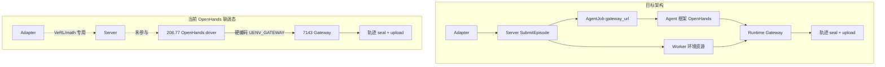
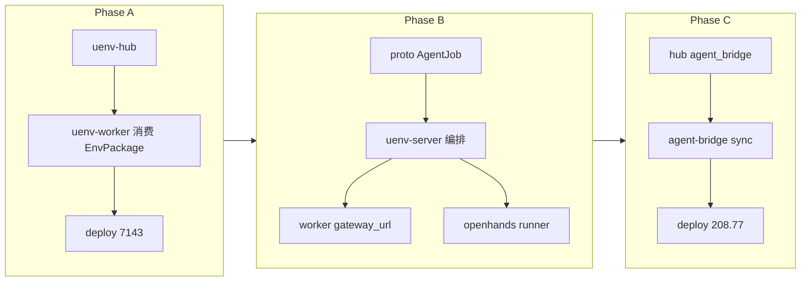

# OpenHands 任务链路与 Hub 组合包实现现状报告

> **日期**：2026-07-01（**v1.3 实机同步更新**：2026-07-03）  
> **依据**：`260629-hub-env-package-design.md`、`260627-swe-openhands-integration-plan.md`、`260627-openhands-swe-trajectory-chain-audit.md`、`Docs/hub/uenv-hub环境标准化指南.md` 及当前仓库代码  
> **目的**：对照目标架构，梳理 SWE/OpenHands 联调链路与 Hub EnvPackage 两条线的**代码实现现状**、**实机部署态**与**差距**

---

## 1. 执行摘要

| 维度 | 目标态（规划） | 当前代码/部署态 | 差距等级 |
|------|----------------|-----------------|----------|
| 任务发起 | Adapter → Server.SubmitEpisode | OpenHands driver **直连** Worker Gateway | **大** |
| 调度与资源组合 | Server 选 Worker，下发 `AgentJob`（含 `gateway_url`） | **proto + Worker for-episode 已实装**；**uenv-server 编排未做**；208.77 仍硬编码 `UENV_GATEWAY` | **大** |
| 环境执行 | Server 调度 Worker 沙箱 + Agent 框架分离协作 | Worker Gateway 与 native `DispatchEpisode` **共享 L2 池**；`for-episode` 已上线 7143 | **中** |
| 轨迹采集 | Worker Gateway 边界 seal → 可选上传 Server | **已实现**（平台层）；OpenHands 路径已验收 | **小** |
| Hub 环境组合包 | `uenv env sync` 批量预制 catalog/overlay/镜像索引 | **Hub 已发布 `swe-bench-pro@0.2.0`**；**7143 已正式 env sync** | **小** |
| Agent 桥接包 | `uenv-agent-openhands` 独立包 + `agent-bridge sync` | **Hub 已发布 `uenv-agent-openhands@1.0.0`**；208.77 **tar 同步源码**，未走 CLI sync | **中** |

**一句话**：**Phase A 实机已闭环**（Hub 发布 → 7143 `env sync` → Worker 加载 EnvPackage）；**Phase B 代码侧 proto/Worker/for-episode/OpenHands AgentJob 消费已就绪，但 uenv-server 编排未实现**，OpenHands 联调仍走「Agent 直连 Gateway」旁路；**Phase C 桥接包已在 Hub 发布，208.77 部署仍以 rsync 源码为主**。

**后续规划**：见 **§5 分模块后续调整规划**（Phase A/B/C + 9 个模块的 P0/P1/P2 清单与验收口径）。

---

## 2. 任务链路：目标架构 vs 当前实现

### 2.1 目标架构（规划冻结）

依据 `260629-hub-env-package-design.md` §7–§8 与 `全链路联调-各层接口与参数字段.md`：

```text
Adapter
  └─► Server.SubmitEpisode(env_package, instance_id, …)
        ├─ 调度：选已 sync 该 package 的 Worker
        ├─ Worker.create_session（本地镜像，无公网 pull）
        └─ AgentJob(gateway_url, session_id, run_id, model_endpoint, agent_bridge@ver)
              └─► Agent 框架 tool loop → Gateway HTTP → submit → ReportResult
                    └─► Worker 异步 upload trajectory
```

关键约束：

- **C 层调度态**（`gateway_url`、`session_id`、`run_id`）由 Server 注入，**不写 Hub**。
- **AgentJob** 作为 Server→Agent 的下发契约（设计 P1，含 `agent_bridge` 版本）。
- Hub 仅注册与分发，**不参与 Episode 热路径**。

### 2.2 当前 SWE/OpenHands 联调态（实装路径）

依据 `260627-swe-openhands-integration-plan.md` 与代码：

```text
208.77 OpenHands（任务发起中心）
  run_swebenchpro_official.py + uenv_runtime shim
  UENV_GATEWAY = http://127.0.0.1:28097（SSH 隧道 → 7143:28097）
        │
        │  HTTP POST /runtime/v1/sessions|exec|submit（绕过 Server）
        ▼
7143 uenv-worker — Runtime Gateway :28097
  SweInstancePool → grader → seal TrajectoryBundle
        │
        ├─► [可选] TrajectoryUploader → Server :8077
        └─► Hub :8088 — 仅 catalog 元数据 pull（旧路径；EnvPackage sync 为备选）

7142 VeRL/LLM — 与 OpenHands 路径并行，不承载 OpenHands
Server（75.157:8088 gRPC + :8077 轨迹 HTTP）— OpenHands 路径不经过 SubmitEpisode
```

**证据（代码/配置）**：

| 环节 | 目标 | 现状 | 位置 |
|------|------|------|------|
| 任务发起 | Adapter `SubmitEpisode` | OpenHands driver **自行** `create_session` | `integrations/openhands/run_swebenchpro_official.py` |
| `gateway_url` | Server `AgentJob` 下发 | CLI/env **硬编码** `--gateway` / `UENV_GATEWAY` | `scripts/run-openhands-pro-20877.sh` L11–15 |
| Server 调度 | 选 Worker + 租约 | **不参与** OpenHands 热路径 | `260627-swe-openhands-integration-plan.md` §1 |
| `AgentJob` | proto + Server 下发 | **proto 已定义**（`agent.proto`）；**Server 未下发**；OpenHands 支持 `UENV_AGENT_JOB_FILE` | `proto/uenv/v1/agent.proto`、`integrations/openhands/uenv_runtime/agent_job.py` |
| `episode_id` | Server 分配，贯穿轨迹 | OpenHands 路径**无** episode；run_id 由 driver 生成 | `run_swebenchpro_official.py` L204–211 |
| Agent 部署 | Hub `agent-bridge sync` | Hub 已发布 bridge 包；208.77 **tar 同步** `integrations/openhands`（非 CLI sync） | `scripts/remote-sync-20877.sh` |
| catalog 来源 | EnvPackage sync 目录 | **7143 已从 Hub sync** `swe-bench-pro@0.2.0` | `/var/lib/uenv/envs/swe-bench-pro/0.2.0/` |

### 2.3 并行存在的「正确」Server 路径（非 OpenHands）

math / VeRL native 路径**已按目标架构工作**：

```text
Adapter（uenv-bridge serve / grpcurl）
  └─► UEnvService.SubmitEpisode
        └─► Server 调度 RoundRobinScheduler
              └─► WorkerGrpcService.DispatchEpisode（Server 主动回连 Worker）
                    └─► EpisodeExecutor（env_type=math|swe native）
                          └─► ReportResult → Server → 返回 EpisodeResult
```

| 组件 | 状态 | 位置 |
|------|------|------|
| `SubmitEpisode` 调度循环 | ✅ | `uenv-server/src/service.rs` |
| `DispatchEpisode` + 租约 | ✅ | `uenv-worker/src/grpc_server/worker_service.rs` |
| SWE native（无 Agent） | ✅ 共用 L2 池 | `uenv-worker/src/episode/executor.rs` + `runtime_gateway` 注释 |
| 轨迹 v2.2 关联 | ✅ native 填 `episode_id`；Gateway 填 `run_id` | `260625-trajectory-server-migration-evaluation.md` §3 |

**结论**：平台**具备** Adapter→Server→Worker 全链路；**OpenHands SWE 评测 deliberately 走 Gateway 旁路**，与 VeRL 训练路径并行，尚未统一到 Server 编排的 AgentJob 模型。

### 2.4 轨迹记录与上传

| 能力 | 规划 | 代码 | 7143 部署 |
|------|------|------|-----------|
| Gateway 边界 `push_step` → seal | 平台 A 层 | ✅ `uenv-worker/src/swe/session.rs` | ✅ |
| `TrajectoryUploader` → Server | v2.2 | ✅ `trajectory_upload.rs` | ✅ `trajectory_upload.endpoint: http://8.130.75.157:8077` |
| OpenHands 传 `X-UEnv-Run-Id` | 强制非空 run_id | ✅ driver 支持 `--run-id` / `UENV_RUN_ID` | ✅ |
| Server 聚合查询 | `:8077` HTTP | ✅ `uenv-server/src/trajectory.rs` + bridge core 启动 | ✅ 208.77 E2E 已验收 |
| `episode_id` 关联 | VeRL 路径 | OpenHands 路径**无** episode_results 行 | 设计预期（双路径文档 §3） |

轨迹链路相对目标**差距最小**；主要遗留是 OpenHands 路径与 Server Episode 控制面**未关联**（无 `ReportResult`、无统一 batch 调度）。

### 2.5 差异对照图



---

## 3. Hub 环境组合包（EnvPackage）实现现状

### 3.1 设计目标回顾

`260629-hub-env-package-design.md` 要求 Hub 从「元数据索引」升级为 **EnvPackage + AgentBridgePackage** 的版本化组合分发：

- **B 层**：catalog、images.manifest、worker_overlay、agent_bridge 引用 → `uenv env sync`
- **A 层**：Gateway、轨迹机制、grader 框架 → uenv-worker 平台发版
- **C 层**：`gateway_url` 等 → Server 调度（**未实现 AgentJob**）

### 3.2 代码实现矩阵

| 能力 | 设计优先级 | 代码状态 | 说明 |
|------|------------|----------|------|
| `EnvPackageManifest` DTO | P0 | ✅ | `uenv-hub/uenv-hub-types/src/lib.rs` |
| DB + 迁移 | P0 | ✅ | `migrations/0002_env_packages.sql` |
| Publish / GET / sync-plan / artifact API | P0 | ✅ | `uenv-hub-core/src/repository.rs`、`routes.rs` |
| 内容寻址制品存储 | P0 | ✅ inline 小文件；大镜像 **registry 带外** | `uenv-hub-core/src/package.rs` |
| 种子包 swe-bench-verified / pro | P0 | ✅ | `uenv-hub-core/src/seed.rs` |
| `uenv env sync` CLI | P1 | ✅ | `uenv-hub-client/src/bin/uenv.rs` |
| Worker 消费 sync 目录 | P1 | ✅ | `uenv-worker/src/swe/env_package.rs`、`runtime.rs::load_swe_catalog` |
| `image_pull_policy=local_only` + digest 校验 | P0 | ✅ | `uenv-worker/src/swe/image_cache.rs` |
| 本地 E2E（publish→sync→worker 加载） | — | ✅ | `Docs/hub/uenv-hub环境标准化指南.md` §9 |
| **`uenv agent-bridge sync`** | P1 | ✅ | `uenv-hub-client/src/bin/uenv.rs` 子命令；共用 `run_package_sync` |
| **AgentBridgePackage 独立发布** | P1 | ✅（seed） | `seed_agent_bridge_openhands` 发布 `uenv-agent-openhands@1.0.0`；源码仍在 monorepo |
| 镜像字节对象存储 / registry push | P2 | ❌ | `images.manifest.json` 索引 + 运维带外 pull/load |
| Server `AgentJob.gateway_url` | P1 | ⚠️ proto ✅ / server ❌ | `agent.proto` 已定义；**uenv-server 编排未实现** |
| 生产 Worker 默认走 EnvPackage | — | ✅（7143） | `UENV_SWE_ENV_PACKAGE` + Hub `env sync`；yaml 已增 `env_package_dir` |

### 3.3 EnvPackage 已实现的 manifest 内容

种子包 `seed_swe_package` 已包含设计文档 §3.2 大部分字段（`uenv-hub/uenv-hub-core/src/seed.rs`）：

| 字段块 | 种子内容 | 与设计差异 |
|--------|----------|------------|
| `platform.features` | `runtime_gateway`, `swe_instance_pool` | ✅ 已补 `trajectory_v2_2`（seed `0.2.0`） |
| `artifacts` | catalog、images.manifest、eval_spec、worker.overlay | ✅ EnvPackage 四件套；bridge 为**独立包** `uenv-agent-openhands` |
| `worker_overlay` | swe variant、grader、`image_pull_policy: local_only`、trajectory 默认 | ✅ |
| `agent_defaults` | driver 名、tools、workspace_dir | ✅ 引用名；**脚本不在 Hub 制品中** |

Worker 加载优先级（`runtime.rs`）：

1. **`UENV_SWE_ENV_PACKAGE`**（sync 目录）— 最高
2. Hub 旧 API `GET /api/v1/swe/{variant}/instances`
3. 本地 `UENV_SWE_INSTANCES` / fixtures

### 3.4 生产部署 vs 组合包工作流

| 节点 | 组合包目标 | 当前实机做法 | 差距 |
|------|------------|--------------|------|
| **Hub 8.130.95.176** | 发布 EnvPackage + AgentBridge | ✅ `swe-bench-pro@0.2.0`、`uenv-agent-openhands@1.0.0` 已 seed；`:8088/healthz` 正常 | DB 曾重置（migration checksum）；无 systemd，nohup 启动 |
| **7143 Worker** | `uenv env sync` → `UENV_SWE_ENV_PACKAGE` | ✅ **2026-07-03 正式 sync**；`.synced` 已写入；`for-episode` + gold 通过 | 运行时 Hub catalog pull 回退仍可触发（未强制关闭） |
| **208.77 Agent** | `uenv agent-bridge sync` | ⚠️ **tar 同步** `/root/UEnv/integrations/openhands`（经 7142 跳板） | 未安装 `uenv` CLI、未走 `agent-bridge sync` 目录布局 |
| **catalog** | package 内 `catalog.json` | ✅ 7143 来自 Hub sync 的 `catalog.json` | 208.77 仍随 tar 带 `config/swe/` 副本 |
| **镜像** | 内网 registry + manifest digest | `jefzda/sweap-images` 等公网/镜像站 | 设计 P2 未 formalize |

### 3.5 Agent 集成层归属（设计 §4.4.1 vs 代码）

| 组件 | 设计归属 | 当前位置 | EnvPackage/Hub |
|------|----------|----------|----------------|
| Gateway HTTP 契约 | 平台 A | `uenv-worker/src/runtime_gateway/` | 仅 contracts 版本号 |
| `UEnvGatewayClient` | 平台 SDK（建议 `uenv-agent-sdk`） | `integrations/openhands/uenv_runtime/client.py` | ❌ 未抽离 |
| `UEnvWorkspace` / `gateway_tools` / patch | AgentBridgePackage | 同上 integrations | ❌ rsync 部署 |
| `run_swebenchpro_official.py` | Bridge 包内 driver | integrations | manifest 仅 **名字引用** |

---

## 4. 两条主线交叉点

当前**唯一收敛点**是 Worker 侧 **Runtime Gateway + SweInstancePool + 轨迹 seal/upload**：

- OpenHands：`UEnvGatewayClient` → Gateway HTTP
- Native SWE：`DispatchEpisode(env_type=swe)` → `EpisodeExecutor` → 同一 L2 池
- 轨迹：两路径共用 `instance_pool.submit()` → seal → 可选 upload

**未收敛点**：

- 任务入口（OpenHands 自发起 vs Adapter/Server）
- 配置分发（rsync/散落 env vs Hub EnvPackage + AgentBridge sync）
- 调度态 URL（硬编码 vs Server AgentJob）
- 版本一致性（OpenHands SDK pin、catalog、Worker overlay **无单一 bundle_digest 约束**）

---

## 5. 分模块后续调整规划

本节在 §1–§4 差距基础上，按**可独立交付的模块**列出「保持 / P0 / P1 / P2」调整项、依赖关系与验收口径。优先级定义：

| 级别 | 含义 |
|------|------|
| **P0** | 不完成则无法从「联调旁路」切到「Server 编排 + Hub 组合包」目标态 |
| **P1** | 目标态可跑通后的**生产化**（版本绑定、批量部署、可观测） |
| **P2** | 规模/运维优化，不阻塞首条目标链路 |

### 5.0 阶段划分与模块依赖

**2026-07-03 进度**：Phase A **实机完成**；Phase B **代码就绪、Server 未做**；Phase C **Hub 发布完成、208.77 部署半完成**。

| Phase | 状态 | 说明 |
|-------|------|------|
| **A** 组合包落地 | ✅ 完成 | Hub 发布 + 7143 `env sync` + Worker 加载 |
| **B** 调度闭环 | ⚠️ 进行中 | proto / Worker `for-episode` / OpenHands AgentJob 消费 **已合入**；**uenv-server 编排未做** |
| **C** 桥接包与镜像 | ⚠️ 部分 | Hub `uenv-agent-openhands@1.0.0` 已发布；208.77 仍 tar 同步源码 |

建议分三阶段推进，避免 Hub、Server、Agent 同时大改：

```text
Phase A — 组合包落地（Hub + Worker + 部署）
  Hub seed/发布真实 Pro catalog
    → uenv env sync @7143
    → Worker UENV_SWE_ENV_PACKAGE
  （OpenHands 仍可旁路 Gateway；先解决「环境版本化」）

Phase B — 调度闭环（Proto + Server + Agent）
  AgentJob proto 冻结
    → Server SubmitEpisode(swe+agent) 编排
    → Worker 预创建 session / 暴露 gateway_url
    → Agent runner 消费 AgentJob（替代硬编码 UENV_GATEWAY）

Phase C — 桥接包与镜像制品（Hub + Agent 部署）
  uenv-agent-openhands 发布 + agent-bridge sync @208.77
    → EnvPackage 引用 agent_bridge artifact
    → 内网镜像 bundle（可选 P2）
```



| 模块 | Phase | 阻塞谁 |
|------|-------|--------|
| uenv-hub（EnvPackage 内容） | A | Worker 不再依赖散落 catalog |
| uenv-worker（EnvPackage 消费） | A | 7143 local_only 镜像策略 |
| uenv-server + proto | B | Agent 去硬编码 gateway |
| integrations/openhands + runner | B/C | Server 编排后的 Agent 执行 |
| uenv-bridge | B（可选） | VeRL 批量 SubmitEpisode 带 package 字段 |
| 部署脚本 / config | A/B/C | 各阶段实机验收 |

---

### 5.1 协议层（`proto/`）

**现状**：`EpisodeRequest` 已有 `env_package_id/version`；**`AgentJob` + `AgentControlService` 已定义**；OpenHands 路径仍走 HTTP Gateway 自行约定，**不经 Server 下发 Job**。

| 类别 | 调整项 | 状态 |
|------|--------|------|
| **保持** | `DispatchEpisode` / `ReportResult` / `StreamReport` 现有语义；Gateway REST `runtime/v1/*` 不变 | — |
| **P0** | 新增 `AgentJob` message（`proto/uenv/v1/agent.proto`） | ✅ 已合入 |
| **P0** | 扩展 `EpisodeRequest`：`env_package_id` + `env_package_version` | ✅ 已合入 |
| **P0** | Server→Agent 拉取或推送 RPC（`AgentControlService`） | ✅ proto 已定义；**Server 未实现** |
| **P1** | `EpisodeResult` 增加 `gateway_session_id`、`trajectory_ref` 摘要 | ❌ 待做 |
| **P1** | `RegisterWorker` 增加 `synced_packages[]`、`gateway_public_url` | ✅ 已合入 |
| **P2** | `SubmitEpisodeStream` 批量 SWE 评测 | ❌ 待做 |

**交付物**：`make proto` 全仓生成通过；`PROTOCOL.md` + `全链路联调-各层接口与参数字段.md` 同步。

**验收**：grpcurl 提交带 `env_package` 的 SWE Episode 不报错；AgentJob JSON/proto 样例 fixture 入库。

---

### 5.2 uenv-server（控制面 + 轨迹 HTTP）

**现状**：`SubmitEpisode` → 调度 → `DispatchEpisode` → 等 `ReportResult` **仅服务 native 执行**；**SWE+Agent 编排、AgentJob 下发均未实现**（刻意排除在本轮实装外）。

| 类别 | 调整项 | 状态 |
|------|--------|------|
| **保持** | RoundRobin 调度、租约、`episode_semaphore`、轨迹 ingest GET/LIST | ✅ |
| **P0** | **SWE+Agent 分支**：选 Worker → 预创建 session → 组装 `AgentJob` | ❌ **待做（阻塞 Phase B 闭环）** |
| **P0** | 从 Worker 注册解析 `gateway_url` 写入 `AgentJob` | ❌ 待做 |
| **P0** | `run_id` 统一由 Server 生成并绑定 session | ❌ 待做 |
| **P1** | 调度约束：`synced_packages` 与 Episode `env_package` 匹配 | ❌ 待做 |
| **P1** | Agent 完成后回调 → `EpisodeResult` | ❌ 待做 |
| **P1** | Admin HTTP：查询 in-flight AgentJob | ❌ 待做 |
| **P2** | 多 Agent 池路由 | ❌ 待做 |

**关键改动面**：`uenv-server/src/service.rs`（SubmitEpisode 分支）、`scheduler/`（package 感知）、`control_plane.rs`（RegisterWorker 扩展）；可能新增 `agent_job.rs` 状态机。

**验收**：grpcurl `SubmitEpisode(swe, instance_id, env_package=…)` → 返回 `EpisodeResult` 且 Server 轨迹库可按 `run_id` 查到；**无需** Agent 侧配置 `UENV_GATEWAY`。

---

### 5.3 uenv-worker（Gateway + SWE 池 + EnvPackage）

**现状**：Runtime Gateway、轨迹 seal/upload、EnvPackage 目录加载 **已实机切换**；`for-episode` 与 RegisterWorker 扩展 **已上线 7143**。

| 类别 | 调整项 | 状态 |
|------|--------|------|
| **保持** | `runtime_gateway` 路由、`push_step`→seal→upload、native `EpisodeExecutor` | ✅ |
| **P0（Phase A）** | 启动优先 `UENV_SWE_ENV_PACKAGE`；deploy 写入 sync 路径 | ✅ 7143 已切 Hub sync |
| **P0（Phase A）** | `RegisterWorker` 上报 `synced_env_packages` | ✅ 已合入 |
| **P0（Phase B）** | `POST /runtime/v1/sessions/for-episode` | ✅ 已合入 + 7143 验收 |
| **P0（Phase B）** | 配置 `gateway_public_url` 供 Server 写入 AgentJob | ✅ 配置项已有；**Server 未消费** |
| **P1** | 启动时合并 `worker.overlay.yaml`（来自 sync 目录） | ⚠️ 部分（catalog/images 来自 package；overlay 合并待加强） |
| **P1** | `local_only` + digest 验收脚本强制 | ⚠️ 行为已有；正式验收脚本待补 |
| **P2** | 内网 registry sync 助手 | ❌ 待做 |

**关键改动面**：`runtime.rs`、`config/mod.rs`、`grpc_server/`（RegisterWorker）、`runtime_gateway/mod.rs`（session 与 episode 绑定）。

**验收**：仅配置 `UENV_SWE_ENV_PACKAGE` 无 Hub endpoint 仍可加载 catalog；Server 触发 session 后 Agent 用下发的 `gateway_url`+`session_id` 可 exec/submit。

---

### 5.4 uenv-bridge / adapter-core

**现状**：`env_package_id/version` → `EpisodeRequest` **已映射**；OpenHands 路径不经过 bridge。

| 类别 | 调整项 | 状态 |
|------|--------|------|
| **保持** | VeRL math 路径、`UENV_ADAPTER_CORE_REWARD_MODE=serve` | ✅ |
| **P1** | L1 mapping 增加 `env_package_id/version` | ✅ `uenv-bridge/core.rs` |
| **P1** | SWE 批量评测 adapter | ❌ 待做 |
| **P2** | runner 改调 Server AgentJob API | ❌ 待做 |

**说明**：OpenHands 路径 **不强制** 经 uenv-bridge Python 包；Phase B 可直接 **208.77 runner ↔ Server** 对接。Bridge 调整主要服务 VeRL/训练与统一 Episode 语义。

**验收**：Adapter 提交的 SWE Episode 在 Server 日志可见 `env_package_id`；与 7143 sync 版本一致。

---

### 5.5 uenv-hub + `uenv` CLI

**现状**：EnvPackage + AgentBridge **已在 Hub 实机发布**；7143 已 `env sync`。

| 类别 | 调整项 | 状态 |
|------|--------|------|
| **保持** | package API、inline 制品、sync digest 校验 | ✅ |
| **P0（Phase A）** | 发布真实 Pro EnvPackage `swe-bench-pro@0.2.0` | ✅ Hub seed + 7143 sync |
| **P0（Phase A）** | publish 流程文档化 | ⚠️ 脚本已有；CI 未接 |
| **P1** | AgentBridgePackage `uenv-agent-openhands@1.0.0` | ✅ Hub seed 已发布 |
| **P1** | CLI `uenv agent-bridge sync` | ✅ 已合入 |
| **P1** | EnvPackage 内 `agent_bridge` artifact 引用 | ❌ 仍为独立包；manifest 未交叉引用 |
| **P1** | `platform.features` 补全 `trajectory_v2_2` | ✅ |
| **P2** | 大文件制品 / registry API | ❌ 待做 |

**关键改动面**：`uenv-hub-core/src/seed.rs`、`repository.rs`、`uenv-hub-client/src/bin/uenv.rs`（新 subcommand）、发布 CI。

**验收**：7143 `uenv env sync swe-bench-pro@x` 后 catalog 与 Hub 一致；208.77 `uenv agent-bridge sync` 后 driver 版本与 EnvPackage 声明一致。

---

### 5.6 Agent 集成层（`integrations/openhands/` + 208.77 runner）

**现状**：**AgentJob 消费与 session attach 代码已合入**；208.77 **已同步最新 integrations**；联调仍硬编码 `UENV_GATEWAY`，**不经 Server**。

| 类别 | 调整项 | 状态 |
|------|--------|------|
| **保持** | `UEnvWorkspace` / `gateway_tools` / driver 核心映射 | ✅ |
| **P0（Phase B）** | driver 从 AgentJob 读 `gateway_url`/`session_id`/`run_id` | ⚠️ 支持 `UENV_AGENT_JOB_FILE`；**默认仍要 `--gateway`** |
| **P0（Phase B）** | `UEnvWorkspace` attach 已有 session | ✅ |
| **P1（Phase C）** | AgentBridgePackage 发布布局 | ✅ Hub 侧；208.77 仍用 monorepo 路径 |
| **P1** | `openhands_runner.py` 从 Server PollAgentJob | ❌ 待做 |
| **P1** | 移除对散落 `pro-python-smoke.json` 硬依赖 | ⚠️ 7143 已不依赖；208.77 tar 仍带副本 |
| **P2** | 抽 `uenv-agent-sdk`；Agent 基础镜像 | ❌ 待做 |

**关键改动面**：`run_swebenchpro_official.py`、`uenv_runtime/workspace.py`、`uenv_runtime/client.py`、`scripts/openhands/openhands_runner.py`、`scripts/run-openhands-pro-20877.sh`。

**验收**：208.77 上不设置 `UENV_GATEWAY`，仅配置 Server endpoint，完成一次 Pro gold/llm 评测且轨迹 Server 可查。

---

### 5.7 轨迹聚合（Server `:8077` + Worker upload）

**现状**：v2.2 **已实装**；7143 已配 `trajectory_upload.endpoint`；OpenHands 已传 `run_id`；**无** `episode_id` 关联。

| 类别 | 调整项 |
|------|--------|
| **保持** | Worker seal/upload、Server SQLite + GET/LIST、`X-UEnv-Run-Id` |
| **P1** | Phase B 完成后：Gateway submit 回调或 Server AgentJob 完成时，**可选**写 `episode_results`（若 OpenHands 路径纳入 SubmitEpisode） |
| **P1** | `TrajectoryRef` 增加 `env_package_id` / `agent_bridge_version`（查询维度，非阻塞） |
| **P2** | 轨迹 retention / 按 package 版本清理策略 |

**验收**：现有 208.77 E2E 保持通过；Phase B 后同一 `episode_id` 可关联 trajectory（若启用 episode 关联）。

---

### 5.8 部署、配置与运维（`config/`、`scripts/`、`secrets/README.md`）

**现状**：7143 / Hub **已远程同步**（2026-07-03）；208.77 integrations 已同步；**uenv-server 未部署本轮变更**。

| 类别 | 调整项 | 状态 | 目标文件（示例） |
|------|--------|------|------------------|
| **P0（Phase A）** | 7143 Hub sync + 重启 Worker | ✅ | `scripts/remote-sync-final.sh`、`restart-worker-gateway-28097-7143.sh` |
| **P0（Phase A）** | Worker yaml `env_package_dir` | ✅ | `config/uenv-worker.deploy-7143-swe-pro.yaml` |
| **P0（Phase A）** | EnvPackage catalog 替代散落 json | ✅（7143） | Hub `swe-bench-pro@0.2.0` |
| **P1（Phase B）** | 208.77 去掉固定 `UENV_GATEWAY` | ❌ | `config/openhands-20877.env.example` |
| **P1（Phase C）** | 208.77 `agent-bridge sync` 部署 | ⚠️ tar 同步代替 | `scripts/remote-sync-20877.sh` |
| **P1** | `secrets/README.md` 验收命令 | ⚠️ 待补 Phase 状态表 | `secrets/README.md` |
| **P2** | 镜像 sync runbook；去 SSH 隧道 | ❌ | 新脚本 / 网络 |
| **运维** | Hub 用 sshpass（无私钥）；7143 跳板 208.77 | ✅ 已验证 | `scripts/remote-sync-*.sh` |

**验收**：新机器从零部署仅依赖 Hub sync + 平台安装，无手工 rsync integrations；`bundle_digest` 在三机配置中可查。

---

### 5.9 LLM Gateway（7142，交叉依赖）

**现状**：DeepSeek v3 经 `uenv-llm-gateway :18888` 供 208.77 OpenHands；与 Worker/SWE **解耦**。

| 类别 | 调整项 |
|------|--------|
| **保持** | 7142 推理层独立；不在 EnvPackage 内打包 vLLM |
| **P1** | Server `AgentJob.model_endpoint` 指向 LLM Gateway 或 Hub `model_profile` 引用（EnvPackage §4.2 部分纳入） |
| **P2** | Hub manifest `model_profile` 字段（仅引用名，URL 仍 Server 填） |

---

### 5.10 模块 × 优先级总表

| 模块 | P0 | P1 | P2 | 主要 Phase | **当前** |
|------|----|----|-----|------------|----------|
| **proto** | AgentJob、EpisodeRequest.env_package | RegisterWorker 扩展 | SubmitEpisodeStream | B | ✅ P0 已合入 |
| **uenv-server** | SWE+Agent 编排、gateway_url 下发 | package 感知调度、Agent 完成回调 | 多 Agent 池 | B | ❌ **未做** |
| **uenv-worker** | EnvPackage 实机切换、RegisterWorker 上报 | overlay 合并、local_only 验收 | 镜像 bulk pull | A / B | ✅ Phase A+B Worker 侧 |
| **uenv-bridge** | — | env_package 映射 | runner 解耦 | B | ✅ env_package 映射 |
| **uenv-hub + CLI** | 真实 Pro package 发布 | agent-bridge sync + artifact | 对象存储 / registry | A / C | ✅ 实机已发布 |
| **integrations/openhands** | 消费 AgentJob、attach session | runner 对接 Server、bridge 部署 | uenv-agent-sdk | B / C | ⚠️ 代码就绪；208.77 tar 部署 |
| **轨迹 HTTP** | — | episode 关联（可选） | retention | B | ✅ 平台层 |
| **部署 / config** | 7143 env sync | 208.77 Server 化、文档 | 镜像 sync、去隧道 | A / B / C | ✅ A 完成；C 部分 |
| **LLM Gateway** | — | model_endpoint 引用 | model_profile | B | — 未动 |

---

### 5.11 建议实施顺序（可执行 checklist）

**Phase A（组合包落地）— ✅ 已完成（2026-07-03）**

- [x] Hub 发布 `swe-bench-pro@0.2.0`（catalog + images.manifest + overlay）
- [x] 7143：`uenv env sync` → `UENV_SWE_ENV_PACKAGE` → 重启 Worker
- [x] 验收：`swe_catalog_loaded_from_env_package`；`for-episode` + gold
- [ ] 文档：`secrets/README.md` 版本对齐表（待补）

**Phase B（调度闭环）— ⚠️ 代码就绪，Server 未做**

- [x] 冻结 `AgentJob` proto + `EpisodeRequest.env_package`；`make proto`
- [x] Worker：`for-episode` + `gateway_public_url` 注册 + session/`run_id` 绑定
- [x] 208.77：driver 支持 `UENV_AGENT_JOB_FILE`、session attach
- [ ] **uenv-server**：SubmitEpisode(swe) 分支 + 生成 AgentJob（**阻塞项**）
- [ ] 208.77：runner 从 Server 取 Job；删除硬编码 `UENV_GATEWAY`
- [ ] 验收：`verify-openhands-trajectory-e2e-20877.sh` 改为 Server 触发

**Phase C（版本绑定）— ⚠️ 部分完成**

- [x] Hub：`uenv-agent-openhands@1.0.0` publish
- [x] CLI：`uenv agent-bridge sync`
- [ ] 208.77：deploy 切 `agent-bridge sync` 目录（当前 tar 同步源码）
- [ ] EnvPackage manifest 增加 `agent_bridge` artifact 交叉引用
- [ ] （P2）内网镜像 bundle 运维脚本

---

## 6. 关键代码索引

| 关注点 | 路径 |
|--------|------|
| OpenHands 主驱动（旁路入口） | `integrations/openhands/run_swebenchpro_official.py` |
| Gateway HTTP 客户端 / patch | `integrations/openhands/uenv_runtime/` |
| Runtime Gateway | `uenv-worker/src/runtime_gateway/mod.rs` |
| 轨迹 seal / upload | `uenv-worker/src/swe/{session,instance_pool,trajectory_upload}.rs` |
| Server SubmitEpisode | `uenv-server/src/service.rs` |
| Adapter core + 轨迹 HTTP | `uenv-bridge/core/src/main.rs` |
| EnvPackage DTO / API | `uenv-hub/uenv-hub-types/src/lib.rs`、`uenv-hub-server/src/routes.rs` |
| env sync CLI | `uenv-hub/uenv-hub-client/src/bin/uenv.rs` |
| Worker 消费 EnvPackage | `uenv-worker/src/swe/env_package.rs`、`runtime.rs` |
| 7143 实机 Worker 配置 | `config/uenv-worker.deploy-7143-swe-pro.yaml` |
| 7143/Hub/208.77 远程同步 | `scripts/remote-sync-final.sh`、`scripts/remote-sync-20877.sh` |
| 208.77 实机 Agent 部署 | `scripts/deploy-openhands-20877.sh`、`scripts/run-openhands-pro-20877.sh` |

---

## 7. 变更记录

| 版本 | 日期 | 说明 |
|------|------|------|
| v1.0 | 2026-07-01 | 首版：OpenHands 旁路 vs Adapter/Server 目标链对照；Hub EnvPackage 代码 vs 生产部署差距 |
| v1.1 | 2026-07-01 | §5 扩展：分模块（proto/server/worker/hub/agent/bridge/部署）P0/P1/P2 调整项、Phase A/B/C 与 checklist |
| v1.2 | 2026-07-03 | 代码实装（除 uenv-server）；7143 实机验收 EnvPackage + for-episode + gold |
| v1.3 | 2026-07-03 | 远程同步完成：Hub 发布 + 7143 正式 env sync + 208.77 integrations 同步；§5 各模块状态列、§8 实机记录更新 |

---

## 8. 实装与实机验收记录（2026-07-03）

### 8.1 已合入代码（**不含 uenv-server 编排**）

| 模块 | 交付 |
|------|------|
| **proto** | `agent.proto`（AgentJob + AgentControlService）；`EpisodeRequest.env_package_*`；`RegisterWorker.gateway_public_url` + `synced_env_packages` |
| **uenv-worker** | RegisterWorker 扩展；`POST /runtime/v1/sessions/for-episode`；`set_session_episode_id`；EnvPackage `.synced` 读取 |
| **uenv-hub** | Pro 包 seed `0.2.0` + `pro-python-smoke.json`；`seed_agent_bridge_openhands`；`trajectory_v2_2` feature |
| **uenv CLI** | `uenv agent-bridge sync`（共用 `run_package_sync`） |
| **uenv-bridge** | `env_package_id/version` → `EpisodeRequest` + SWE payload |
| **OpenHands** | `agent_job.py`；`UEnvWorkspace.session_id` attach；driver 支持 `UENV_AGENT_JOB_FILE` |
| **部署** | `scripts/deploy-phase-abc-e2e.sh`、`setup-env-package-local-7143.sh`、`test-for-episode-7143.sh` |
| **远程同步（2026-07-03）** | `scripts/remote-sync-final.sh`、`remote-sync-20877.sh`、`remote-sync-remaining.sh` |

### 8.2 7143 实机验收（SSH key，已通过）

| 项 | 结果 |
|----|------|
| Worker 编译 + 重启 | ✅ |
| **Hub 正式 `env sync`** `swe-bench-pro@0.2.0` | ✅ `/var/lib/uenv/envs/swe-bench-pro/0.2.0/.synced` |
| `UENV_SWE_ENV_PACKAGE` 加载 | ✅ 日志 `swe_catalog_loaded_from_env_package` count=1 |
| `POST /runtime/v1/sessions/for-episode` | ✅ 返回 `session_id` + `gateway_url=http://219.147.100.43:28097` |
| duck-type gold（EnvPackage catalog） | ✅ `reward=1.0` |

### 8.3 远程同步验收（2026-07-03，经 7143 跳板 + sshpass）

| 节点 | 动作 | 结果 |
|------|------|------|
| **Hub 8.130.95.176** | 同步代码 → `cargo build` → 重启 → seed 包 | ✅ `swe-bench-pro@0.2.0`、`uenv-agent-openhands@1.0.0`；`:8088/healthz` |
| **7143** | `uenv env sync swe-bench-pro@0.2.0` | ✅ 替代手工 `setup-env-package-local-7143.sh` |
| **208.77** | tar 同步 `integrations/openhands`（7142 跳板） | ✅ `agent_job.py` 等已就位 |

**备注**：Hub 因 migration checksum 冲突重置了 `hub.db`（保留 `data/.admin_token`）；Hub 进程为 nohup 启动（无 systemd）。同步脚本：`scripts/remote-sync-final.sh`、`scripts/remote-sync-20877.sh`。

### 8.4 仍待完成（按优先级）

| 优先级 | 项 | 说明 |
|--------|-----|------|
| **P0** | **uenv-server SWE+Agent 编排** | SubmitEpisode → 选 Worker → `for-episode` → 下发 `AgentJob`；**当前最大阻塞** |
| **P0** | 208.77 去掉 `UENV_GATEWAY` 硬编码 | 改由 Server/AgentJob 注入 `gateway_url` |
| **P1** | 208.77 `uenv agent-bridge sync` 正式部署 | 需在 208.77 安装 `uenv` CLI 或从 Hub 拉 sync 目录 |
| **P1** | Worker 关闭 Hub catalog 运行时回退 | 强制仅 `UENV_SWE_ENV_PACKAGE` |
| **P1** | `worker.overlay.yaml` 与 sync 目录自动合并 | Worker 启动配置 |
| **P1** | `openhands_runner.py` 对接 Server PollAgentJob | Phase B 验收 |
| **P1** | EnvPackage ↔ agent_bridge manifest 交叉引用 | Phase C |
| **P2** | 内网镜像 bundle / registry 运维 | `images.manifest.json` bulk pull |
| **P2** | Hub systemd / migration 升级策略 | 避免再次 reset DB |
| **P2** | `secrets/README.md` 版本对齐与验收命令 | 运维文档 |

```bash
# 7143 复验（已有 key）
ssh -p 7143 -i secrets/9aa460dab6678381f86a1022b8a54c9f_32e42d1c7902ce68ba6719d551645e02_8.143 root@219.147.100.43 \
  'bash /root/UEnv/scripts/test-for-episode-7143.sh'

# Hub 包查询（7143 上）
HUB_TOKEN=$(sshpass -p 'pku@345' ssh root@8.130.95.176 cat /root/uenv/uenv-hub/data/.admin_token)
curl -H "Authorization: Bearer $HUB_TOKEN" http://8.130.95.176:8088/api/v1/packages/swe-bench-pro/versions/0.2.0

# 208.77 gold（待 Server 化后改验收口径）
bash /root/UEnv/scripts/run-openhands-pro-20877.sh gold
```
