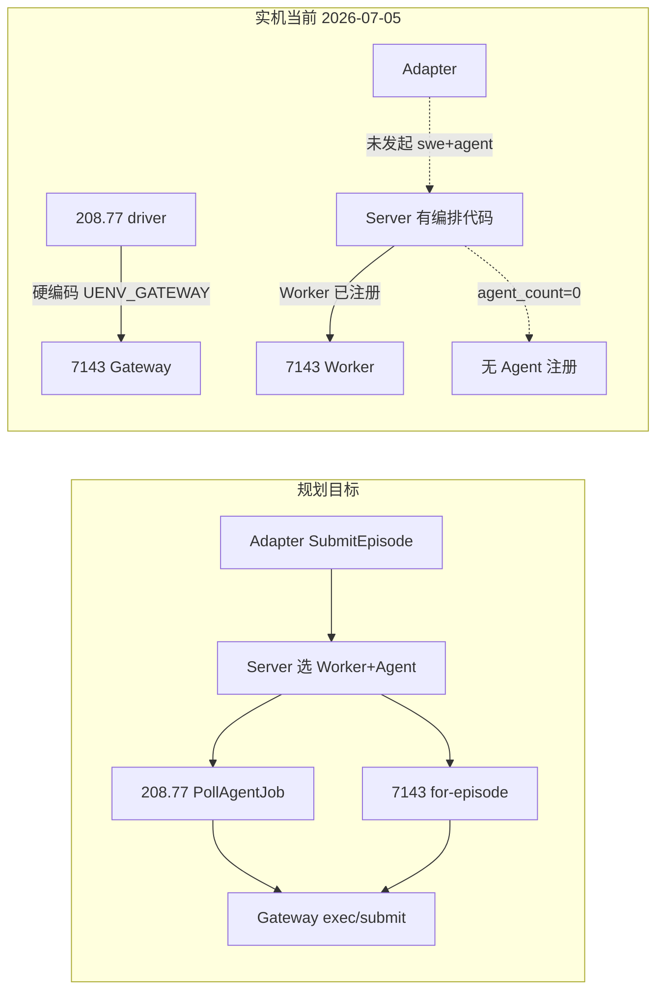

# SWE+Agent 全链路实机审计报告

> **日期**：2026-07-05  
> **依据**：`260701-openhands-hub-implementation-status-report.md`、`260629-hub-env-package-design.md`、`secrets/README.md` 及仓库代码 + 实机 SSH 探测  
> **目的**：核对规划中的「Adapter 发起 Episode → Server 调度 → Worker(SWE) + Agent(OpenHands) 组合 → 完整测试」是否已在**本地代码**与**四端实机**落地

---

## 1. 执行摘要

| 维度 | 规划目标 | 本地代码（仓库） | 实机部署 | 全链路 E2E |
|------|----------|------------------|----------|------------|
| Adapter 发起 | `SubmitEpisode(swe, execution_mode=agent)` | ✅ 已透传字段 | ❌ 无专用发起脚本/配置 | ❌ 未跑通 |
| Server 编排 | 选 Worker + Agent → `for-episode` → `AgentJob` | ✅ `submit_swe_agent_episode`（7/4–7/5） | ⚠️ 二进制已含编排（7/4），Agent 池空 | ❌ 缺 Agent 无法闭环 |
| Worker 环境 | EnvPackage + Gateway + `for-episode` | ✅ | ✅ 7143 已验收 | ✅ 单点可用 |
| Agent 框架 | `RegisterAgent` + `PollAgentJob` | ✅ `openhands_runner` poll 模式 | ❌ 208.77 仍为旁路 | ❌ `agent_count=0` |
| 实际 SWE 测试 | Server 居中双池 | 旁路 + Server 路径代码并存 | **旁路** gold + 轨迹已验收 | 旁路 ✅ / **Server 编排 ✅ 2026-07-05** |

**一句话**：Phase A（Hub → 7143 EnvPackage → Worker Gateway）**实机已闭环**；Phase B **Server 编排全链路已于 2026-07-05 17:42 验收通过**（`ExecuteBatch` → for-episode → AgentJob → 208.77 gold → reward=1.0）。旁路模式仍保留作调试路径。

**与 `260701` 报告的差异**：该报告（v1.4，7/3）仍写「uenv-server 编排未做」——**已过时**。7/4 commit `add agent` 已合入 Server 编排；本报告以 **7/5 实机探测**为准更新结论。

---

## 2. 审计范围与方法

### 2.1 规划链路（对照 `260701` §2.0）

```text
Adapter / 运维
  └─► SubmitEpisode(
        env_type = swe,
        execution_mode = agent,
        env_package_id / version,
        instance_id, benchmark_variant,
        agent_bridge_id / version,
        model_endpoint,
      )
        ├─ 1 选 Worker（synced_env_packages + gateway_public_url）
        ├─ 2 选 Agent（synced_agent_bridges + agent_pool_id）
        ├─ 3 POST Worker for-episode → session_id + gateway_url
        ├─ 4 入队 AgentJob → Agent PollAgentJob 领取
        └─ 5 CompleteAgentJob → EpisodeResult + 轨迹 upload
```

### 2.2 审计方法

| 方法 | 内容 |
|------|------|
| 本地代码 | 阅读 `uenv-server/src/service.rs`、`uenv-bridge/core`、`scripts/openhands/openhands_runner.py`；运行 `cargo test -p uenv-server swe_agent_episode_full_orchestration` |
| 实机 SSH | 7143 Worker（私钥）；8.130.75.157 Server、8.130.208.77 Agent（密码，paramiko） |
| 探测项 | 进程/二进制时间戳、`strings` 符号、admin HTTP `/agents`、Worker `for-episode`、Gateway health、208.77 环境变量 |

### 2.3 实机拓扑（`secrets/README.md`）

| 角色 | 地址 | 说明 |
|------|------|------|
| Adapter（VeRL） | 7142 `219.147.100.43:7142` | Python 客户端，连 Server `:8088` |
| Worker | 7143 `219.147.100.43:7143` | gRPC `:28888`，Gateway `:28097` |
| Server | `8.130.75.157:8088` | `uenv-adapter-core`（Adapter + ControlPlane + AgentControl） |
| Agent（OpenHands） | `8.130.208.77:8888` | runner health `:8777` |
| Hub | `8.130.95.176:8088` | EnvPackage / AgentBridge 制品 |

---

## 3. 目标架构 vs 实机现状



---

## 4. 分层核对

### 4.1 Adapter 发起 Episode

| 项 | 规划 | 本地代码 | 实机 |
|----|------|----------|------|
| 入口 | `AdapterCore.ExecuteBatch` → `SubmitEpisode` | ✅ | — |
| SWE payload | `execution_mode=agent` 等字段 | ✅ `uenv-bridge/core/src/core.rs` 透传 `execution_mode`、`agent_bridge_*`、`agent_pool_id` 等 | — |
| 实机发起 | 7142 经 Core 提交 swe+agent batch | — | ❌ 7142 仅有 VeRL/math 联调，**无 SWE+Agent 专用脚本或 envelope 样例** |
| 旁路 | — | OpenHands driver 自发起 | ✅ 208.77 仍直连 Gateway |

**结论**：Adapter **代码就绪**，实机**未走目标路径**。

### 4.2 Server 调度与 AgentJob

| 项 | 规划 | 本地代码 | 实机（8.130.75.157） |
|----|------|----------|----------------------|
| SWE+Agent 分支 | `submit_swe_agent_episode` 五步编排 | ✅ `uenv-server/src/service.rs` | ✅ 二进制含符号 |
| AgentControlService | RegisterAgent / PollAgentJob / CompleteAgentJob | ✅ `uenv-server/src/agent_job.rs` | ✅ gRPC 服务已注册 |
| 单元测试 |  mock Worker Gateway + Agent poll/complete | ✅ `swe_agent_episode_full_orchestration` **通过** | — |
| 运行进程 | `uenv-adapter-core` | — | ✅ pid 275895，监听 `:8088`、`:8077`、`:50052` |
| 二进制 | 含 7/4+ 编排 | commit `26e5bad`（7/4）、`298dcda`（7/5） | `/usr/local/bin/uenv-adapter-core`，**2026-07-04 23:28** |
| Worker 注册 | `worker-7143-pro` | — | ✅ `/status` 可见，load=0 |
| Agent 池 | ≥1 Agent 注册 | — | ❌ `GET :50052/agents` → **`agent_count: 0`** |

**实机 admin `/agents` 快照（2026-07-05）**：

```json
{
  "agent_count": 0,
  "agents": [],
  "in_flight_detail": [],
  "outstanding_jobs": 0,
  "pending_jobs": 0,
  "pools": [],
  "running_jobs": 0,
  "server_epoch": 1783178919
}
```

**结论**：Server **编排能力已部署**，但因 **无 Agent 注册**，从 Adapter 发起的 swe+agent Episode 会在等待 `CompleteAgentJob` 阶段**超时失败**。

### 4.3 Worker 环境组合（7143）

| 项 | 规划 | 本地代码 | 实机 |
|----|------|----------|------|
| EnvPackage sync | `swe-bench-pro@0.2.0` | ✅ | ✅ `/var/lib/uenv/envs/swe-bench-pro/0.2.0/.synced` |
| catalog 加载 | `swe_catalog_loaded_from_env_package` | ✅ | ✅ 日志 count=1 |
| Gateway | `:28097`，`gateway_public_url` 注册 | ✅ | ✅ `http://219.147.100.43:28097` |
| for-episode | Server 预建 session | ✅ `runtime_gateway` | ✅ 实测返回 `session_id` + `gateway_url` |
| 轨迹 upload | → Server `:8077` | ✅ | ✅ yaml 已配置 |
| 进程 | `uenv-worker --config deploy-7143-swe-pro.yaml` | — | ✅ 运行中；二进制 **2026-07-04** |

**for-episode 实测响应（节选）**：

```json
{
  "session_id": "sess-instance-qutebrowser--...-1",
  "gateway_url": "http://219.147.100.43:28097",
  "instance_id": "instance_qutebrowser__qutebrowser-f91ace96223cac8161c16dd061907e138fe85111-v059c6fdc75567943479b23ebca7c07b5e9a7f34c",
  "benchmark_variant": "pro",
  "command_mode": "FullShell"
}
```

**结论**：Worker 侧 **Phase A + for-episode 已实机就绪**，可作为 Server 编排的环境执行面。

### 4.4 Agent 框架（208.77 OpenHands）

| 项 | 规划 | 本地代码 | 实机 |
|----|------|----------|------|
| 目标态 | `OPENHANDS_AGENT_POLL=1` → RegisterAgent → PollAgentJob | ✅ `scripts/openhands/openhands_runner.py` | ❌ 未启用 |
| systemd | `uenv-agent-poller.service` | ✅ 仓库内 | ❌ **inactive** |
| gateway 来源 | AgentJob 注入，非硬编码 | ✅ `run-openhands-pro-20877.sh` 支持 `UENV_AGENT_JOB_FILE` | ❌ `.openhands-20877.env` 仍设 `UENV_GATEWAY=http://127.0.0.1:28097` |
| agent_client | gRPC 注册/轮询 | ✅ `integrations/openhands/uenv_runtime/agent_client.py` | ❌ 208.77 **无此文件**（旧部署路径） |
| Runner 路径 | `scripts/openhands/openhands_runner.py` | ✅ | ⚠️ 实机为 `/root/UEnv/services/openhands-runner/openhands_runner.py` |
| RegisterAgent | 向 Server 注册 bridge 版本 | — | ❌ Server `agent_count=0` |

**结论**：Agent 侧 **代码就绪、实机仍为旁路模式**，是目标全链路的**主要阻塞项**。

### 4.5 完整测试链路

| 路径 | 描述 | 实机状态 | 验收依据 |
|------|------|----------|----------|
| **目标路径** | Adapter → Server → Worker for-episode + Agent Poll → Gateway → 轨迹 | ❌ 未跑通 | 无专用 E2E 脚本 |
| **旁路路径** | 208.77 → SSH 隧道 Gateway → gold + 轨迹 upload | ✅ 已验收 | `verify-openhands-trajectory-e2e-20877.sh`（仍 `UENV_GATEWAY=...`） |
| **Math/VeRL** | Adapter → Server → Worker native | ✅ 已工作 | `verify_pre_rollout_rust_core_loop.py` |

---

## 5. 本地代码 vs `260701` 报告对照

| 模块 | `260701` v1.4（7/3）表述 | 本审计（7/5）更新 |
|------|--------------------------|-------------------|
| uenv-server 编排 | ❌ 未做 | ✅ 7/4 已合入并部署到 75.157；7/5 本地另有改进未必已部署 |
| Worker for-episode | ✅ 7143 已验收 | ✅ 仍成立 |
| OpenHands AgentJob 消费 | ⚠️ 代码就绪，208.77 tar | ❌ 208.77 **未**启用 poll 模式 |
| Adapter swe+agent | 未单独列项 | ⚠️ bridge 已透传，**无实机 E2E** |
| 全链路 E2E | Phase B 阻塞 | **Server 半就绪 + Agent/Adapter 未就绪** |

**建议**：后续更新 `260701` §1 执行摘要、§5.10 模块表、§8.4 待完成项，或在本报告基础上做 v1.5 增补引用。

---

## 6. 关键代码索引

| 关注点 | 路径 |
|--------|------|
| Server SWE+Agent 编排 | `uenv-server/src/service.rs`（`submit_swe_agent_episode`） |
| Agent 池 / Job 队列 | `uenv-server/src/agent_pool.rs`、`agent_job.rs` |
| 编排单元测试 | `uenv-server/tests/swe_agent_orchestration.rs` |
| Adapter payload 透传 | `uenv-bridge/core/src/core.rs` |
| adapter-core 注册 AgentControl | `uenv-bridge/core/src/main.rs` |
| OpenHands poll 模式 runner | `scripts/openhands/openhands_runner.py` |
| Agent poller systemd 模板 | `scripts/openhands/uenv-agent-poller.service` |
| 208.77 旁路 driver 脚本 | `scripts/run-openhands-pro-20877.sh` |
| 7143 Worker 配置 | `config/uenv-worker.deploy-7143-swe-pro.yaml` |
| Server 部署脚本 | `scripts/deploy-adapter-core-75157.sh` |
| 旁路 E2E 验收 | `scripts/verify-openhands-trajectory-e2e-20877.sh` |

---

## 7. 打通全链路建议步骤（P0）

1. **208.77 切 Server 编排模式**
   - 同步 `integrations/openhands`（含 `agent_client.py`、proto gen）、`scripts/openhands/openhands_runner.py`
   - 设置 `OPENHANDS_AGENT_POLL=1`、`UENV_SERVER_ENDPOINT=8.130.75.157:8088`
   - 安装/启用 `uenv-agent-poller.service` 或等效 systemd
   - 验证 Server `/agents` 出现已注册 Agent

2. **Server 升级到最新构建**
   - 在 75.157 执行 `scripts/deploy-adapter-core-75157.sh`（含 7/5 `298dcda` 改动）

3. **Adapter 发起 swe+agent Episode**
   - 构造 `SampleEnvelope`：`env_type=swe`，`env_config.execution_mode=agent`，以及 `env_package_id/version`、`agent_bridge_*`、`instance_id` 等
   - 经 7142 → `8.130.75.157:8088` 提交

4. **新增目标路径 E2E 验收**
   - 编写 `verify-swe-agent-orchestration-e2e.sh`：Server 触发 → Agent 领取 → reward + 轨迹 `:8077` 可查
   - 逐步将 `verify-openhands-trajectory-e2e-20877.sh` 从旁路迁移为 Server 触发（或保留旁路作调试）

---

## 8. 审计记录

| 项 | 值 |
|----|-----|
| 审计日期 | 2026-07-05 |
| 本地分支/提交 | 含 `26e5bad add agent`、`298dcda 0705`；E2E 当日补丁（gateway API key、agent stub、隧道） |
| 本地测试 | `cargo test -p uenv-server swe_agent_episode_full_orchestration` → **ok** |
| 7143 Worker | 运行中；EnvPackage sync ✅；for-episode ✅；`gateway_public_url=http://127.0.0.1:28097` |
| 75.157 Server | `uenv-adapter-core` **7/5 重建**（for-episode 带 `X-API-Key`）；Worker 1 台；Agent 池 1 台活跃 |
| 208.77 Agent | **poll 模式** `uenv-agent-poller.service` active；RegisterAgent ✅；Gateway 隧道 `:28097` ✅ |
| 轨迹 HTTP | `8.130.75.157:8077` health → `{"db":"ok"}` |
| **全链路 E2E** | `scripts/swe_agent_orchestration_e2e.py` @75157：`ExecuteBatch(swe, execution_mode=agent, mode=gold)` → **status=completed reward=1.0**；monitor 心跳可见 `running_jobs=1` |

### 8.1 E2E 验收命令（可复现）

```bash
# 在 75157 或经 SSH 同步脚本后执行
PROTOCOL_BUFFERS_PYTHON_IMPLEMENTATION=python \
PYTHONPATH=/root/UEnv/uenv-bridge/src/uenv/bridge/gen \
python3 -u scripts/swe_agent_orchestration_e2e.py \
  --server 127.0.0.1:8088 \
  --admin http://127.0.0.1:50052 \
  --episode-timeout 900 \
  --monitor-interval 5
# 成功标志：ACCEPTANCE_OK swe+agent orchestration E2E passed
```

**前置条件（实机）**：

1. 75157 `uenv-gateway-tunnel-7143.service` → `127.0.0.1:28097` → 7143 Gateway
2. 7143 Worker `UENV_SWE_GATEWAY_PUBLIC_URL=http://127.0.0.1:28097`（公网 `:28097` NAT 未通）
3. 208.77 `uenv-agent-poller` + `uenv-gateway-tunnel` active

---

## 9. 变更记录

| 版本 | 日期 | 说明 |
|------|------|------|
| v1.1 | 2026-07-05 | 全链路 E2E 验收通过：208.77 poll、75157 隧道、Server for-episode API key、gold reward=1.0 |
