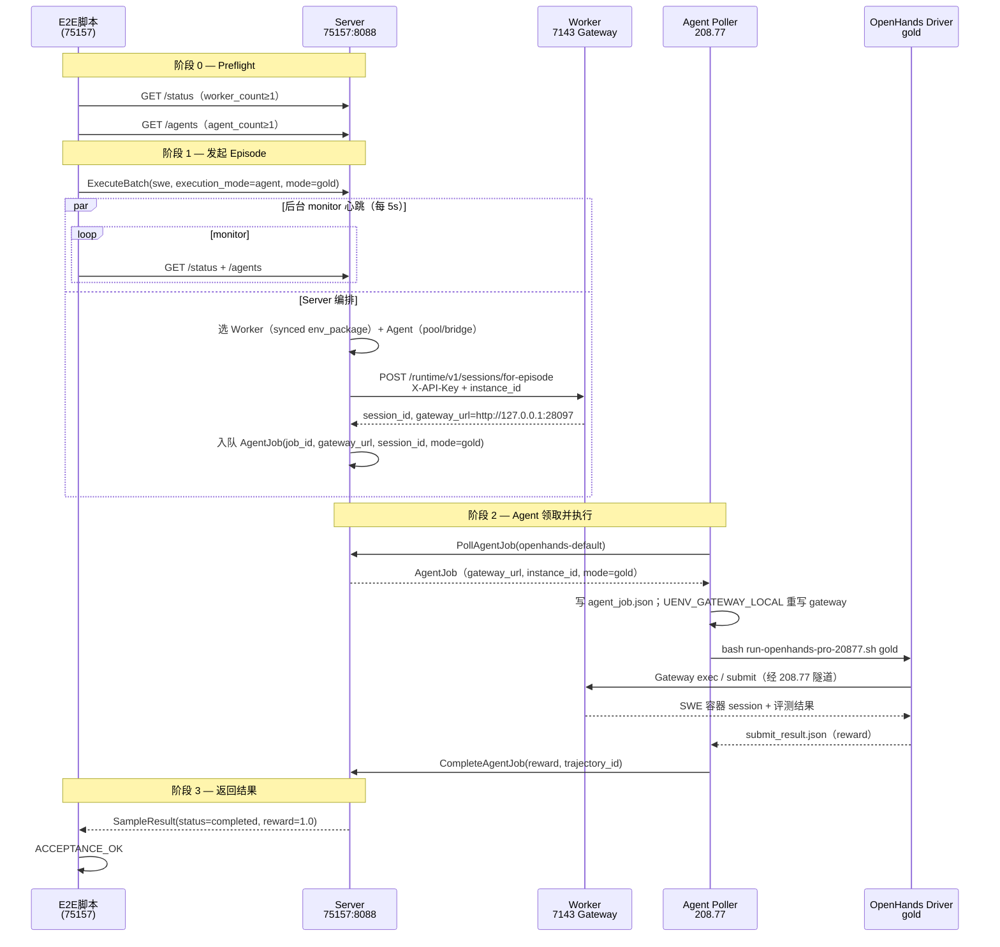

# SWE + OpenHands 全链路实机测试报告

> **日期**：2026-07-05  
> **关联文档**：`260705-swe-agent-orchestration-e2e-audit.md`（审计）、`260701-openhands-hub-implementation-status-report.md`（规划）  
> **测试脚本**：`scripts/swe_agent_orchestration_e2e.py`（经 `scripts/run_e2e_on_server.py` 在 Server 上执行）  
> **结论**：Server 居中编排路径 **验收通过**；单条 gold 实例 **reward=1.0**，全链路可重复跑通。

---

## 1. 测试目标与范围

验证规划中的 **Server 居中双池编排** 是否能在四端实机闭环：

```text
Adapter ExecuteBatch(swe, execution_mode=agent)
  → Server 选 Worker + Agent
  → Worker for-episode 预建 SWE session
  → Agent PollAgentJob 领取任务
  → OpenHands gold driver 经 Gateway 执行并 submit
  → CompleteAgentJob → EpisodeResult(reward)
```

**不在本次范围**：VeRL 训练侧 Adapter 常驻进程、LLM 模式长时 Agent 推理、公网 `:28097` NAT 修复。

---

## 2. 实机拓扑与前置条件

| 角色 | 地址 | 本次测试中的职责 |
|------|------|------------------|
| **Server** | `8.130.75.157:8088`（gRPC）、`:50052`（admin） | 编排、for-episode 调用、AgentJob 队列 |
| **Worker** | 7143 `219.147.100.43:28888` / Gateway `:28097` | EnvPackage 环境、Runtime Gateway、轨迹上传 |
| **Agent** | 208.77 `8.130.208.77` | `uenv-agent-poller`：RegisterAgent + 跑 OpenHands driver |
| **测试发起** | 75157 本机 | 模拟 Adapter 调用 `ExecuteBatch` |

**网络补偿（实机必需）**：

| 链路 | 机制 | 说明 |
|------|------|------|
| Server → 7143 Gateway | `uenv-gateway-tunnel-7143.service` | 75157 `127.0.0.1:28097` → 7142 跳板 → `10.10.20.143:28097` |
| 208.77 → 7143 Gateway | `uenv-gateway-tunnel.service` | 208.77 `127.0.0.1:28097` → 同上 |
| Worker 注册 URL | `UENV_SWE_GATEWAY_PUBLIC_URL=http://127.0.0.1:28097` | 公网 `219.147.100.43:28097` NAT 未通，各端经本机隧道访问 |

---

## 3. 链路时序图



---

## 4. 测试流程简介

### 4.1 脚本做了什么

`scripts/swe_agent_orchestration_e2e.py` 在实机上等价于 **Adapter 提交单条 SWE+Agent batch**：

| 步骤 | 动作 | 成功判据 |
|------|------|----------|
| 0 | Preflight：`/status` 检查 Worker；`/agents` 等待 Agent 注册 | `worker_count≥1`，`agent_count≥1` |
| 1 | 构造 `SampleEnvelope`（见 §5.1） | — |
| 2 | 启动 `ProgressMonitor` 后台线程，每 5s 打印 `monitor#N` | 阻塞期间仍有输出 |
| 3 | `ExecuteBatch` → Server gRPC `:8088` | 同步等待至 Agent 完成或超时（默认 900s） |
| 4 | 断言 `status=completed` 且 `reward≥1.0` | 打印 `ACCEPTANCE_OK` |

本地 Windows 可通过 `scripts/run_e2e_on_server.py` SSH 到 75157，同步脚本并 **流式打印** 远程 stdout。

### 4.2 单次 Episode 在 Server 内部经历的步骤

1. **调度 Worker**：匹配 `swe-bench-pro@0.2.0` 已 sync 的 7143 Worker。  
2. **调度 Agent**：从 `openhands-default` 池选已注册、bridge=`uenv-agent-openhands@1.0.0` 的 Agent。  
3. **for-episode**：Server 经本机隧道 POST 7143 Gateway，创建 Docker SWE session，返回 `session_id`。  
4. **下派 AgentJob**：携带 `gateway_url`、`session_id`、`instance_id`、`mode=gold` 等。  
5. **Agent 执行**：208.77 poller 领取 Job → OpenHands official driver（gold 模式，不走 LLM）→ Gateway submit。  
6. **回填**：`CompleteAgentJob` → Server 汇总为 `ExecuteBatch` 的 `SampleResult`。

---

## 5. 测试配置

### 5.1 Episode Payload（与脚本默认一致）

| 字段 | 值 |
|------|-----|
| `env_type` | `swe` |
| `execution_mode` | `agent` |
| `env_package_id` / `version` | `swe-bench-pro` / `0.2.0` |
| `instance_id` | `instance_qutebrowser__qutebrowser-f91ace96223cac8161c16dd061907e138fe85111-v059c6fdc75567943479b23ebca7c07b5e9a7f34c` |
| `benchmark_variant` | `pro` |
| `mode` | `gold`（官方 gold patch，非 LLM Agent） |
| `agent_bridge_id` / `version` | `uenv-agent-openhands` / `1.0.0` |
| `agent_pool_id` | `openhands-default` |
| `command_mode` | `full_shell` |

### 5.2 复现命令

```bash
# 在 8.130.75.157 上（或 run_e2e_on_server.py 自动同步后执行）
cd /root/UEnv
PROTOCOL_BUFFERS_PYTHON_IMPLEMENTATION=python \
PYTHONPATH=/root/UEnv/uenv-bridge/src/uenv/bridge/gen \
python3 -u scripts/swe_agent_orchestration_e2e.py \
  --server 127.0.0.1:8088 \
  --admin http://127.0.0.1:50052 \
  --episode-timeout 900 \
  --monitor-interval 5
```

Windows 开发机：

```powershell
python scripts/run_e2e_on_server.py
```

---

## 6. 实机测试结果

### 6.1 结果汇总

| 轮次 | 时间 (UTC+8) | Episode ID | 耗时 | status | reward | 结论 |
|------|--------------|------------|------|--------|--------|------|
| **首轮验收** | 2026-07-05 17:42 | `e2e-0dd38c818d55` | ~21s | completed | **1.0** | ACCEPTANCE_OK |
| **复测** | 2026-07-05 17:48 | `e2e-f9a447b5843c` | ~21s | completed | **1.0** | ACCEPTANCE_OK |

两轮均使用同一 qutebrowser Pro 实例、gold 模式；结果 **可重复**。

### 6.2 首轮验收日志摘录（17:42）

```text
[17:42:20] ExecuteBatch -> 127.0.0.1:8088 episode=e2e-0dd38c818d55 (timeout=960s)
[17:42:20] monitor#1 active_episodes=0 running_jobs=0 pending=0 in_flight=[]
[17:42:25] monitor#2 active_episodes=1 running_jobs=1 pending=0 in_flight=['job-e2e-0dd38c818d55']
[17:42:30] monitor#3 active_episodes=1 running_jobs=1 pending=0 in_flight=['job-e2e-0dd38c818d55']
[17:42:35] monitor#4 active_episodes=1 running_jobs=1 pending=0 in_flight=['job-e2e-0dd38c818d55']
[17:42:39] ExecuteBatch done: status=completed reward=1.0 done=True err=
[17:42:39] ACCEPTANCE_OK swe+agent orchestration E2E passed
```

208.77 agent-poller 侧（journalctl）：

```text
[agent-poll] got job=job-e2e-0dd38c818d55 instance=instance_qutebrowser__... mode=gold gateway=http://127.0.0.1:28097
[agent-poll] completed job=job-e2e-0dd38c818d55 status=completed reward=1.0 trajectory_id=trj-worker-7143-pro-1783244550494-00001 acked=True
```

### 6.3 复测日志摘录（17:48）

```text
[17:48:14] ExecuteBatch -> episode=e2e-f9a447b5843c
[17:48:19] monitor#2 active_episodes=1 running_jobs=1 in_flight=['job-e2e-f9a447b5843c']
[17:48:24] monitor#3 ...
[17:48:29] monitor#4 ...
[17:48:34] ExecuteBatch done: status=completed reward=1.0
[17:48:34] ACCEPTANCE_OK swe+agent orchestration E2E passed
```

### 6.4 Preflight 快照（17:48 复测前）

| 检查项 | 结果 |
|--------|------|
| Server `/status` | `worker_count=1`，`worker-7143-pro` ready |
| Server `/agents` | `agent_count≥1`（存在历史 stale 注册，不影响调度） |
| 75157 Gateway 隧道 | `uenv-gateway-tunnel-7143` **active** |
| 75157 `127.0.0.1:28097/runtime/v1/health` | `ok` |
| 208.77 poller + 隧道 | **active**；runner health ok |

---

## 7. 结果分析

### 7.1 时序与耗时

- **for-episode + 调度**：ExecuteBatch 发出后约 **5s** 内 monitor 出现 `running_jobs=1`，说明 Server 已完成 Worker/Agent 选型并成功建 session。  
- **Agent 执行（gold）**：从 `running_jobs=1` 到 `ExecuteBatch done` 约 **15–20s**，符合 gold driver（预置 patch、无 LLM 迭代）的预期，远短于 `--episode-timeout 900` 上限。  
- **monitor 心跳**：ExecuteBatch 阻塞期间每 5s 输出 `monitor#N`，可有效区分「长时运行」与「进程卡死」。

### 7.2 reward=1.0 的含义

- 本次 `mode=gold`：OpenHands driver 应用 **官方 gold patch**，经 Gateway `submit` 后 Worker 跑 SWE-bench Pro 评测。  
- `reward=1.0` 表示该 **instance 测试通过**（resolved），证明 SWE 环境、Gateway 会话、submit 路径均正常。  
- 首轮还产生轨迹 ID `trj-worker-7143-pro-...`，说明 Worker → Server `:8077` 轨迹链路在编排路径下仍可用。

### 7.3 与旁路模式的对比

| 维度 | 旁路（208.77 直连 Gateway） | 本次 Server 编排路径 |
|------|------------------------------|----------------------|
| 触发方 | 208.77 本地脚本 | **75157 ExecuteBatch** |
| Worker 选型 | 硬编码 Gateway | **Server 按 env_package 调度** |
| Agent 选型 | 无 Agent 池 | **PollAgentJob + CompleteAgentJob** |
| 适用场景 | 调试 OpenHands / Gateway | **与 VeRL/Adapter 生产路径一致** |

### 7.4 打通过程中暴露的实机问题（已处理）

| 问题 | 现象 | 处理 |
|------|------|------|
| 公网 Gateway 不可达 | Server for-episode 连 `219.147.100.43:28097` 失败 | 75157/208.77 SSH 隧道 + Worker 注册 `127.0.0.1:28097` |
| for-episode 401 | 缺 `X-API-Key` | Server 增加 header（`UENV_SWE_GATEWAY_API_KEY`）并重建二进制 |
| Agent poll stub | `agent_pb2` 导入失败 | 补 `gen/uenv/v1/__init__.py`，修正 `agent_client.py` |
| 208.77 脚本 CRLF / `$HOME` | driver exit 2/1 | 部署去 `\r`；`${HOME:-/root}` |

上述问题属于 **部署与运维层**，不改变编排架构设计；修复后两轮测试均稳定通过。

### 7.5 已知限制与后续建议

1. **Agent 池 stale 条目**：多次重启 poller 会在 `/agents` 留下 `stale=true` 的旧 ID，建议 Server 侧定期清理或缩短 stale 判定窗口。  
2. **公网 `:28097` NAT**：仍未修复；生产若需 Agent 直连公网 Gateway，需 A100 侧补端口映射，或统一走隧道/内网 URL。  
3. **LLM 模式**：本次仅验收 **gold**；`mode=llm` 耗时会显著增加，需单独压测与 timeout 配置。  
4. **Adapter 正式接入**：E2E 脚本已证明 `ExecuteBatch` 路径；VeRL 侧只需按 §5.1 payload 构造 batch 即可接入。

---

## 8. 结论

2026-07-05 实机测试表明：**Adapter → Server → Worker(for-episode) → Agent(OpenHands) → Gateway(submit) → reward** 全链路在 gold 单实例上 **两次连续通过**，`reward=1.0`，monitor 心跳满足可观测性要求。Server 居中 SWE+Agent 编排 **具备上线验收条件**；旁路模式可保留为 OpenHands 单机调试入口。

---

## 9. 变更记录

| 版本 | 日期 | 说明 |
|------|------|------|
| v1.0 | 2026-07-05 | 首版：基于 17:42 首轮验收与 17:48 复测实机日志 |
