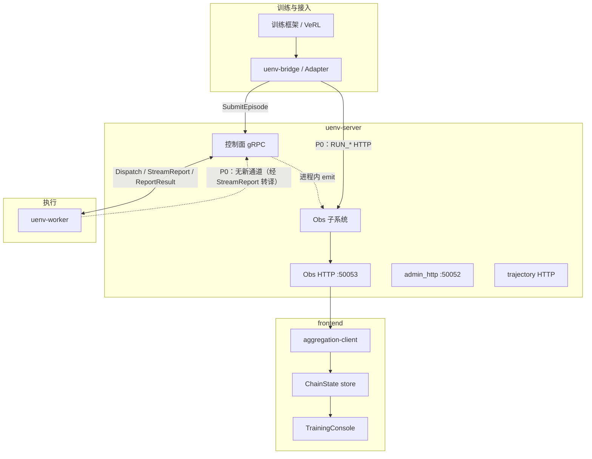
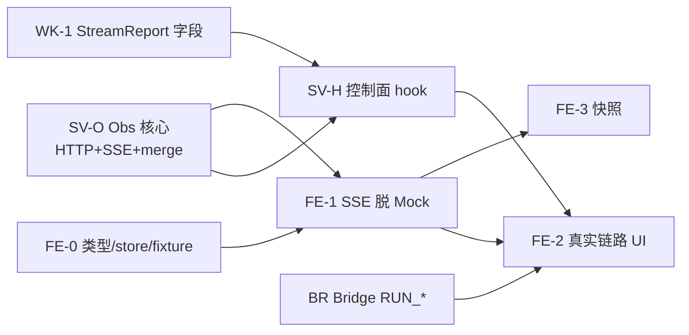

# UEnv 可视化：Server 侧聚合与前端接入规划

> **日期**：2026-07-15（细化修订）  
> **状态**：讨论稿（待确认后可作为实现依据）  
> **相对 6/12 冻结决策的变更**：观测面**聚合层不再独立进程**，内嵌于 **`uenv-server`**；前端仍只消费观测面，不直连控制面 gRPC。  
> **继承文档**（数据模型 / UI / 事件治理仍有效，落点改名即可）：
> - [2026-06-12-讨论稿.md](./2026-06-12-讨论稿.md)
> - [260612-前端完整设计.md](./260612-前端完整设计.md)（`ObservabilityEvent` / `ChainState` / SSE / 僵尸事件策略）
> - [2026-06-12-前端ui设计稿.md](./2026-06-12-前端ui设计稿.md)
> - [260612-实现清单.md](./260612-实现清单.md)（任务归属以本稿 §10–§11 为准）
> - 前端现状：[frontend/README.md](../../../frontend/README.md)（UI 骨架 + Mock，未接 API）

**本文结构**：§1–§3 决策与架构 → **§4 前端推进路线** → **§5–§9 各模块改动** → §10 依赖与分期 → §11 拍板项。

---

## 1. 为什么改成 Server 侧聚合

### 1.1 现状与矛盾

| 项 | 说明 |
|----|------|
| 前端 | `TrainingConsole` 布局就绪；API / store / SSE **未实现** |
| 6/12 冻结 | 独立聚合层 + 各模块 HTTP 上报 |
| Server | 已是调度事实中心；另有 `admin_http`、`trajectory` |
| 早期讨论 | §3.4 原建议即「Server 侧聚合 + SSE」 |

### 1.2 本稿决策

| # | 议题 | 新结论 |
|---|------|--------|
| A | 事实源 | **`uenv-server` 内嵌 Obs** |
| B | 前端 | 只连 Obs **REST + SSE** |
| C | 契约 | `ObservabilityEvent` / `ChainState` / 归并规则 **不变** |
| D | P0 控制 | **只读观测优先**；start/stop 可后置 |
| E | 隔离 | Obs 失败不阻断调度；`emit` 禁止同步 IO |

---

## 2. 目标架构



| 平面 | 前端关系 |
|------|----------|
| 业务执行面（gRPC） | **不**直连 |
| 观测面（Obs HTTP） | **唯一**入口 |

| 通道 | 默认 | 与 Obs |
|------|------|--------|
| gRPC | `:50051` | 旁听 hook |
| `admin_http` | `:50052` | 保留运维，不当前端主协议 |
| `trajectory` | 可配 | 产物仓，可外链 `trajectory_id` |
| **Obs HTTP** | **`:50053`** | 前端 + ingress |

---

## 3. 数据汇入原则（跨模块）

**谁最早拥有事实，谁发出事件。**

| 形态 | 谁 | P0 |
|------|----|----|
| 进程内 `obs.emit` | Server 控制面 | **主路径** |
| StreamReport / ReportResult 转译 | Server `project` | **Worker 进展主路径** |
| HTTP `POST /api/v1/events` | Bridge `RUN_*`；未来 Worker 细粒度 | **补充** |

统一契约见 [260612-前端完整设计 §5](./260612-前端完整设计.md)：`ObservabilityEvent` 入站，SSE `full_state` / `state_delta` 出站。

```text
hook / HTTP / StreamReport 转译
        │
        ▼
   Ingest（幂等 event_id）→ Merge（lifecycle + seq）→ obs.db
        │
        ▼
   ChainState 内存态 → 批合并 → SSE
```

---

## 4. 前端推进路线（在现有骨架上继续）

> **现状**：`frontend/src/components/training-console.tsx` 全 Mock；`src/lib/api/` 仅示例 `createServerFn`；无 `ChainState` types / SSE client / store。  
> **目标**：脱 Mock，消费 Server Obs；**不**改业务控制面。

### 4.1 与 Server 的并行策略

前端不必等 Server 全部 hook 做完再开发，按可联调能力拆解：

| 阶段 | 前端可做什么 | Server 最小依赖 |
|------|--------------|-----------------|
| **FE-0** | 类型、client、store 单测、Mock SSE fixture | 无 |
| **FE-1** | 接真实 SSE；UI 绑 store | Obs：`/state` + `/stream` + 可注入假事件（HTTP ingest 或内存 seed） |
| **FE-2** | 接真实训练链路 | 控制面 hook 产出真实 episode 流 |
| **FE-3** | 快照体验打磨；可选 start/stop | run lifecycle +（可选）REST 控制 |

### 4.2 目录与文件改造（建议）

```text
frontend/src/
├── lib/
│   ├── types/
│   │   ├── chain-state.ts      # ChainState, WorkflowGraph, TreeGraph, …
│   │   ├── events.ts           # ObservabilityEvent（可选，主要给工具页）
│   │   ├── state-delta.ts      # StateDelta, EventCursor
│   │   └── run.ts              # RunStatus, ClientSnapshot
│   ├── api/
│   │   ├── aggregation-client.ts   # REST + EventSource
│   │   └── aggregation-types.ts    # SSE envelope
│   ├── store/
│   │   ├── chain-store.ts      # 本地 ChainState + applyDelta
│   │   ├── connection.ts       # SSE 连接态
│   │   └── snapshots.ts        # 本地快照列表
│   └── config.ts               # 读 VITE_AGGREGATION_*
├── hooks/
│   ├── use-run-stream.ts       # 订阅某 training_run_id
│   └── use-chain-view.ts       # live vs snapshot 选择渲染源
└── components/
    ├── training-console.tsx    # 去 Mock，接 hooks
    ├── workflow-panel.tsx      #（可拆）绑 WorkflowGraph
    ├── tree-panel.tsx
    └── …
```

### 4.3 前端任务清单（按优先级）

#### FE-0：类型与纯逻辑（可先做，不堵后端）

| ID | 改动 | 验收 |
|----|------|------|
| FE-0.1 | 按 §5.4–5.5 定义 TS 类型；字段名与 Server JSON **snake_case 对齐** | typecheck 通过 |
| FE-0.2 | `applyStateDelta(state, delta)`：仅接受更高 `event_seq`；幂等 | 单测：乱序 / 重复 / 覆盖 |
| FE-0.3 | 用静态 JSON fixture（一份 `full_state` + 若干 `state_delta`）驱动 store | 无网络可演示状态推进 |
| FE-0.4 | 环境变量：`VITE_AGGREGATION_BASE_URL`、`VITE_AGGREGATION_TOKEN`；缺省回落 fixture 模式 | README 更新 |

#### FE-1：API 客户端 + SSE + 脱 Mock 主路径

| ID | 改动 | 验收 |
|----|------|------|
| FE-1.1 | `aggregationClient.getState(runId)` → `GET .../state` | 能拉到 `ChainState` |
| FE-1.2 | `subscribeStream(runId, { lastEventId })`：处理 `full_state` / `state_delta` / `run_status` / `ping` | 控制台见连接态变化 |
| FE-1.3 | 断线重连：带 `Last-Event-ID`；收到全量则覆盖；按 `event_id` 去重 | 断网恢复后状态一致 |
| FE-1.4 | `TrainingConsole`：workflow / tree / 顶栏 run 态绑 store；**删除或 `#if mock` 静态数组** | 页面数据来自 SSE |
| FE-1.5 | SSE 指示：连接中 / 重连中 / 已断开；空态与 API 错误态 | 与 §0.4 G 一致 |
| FE-1.6 | Detail 面板：选中 workflow 节点展示 `payload_summary` | 选中切换有效 |

**此阶段可不实现**：开始/终止训练按钮的真实 API（按钮可 disabled + tooltip「P0 只读」）。

#### FE-2：与真实链路对齐（依赖 Server hook）

| ID | 改动 | 验收 |
|----|------|------|
| FE-2.1 | 工作流节点映射真实 `WorkflowGraph.stage`（SUBMIT→…→DONE） | 一次 SubmitEpisode 走完节点变色 |
| FE-2.2 | 树：`run → worker → env_instance? → episode → step` | 树节点数随 episode 增减 |
| FE-2.3 | 顶栏展示 `training_run_id`、`run_state`、`updated_at` | 与 Obs 一致 |
| FE-2.4 | 底部 Events Tab：可选展示近期 delta 游标/摘要（非原始刷屏） | 可选；日志 Tab 仍 P1 |

#### FE-3：快照与体验（前端本地，几乎不依赖后端）

| ID | 改动 | 验收 |
|----|------|------|
| FE-3.1 | 抓拍：深拷贝 `ChainState` + `EventCursor` + `captured_at` | 列表新增一条 |
| FE-3.2 | live ↔ snapshot 切换；抓拍不中断 SSE | 切回 live 见最新态 |
| FE-3.3 | （可选）快照 IndexedDB 持久化 | 刷新后仍在 |
| FE-3.4 | （可选）工作流 ↔ 树选中联动 | UX |

#### FE-P1：后置

| ID | 内容 |
|----|------|
| FE-P1.1 | 日志 / Metrics Tab 接真实 API |
| FE-P1.2 | 历史回放时间轴 |
| FE-P1.3 | `POST /runs` + `/stop` 正式控制（若拍板需要） |

### 4.4 前端明确不做

- 直连 gRPC / `admin_http /status` 当主状态机  
- 解析多机文本日志拼工作流  
- 用 trajectory list 拼主视图（最多外链）

### 4.5 前端联调最小环境

```bash
# 1) Server Obs 已 listen :50053，且至少能 seed 一个 run
# 2) frontend
cd frontend && npm install
cp .env.local.example .env.local   # VITE_AGGREGATION_BASE_URL=http://127.0.0.1:50053
npm run dev                          # :8080
```

联调顺序建议：**先 FE-0 fixture → FE-1 接 Obs seed → FE-2 接真实 SubmitEpisode**。

---

## 5. 模块改动总览

| 模块 | 仓库路径 | P0 改动量 | 角色 |
|------|----------|-----------|------|
| **frontend** | `frontend/` | 中 | 观测消费端 |
| **uenv-server（Obs）** | `uenv-server/src/obs/` | **大**（新建） | 事实源 + HTTP/SSE |
| **uenv-server（控制面）** | `service.rs` / `control_plane.rs` 等 | 中（埋点） | 进程内 emit |
| **uenv-bridge** | `uenv-bridge/` | 小 | `RUN_*` + 可选元数据 |
| **uenv-worker** | `uenv-worker/` | **P0 接近零** | 靠现有 StreamReport |
| **proto** | `proto/uenv/v1/` | 可选小改 | metadata / 文档；不阻塞 P0 |
| **Hub / 插件** | — | P0 无 | 字段捎带即可 |

以下各节给出**具体文件、触发点、事件、验收**。

---

## 6. `uenv-server`：Obs 子系统 + 控制面埋点

### 6.1 新建 Obs 模块（P0 核心）

建议目录：

```text
uenv-server/src/obs/
  mod.rs          # ObsHandle { emit, subscribe }
  event.rs        # ObservabilityEvent / Disposition
  ingest.rs
  merge.rs        # RunLifecycle / EntityVersion / ChainState
  store.rs        # SQLite obs.db（与 trajectory.db 分库）
  http.rs         # axum：events / runs / stream / state / health
  project.rs      # StreamReport → ObservabilityEvent
  seed.rs         # 开发用 seed run（供 FE-1）
```

| ID | 改动 | 参考原清单 |
|----|------|------------|
| SV-O1 | `obs.enabled` / `http_listen` / `db_path` / `token` / `queue_capacity` 配置 | A-M1 |
| SV-O2 | SQLite DDL：`events`、lifecycle 表、`late_events`、`reverse_index` | A-M2–3 |
| SV-O3 | `emit`：入队；满则丢弃 + metrics；**调用方永不 await 落盘** | §1.2 E |
| SV-O4 | Ingest：schema、`event_id` 幂等、`ingest_ts`/`disposition` | A-M5–7 |
| SV-O5 | Merge：关闭边界、乱序 seq、更新 `ChainState.workflow/tree` | A-M8–15 |
| SV-O6 | HTTP：`POST /api/v1/events`、`GET .../state`、`GET .../stream`、`GET /health` | A-M16–25 子集 |
| SV-O7 | SSE：连接推 `full_state`；增量 `state_delta`；`ping`；`Last-Event-ID` | A-M16–22 |
| SV-O8 | 启动从 `events` 重放恢复内存态 | A-M28–29 |
| SV-O9 | CORS + Bearer（与前端 token 对齐） | §13.1 |
| SV-O10 | `lib.rs` 导出 `obs`；main 与 trajectory 并列 `serve` | — |

**P0 可延后**：`POST /runs`、`/stop`（FE 只读时）；logs/metrics API。

### 6.2 控制面埋点（进程内 emit）

在现有热路径**旁路**构造事件，字段尽量从已有 `EpisodeRequest` / 调度结果填充。

| ID | 插入点（大致位置） | 事件 | 关键字段 |
|----|-------------------|------|----------|
| SV-H1 | `EpisodeService::submit_episode` 接受请求后 | `EPISODE_SUBMITTED` | `episode_id`, `correlation_id`, `env_type`；`training_run_id`←`metadata` 或默认 `_orphan` |
| SV-H2 | `reserve` / 发起 `DispatchEpisode` 成功 | `EPISODE_DISPATCHED` + `ATTEMPT_STARTED` | `worker_id`, `attempt_id`, `dispatch_lease_id`, `scheduler_epoch` |
| SV-H3 | Dispatch 流收到 `StreamReport`（`project.rs`） | `STEP_STARTED` / `STEP_COMPLETE`（可采样） | `step_index`, `worker_id`, `correlation_id` |
| SV-H4 | `ReportResult` / 完成路径 ack 后 | `EPISODE_COMPLETED` 或 `EPISODE_FAILED` → `EPISODE_CLOSED` | `status`, `trajectory_id?`（摘要，非 body） |
| SV-H5 | attempt 改派 / 超时回收 | 旧 `ATTEMPT_CLOSED` + 新 `ATTEMPT_STARTED` | `attempt_id` |
| SV-H6 | `RegisterWorker` / heartbeat / drain | `WORKER_REGISTERED` / `WORKER_HEARTBEAT` | `worker_id`；心跳**不**驱动 workflow 主变色 |
| SV-H7 | （可选）异步 submit / batch API 同样 hook | 同上 | 与同步路径共用 helper |

实现建议：抽出 `obs_emit_episode_*` helper，统一 `source_id = "server:{epoch}"`、本地 `AtomicU64` 作 `seq`。

**硬约束**：埋点失败只 `tracing::warn`，**不** `?` 传播到调度返回值。

### 6.3 与现有 HTTP 共存

| ID | 改动 | 说明 |
|----|------|------|
| SV-X1 | **不**把 Obs 塞进手写 `admin_http` | 用 axum（同 trajectory） |
| SV-X2 | `admin_http` 可加一行 `obs_url` 指针（可选） | 运维发现用 |
| SV-X3 | trajectory 与 Obs 分库；树节点可挂 `trajectory_id` 外链 | 语义分离 |

### 6.4 Server 验收（P0）

1. `curl /health` → ready  
2. 仅跑 Server+Worker，无 Bridge：用 grpcurl `SubmitEpisode` → `GET .../state` 见 episode 从 SUBMIT→DISPATCH→EXECUTE→DONE  
3. 前端 FE-1 能订阅同一 `training_run_id`（可用 seed 或 metadata 约定）  
4. kill SSE 客户端不影响 episode 完成  
5. Obs 队列满时调度仍成功，metrics 可见 drop

---

## 7. `uenv-bridge` / Adapter 改动

### 7.1 P0 要做

| ID | 改动 | 说明 |
|----|------|------|
| BR-1 | 配置 `UENV_OBS_URL` / `UENV_OBS_TOKEN`（可空=禁用） | 与 Server Obs 对齐 |
| BR-2 | 薄客户端：`POST /api/v1/events`（单条即可） | 超时短、失败只打日志 |
| BR-3 | 训练/rollout **run 开始**：发 `RUN_STARTED` | 带 `training_run_id`、`source_id=bridge:...`、`seq` |
| BR-4 | run 正常/异常结束：`RUN_STOPPED` / `RUN_CLOSED` | 关闭边界供僵尸策略 |
| BR-5 | `SubmitEpisode` 请求 `metadata`（或已有字段）写入 `training_run_id`、`batch_id` | **让 Server hook 能挂到同一 run**；Bridge **不**再发 `EPISODE_SUBMITTED`（避免双写，以 Server 为准） |

落点建议：

- Python：`uenv-bridge/src/uenv/bridge/clients.py` 或新 `obs_client.py`  
- 调用点：`verl_agent_loop.py` / rollout 入口 / CLI 起停  

### 7.2 P0 不做

| 项 | 原因 |
|----|------|
| 每个 Submit 同步等 Obs ACK | 违背隔离 |
| Adapter 本地完整 WAL（可 P1） | 先保证 run 边界事件；丢一两个 RUN_STARTED 可补发 |
| `EPISODE_SUBMITTED` HTTP | 由 Server SV-H1 负责 |

### 7.3 P1

| ID | 改动 |
|----|------|
| BR-P1 | run 边界事件本地 spool + 重试 |
| BR-P2 | 结构化诊断日志 → `/api/v1/logs` |
| BR-P3 | 与前端 start/stop 编排（若启用控制 API） |

### 7.4 Bridge 验收

1. 启动一轮 VeRL/ mock loop → Obs 出现 `RUN_STARTED`，`run_state=RUNNING`  
2. 同 run 下 Submit 的 episode 在树中挂在同一 `training_run_id`  
3. Obs URL 未配置时训练仍成功  

---

## 8. `uenv-worker` 改动

### 8.1 P0：推荐零改或仅校验

| ID | 改动 | 说明 |
|----|------|------|
| WK-0 | **默认无 Obs HTTP 客户端** | 进展走现有 Dispatch 流 |
| WK-1 | 确认 `StreamReport` 填写：`episode_id`、`attempt_id`、`current_step`、`report_type`/`phase`、`correlation_id`、`worker_id` | 供 SV-H3 转译；查 `executor.rs` 现有构造 |
| WK-2 | 确认 `ReportResult` 含 `status` / 摘要 / `trajectory_id`（若有） | 供 SV-H4 |

若某路径只写 `phase` 字符串、未设 `report_type`：P0 允许 Server 按 `phase` 兼容映射（已有 MVP 兼容字段）。

### 8.2 P1：可选增强

| ID | 改动 |
|----|------|
| WK-P1 | Obs HTTP + 本地 WAL：细粒度 step / 诊断，超出 StreamReport 带宽时 |
| WK-P2 | 卡住/超时结构化事件 |
| WK-P3 | metrics 采样上报 |

### 8.3 Worker 验收（P0）

一次多步 math episode：前端树中出现 step 推进（来自 Server 转译，非 Worker 直连 Obs）。

---

## 9. 其他模块

### 9.1 proto / 公共字段（可选，不阻塞）

| ID | 改动 | 说明 |
|----|------|------|
| PR-1 | 文档约定：`EpisodeRequest.metadata["training_run_id"]` | 无需改 proto 亦可 |
| PR-2 | （可选）正式字段 `training_run_id` / `batch_id` 进 `EpisodeRequest` | 更干净，但要全链路改生成代码 |
| PR-3 | 保持 `StreamReport.report_type` 为优选；`phase` 兼容 | 已存在 |

### 9.2 Hub / 环境插件

P0 **无代码任务**。`env_type` / `env_package_id` 随 episode 事件展示即可。

### 9.3 文档 / 脚本

| ID | 改动 |
|----|------|
| DOC-1 | `uenv-server/README.md` 增加 Obs 端口与配置 |
| DOC-2 | `frontend/README.md` 将「聚合层」改为「Server Obs」；联调步骤对齐本稿 |
| DOC-3 | 联调脚本：seed run + 一条 grpcurl Submit + 打印 `/state` |
| DOC-4 | 本目录 `260612-实现清单` 头部加「被 2026-07-15 规划 supersede 任务归属」指针 |

---

## 10. 依赖关系、分期与并行

### 10.1 依赖图



### 10.2 推荐冲刺切片

| Sprint | 交付 | 参与模块 |
|--------|------|----------|
| **S1** | Obs 可 seed + SSE；前端 FE-0→FE-1 接上假数据 run | Server Obs、frontend |
| **S2** | SubmitEpisode 全生命周期进 `ChainState`；FE-2 | Server hook、Worker 字段确认、frontend |
| **S3** | Bridge `RUN_*` 挂真实 training_run；快照 FE-3；联调手册 | Bridge、frontend、docs |
| **S4（P1）** | 日志/Metrics/回放；可选 Worker HTTP；可选 start/stop | 全模块 |

### 10.3 事件所有权速查（防双写）

| event_type | P0 生产者 | 禁止 |
|------------|-----------|------|
| `RUN_STARTED/STOPPED/CLOSED` | Bridge HTTP | Server 不要凭空造 run（除非 orphan 占位策略拍板） |
| `EPISODE_SUBMITTED` | Server hook | Bridge 不要再 POST 同语义事件 |
| `EPISODE_DISPATCHED` / attempt* | Server hook | — |
| `STEP_*` | Server 转译 StreamReport | Worker P0 不直 POST |
| `EPISODE_COMPLETED/FAILED/CLOSED` | Server hook（ReportResult） | Worker 不重复 |
| `WORKER_*` | Server hook | Worker 不重复打心跳到 Obs |

### 10.4 修订后的分期表

| 阶段 | Server | Bridge | Worker | Frontend |
|------|--------|--------|--------|----------|
| **P0-a / S1** | Obs 核心 + seed | — | — | FE-0, FE-1 |
| **P0-b / S2** | SV-H1–H6 + step 转译 | — | WK-1 确认 | FE-2 |
| **P0-c / S3** | CORS/恢复打磨 | BR-1–5 | — | FE-3 |
| **P1** | logs/metrics/回放 | BR-P* | WK-P* | FE-P1 |

---

## 11. 建议拍板项

1. **Obs 端口**：固定独立 `:50053`？（本文默认是）  
2. **P0 前端**：确认 **只读观测**，start/stop 进 P1？  
3. **Worker step**：确认 P0 **仅** StreamReport 转译？  
4. **`training_run_id`**：Bridge 必传 metadata；缺失时 Server 归入 `_orphan` run 还是拒绝展示？  
5. **队列满**：丢最新 + metrics counter？（默认推荐）  

---

## 12. 结论摘要

- **前端**：按 FE-0→FE-3 在 `frontend/` 骨架上接 Obs；先 fixture/SSE，再真实链路，快照纯本地。  
- **Server**：新建 `obs/` + 控制面 `emit` + StreamReport 转译 —— **P0 工作量最大、也是主路径**。  
- **Bridge**：只保证 run 边界 + `training_run_id` 透传。  
- **Worker**：P0 基本不改，校核 StreamReport 字段即可。  
- 契约沿用 6/12；变的是**落点**与**事件所有权**，避免双写。

确认后可拆具体 PR（建议：`obs` crate 切片 → frontend types/client → hooks → Bridge RUN_*）。
