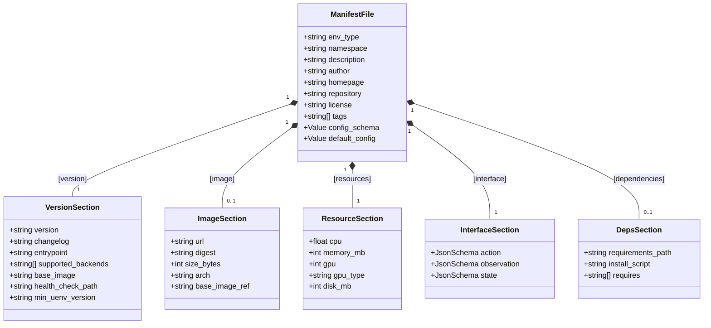
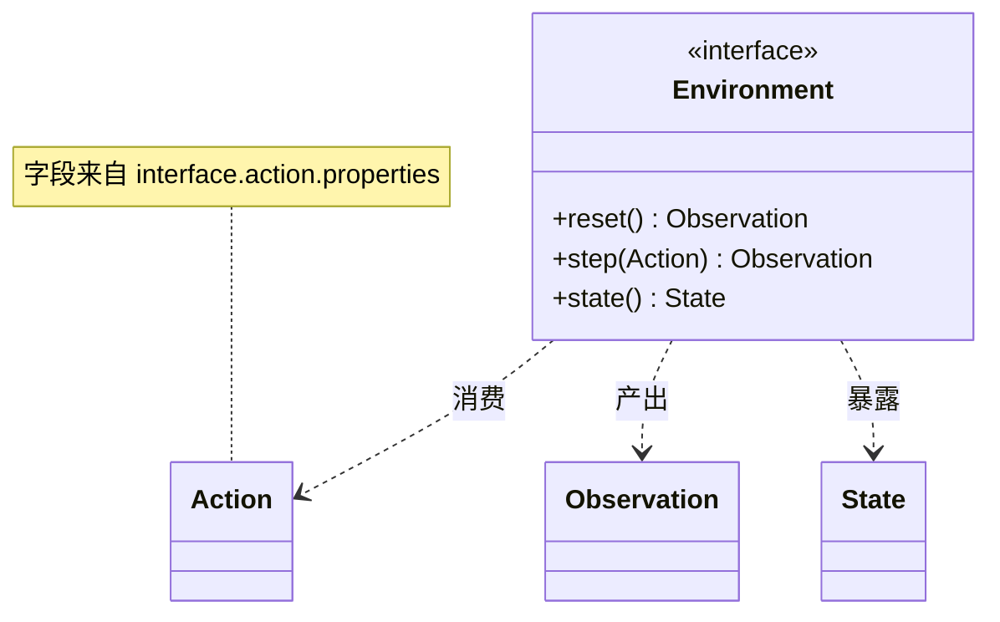
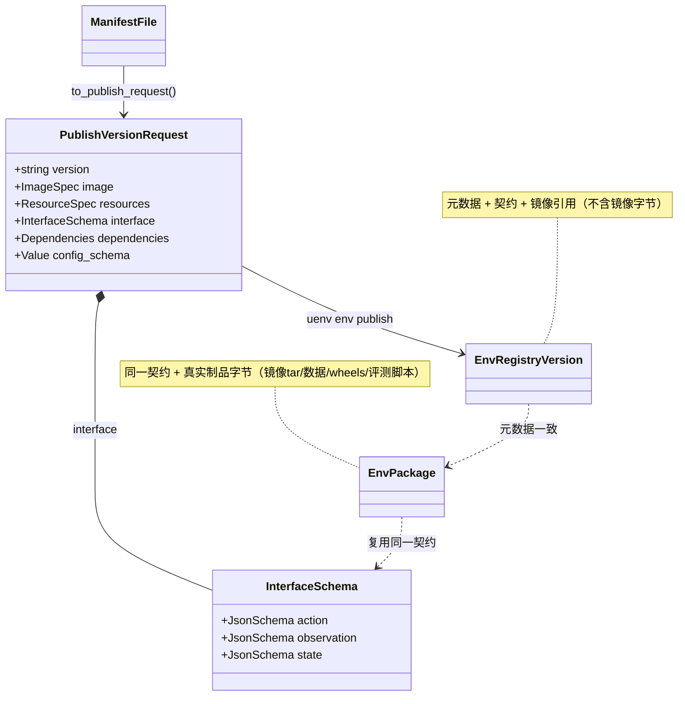

# UEnv 标准化环境定义规范（从零创建一个封装环境）

- 版本：v1.0
- 日期：2026-07-16
- 适用组件：`uenv-hub`（注册/校验/分发）、`uenv` CLI（脚手架/校验/发布）
- 关联文档：`Docs/hub/260710-标准化Hub使用手册.md`（面向使用者的发布与消费流程）、`Docs/hub/uenv-hub环境标准化指南.md`（EnvPackage 制品规范）

---

## 1. 目的与范围

已有能力解决的是「一个已封装好的环境，如何在 Hub 上提交、发布、分发与消费」。本规范解决其上游问题：**从零定义一个环境需要哪些信息、以什么结构声明、如何校验其合规**，使不同环境的创建方式统一、可复现、可机器校验。

设计上对齐 HuggingFace OpenEnv 的两条主线，并叠加本项目的硬约束：

1. **强类型环境契约**：环境以 `Action / Observation / State` 三份 JSON Schema 声明其 `reset() / step() / state()` 接口，供训练框架与校验器统一绑定；
2. **容器化封装**：环境以镜像为交付单元（`Dockerfile` + 基础镜像分层）；
3. **内网零外拉（本项目硬约束）**：运行期与构建期均不得从公网仓库拉取，镜像与依赖须内网可达或经 Hub 托管。

一句话类比：环境定义文件 `manifest.toml` 即本项目的 “openenv.yaml / Dockerfile 元数据”——它回答“这个环境是什么、怎么起、输入输出长什么样、依赖什么、镜像在哪”。

---

## 2. 一个标准环境工程的构成

`uenv env init <name>` 生成如下工程骨架（OpenEnv 风格），即“从零”所需的全部信息载体：

```
<env>/
├── manifest.toml              # 环境定义（唯一权威声明，见 §3）
├── Dockerfile                 # 镜像构建（FROM 内网基础镜像）
├── requirements.txt           # Python 依赖清单
├── src/
│   ├── models.py              # Action / Observation / State 数据结构
│   ├── env.py                 # reset() / step() / state() 业务逻辑
│   └── server.py              # HTTP 入口（暴露 /health 等）
├── examples/
│   └── episode_demo.json      # 示例 EpisodeRequest（可被校验）
├── tests/
│   └── test_episode.py        # 冒烟测试
└── README.md
```

其中 `manifest.toml` 是机器可读的权威声明，其余文件是实现载体。`src/models.py` 的三个结构必须与 `manifest.toml` 的 `[interface.*]` JSON Schema 保持一致——这是契约的“单一事实来源”。

### 2.1 环境定义数据模型（类图）

`manifest.toml` 反序列化为 `ManifestFile`（`uenv-hub-client`），由六个组合部分构成。下图给出其结构与基数，即“从零定义一个环境所需信息”的完整集合：



约束：`env_type`（必填）、`VersionSection.version`（必填、SemVer）；声明镜像时 `ImageSection.url` 必填且须内网可达（§5）；`InterfaceSection` 三份 Schema 为标准化契约（§3.4）。

### 2.2 OpenEnv 运行时契约（类图）

`[interface.*]` 三份 JSON Schema 描述的是环境运行期的强类型契约，与 `src/env.py`／`src/models.py` 一一对应。字段形状以 Schema 为准，`models.py` 只是其宿主实现：



`Action / Observation / State` 的属性即 `manifest.toml` `[interface.*]` 的 `properties`；校验器会用 `interface.action` 逐条校验 `examples/*.json` 的动作，确保示例与契约不漂移。

---

## 3. `manifest.toml` 字段规范

`manifest.toml` 是环境定义的核心。字段分为四组：**元数据、版本与运行时、镜像、契约与配置**。

### 3.1 元数据（环境级）

| 字段 | 必填 | 说明 |
|------|------|------|
| `env_type` | 是 | 环境唯一标识，仅小写字母/数字/`-`/`_`/`.`，≤128 字符 |
| `namespace` | 否 | 命名空间，默认 `default`；发布受命名空间 RBAC 约束 |
| `description` | 否 | 一句话描述 |
| `author` | 否 | 维护者 |
| `homepage` / `repository` | 否 | 主页 / 源码地址 |
| `license` | 否 | 许可证，如 `Apache-2.0` |
| `tags` | 否 | 检索标签数组 |

### 3.2 `[version]`（版本与运行时）

| 字段 | 必填 | 说明 |
|------|------|------|
| `version` | 是 | 语义化版本（SemVer），如 `0.1.0` |
| `changelog` | 否 | 本版本变更说明 |
| `entrypoint` | 建议 | 启动命令，如 `uenv-worker <env>`；无 `entrypoint` 又无 `[image]` 时校验器告警 |
| `supported_backends` | 否 | 支持的执行后端，如 `["process", "podman"]` |
| `base_image` | 否 | 构建期基础镜像（应内网可达） |
| `health_check_path` | 否 | 健康检查路径，应以 `/` 开头 |
| `min_uenv_version` | 否 | 可消费该版本的最低 `uenv-worker` 版本 |

### 3.3 `[image]`（运行时镜像）

| 字段 | 必填 | 说明 |
|------|------|------|
| `url` | 是（如声明镜像） | 运行时镜像地址；**必须内网可达**，禁止公网仓库（见 §5） |
| `digest` | 建议 | `sha256:<hex>`，用于防篡改；缺失或非法仅告警 |
| `size_bytes` / `arch` | 否 | 体积 / 架构（如 `amd64`） |
| `base_image_ref` | 否 | 构建基础镜像引用（应内网可达） |

### 3.4 契约与配置

```toml
# OpenEnv 强类型契约：三份 JSON Schema，须与 src/models.py 对齐
[interface.action]
type = "object"
[interface.action.properties.answer]
type = "string"

[interface.observation]
type = "object"
[interface.observation.properties.prompt]
type = "string"

[interface.state]
type = "object"
[interface.state.properties.step]
type = "integer"
```

| 字段 | 必填 | 说明 |
|------|------|------|
| `[interface.action/observation/state]` | 建议 | 三份 JSON Schema；缺任一，校验器给出标准化引导告警 |
| `config_schema` | 否 | 环境运行配置的 JSON Schema（如 benchmark `dataset` 枚举） |
| `default_config` | 否 | 默认配置，必须能通过 `config_schema` 校验 |
| `[dependencies]` | 否 | `requirements_path` / `install_script` / `requires`（`env_type@version` 形式） |

`examples/*.json` 中的 `request.actions[]` 会被校验器按 `interface.action` 逐条校验，确保示例与契约不漂移。

---

## 4. 两类产物：注册版本 vs EnvPackage

标准化环境在 Hub 上有两种落地形态，创建时按需选择：

| 形态 | 内容 | 何时使用 | 命令 |
|------|------|----------|------|
| **注册版本**（env registry version） | 元数据 + 运行时 + OpenEnv 契约 + 配置（**指向镜像，不含镜像字节**） | 环境有内网/托管镜像可引用，只需登记“是什么、怎么起、契约如何” | `uenv env publish` |
| **EnvPackage**（离线制品包） | 上述元数据 + **真实制品字节**（镜像 tar、benchmark 数据、依赖 wheels、评测脚本等），供 `uenv env sync` 后完全离线消费 | 内网预缓存：Worker 侧不得外拉，需把镜像/数据/依赖一并托管到 Hub | `uenv env publish-image`（镜像 tar）/ EnvPackage 发布流程（见标准化指南） |

两者互补：注册版本回答“契约与元数据”，EnvPackage 回答“离线所需的全部字节”。DSCodeBench 即以 EnvPackage 形态托管 benchmark + wheels + 评测脚本。

同一份 `manifest.toml` 是两类产物的共同上游——它先转换为 `PublishVersionRequest`（内含 `InterfaceSchema` / `ImageSpec` / `ResourceSpec` / `Dependencies`），注册版本与 EnvPackage 复用同一 `InterfaceSchema` 契约，因此二者在契约层永不漂移：



---

## 5. 内网零外拉（硬约束）

标准化环境**默认面向内网部署，运行期与构建期均不得访问公网**。规范要求：

1. **运行时镜像 `[image].url` 必须内网可达**：内部 registry（如 `registry.local/...`、`10.x:5000/...`），或先用 `uenv env publish-image` 将 `docker save` 出的 tar 托管到 Hub，再由 Worker `uenv env sync --docker-load` 本地 `docker load`；
2. **构建期基础镜像**（`base_image` / `image.base_image_ref`）须内网镜像；确需公网基础镜像时，经离线打包流程（`airgap-image-bundle.sh` 等）内网镜像化后再引用；
3. **依赖**：Python 依赖以内网 wheels/离线源提供，随 EnvPackage 分发，评测脚本仅依赖标准库或已随包的 wheels。

校验器对公网仓库引用给出告警（见 §6），公网仓库识别为镜像引用中显式的 registry host（`docker.io`、`registry-1.docker.io`、`index.docker.io`、`ghcr.io`、`quay.io`、`gcr.io`、`registry.k8s.io`、`k8s.gcr.io`、`public.ecr.aws`、`mcr.microsoft.com`、`nvcr.io`、`docker.elastic.co`）；`registry.local`、私网 IP、裸名（`uenv-base:latest`）视为内网，不告警。

> 说明：为避免误伤且不阻断早期脚手架，零外拉当前以**告警**形式呈现（`uenv env validate` 与服务端发布路径共用同一校验逻辑），团队可据此收敛为内网引用；如需硬拦截可将其升级为 error。

---

## 6. 校验规则

`uenv env validate` 与服务端发布使用**同一套** `domain::manifest` 校验逻辑，二者结论一致。规则如下：

| 级别 | 位置 | 规则 |
|------|------|------|
| error | `version` | 必须为合法 SemVer |
| error | `env_type` | 命名字符集与长度约束 |
| error | `image.url` | 声明镜像时不得为空 |
| error | `default_config` | 必须能通过 `config_schema` 校验 |
| error | `interface.*` / `config_schema` | 提供时必须是合法 JSON Schema |
| error | `dependencies.requires[]` | 必须为 `env_type@version` 形式 |
| warning | `image.url` / `base_image` / `image.base_image_ref` | 引用公网仓库（零外拉，见 §5） |
| warning | `image.digest` | 缺失或非 `sha256:<hex>`（防篡改） |
| warning | `health_check_path` | 不以 `/` 开头 |
| warning | `interface.action/observation/state` | 缺失（OpenEnv 标准化引导） |
| warning | `entrypoint` | 既无 `entrypoint` 又无 `[image]`（Worker 无法确定如何启动） |

error 会阻断发布；warning 不阻断，仅作合规引导。

---

## 7. 标准工作流

```bash
# 1. 从模板脚手架（模板由 Hub 托管，下载后按 sha256 校验）
uenv env init my-env --template echo --dir ./my-env
cd my-env

# 2. 按 §3 编辑 manifest.toml，并让 src/models.py 与 [interface.*] 对齐
$EDITOR manifest.toml src/models.py src/env.py

# 3. 本地校验（与服务端同源；先本地过再上网）
uenv env validate --manifest manifest.toml

# 4. 构建镜像（内网基础镜像）
uenv env build --manifest manifest.toml

# 5a. 内网托管镜像 tar（零外拉），供 Worker docker load
uenv env publish-image my-env-images --tar ./my-env-0.1.0.tar

# 5b. 登记注册版本（元数据 + 契约，指向内网/托管镜像）
uenv env publish --manifest manifest.toml

# 6. Worker 侧离线消费
uenv env sync my-env-images --docker-load        # 载入镜像
uenv env sync my-env                               # 拉取制品到本地目录
```

---

## 8. 完整示例（`echo` 环境）

```toml
env_type = "echo"
namespace = "default"
description = "Minimal echo environment: returns the action verbatim."
license = "Apache-2.0"
tags = ["echo", "example"]

[version]
version = "0.1.0"
entrypoint = "uenv-worker echo"
supported_backends = ["process", "podman"]
base_image = "uenv-base:latest"
health_check_path = "/health"

# 内网零外拉：url 指向内部 registry 或经 Hub 托管，切勿写 docker.io/ghcr.io
[image]
url = "registry.local/uenv/echo:0.1.0"
arch = "amd64"
base_image_ref = "uenv-base:latest"

[resources]
cpu = 1.0
memory_mb = 1024
gpu = 0

[interface.action]
type = "object"
[interface.action.properties.answer]
type = "string"

[interface.observation]
type = "object"
[interface.observation.properties.prompt]
type = "string"
[interface.observation.properties.done]
type = "boolean"

[interface.state]
type = "object"
[interface.state.properties.step]
type = "integer"
[interface.state.properties.score]
type = "number"

[dependencies]
requirements_path = "requirements.txt"
```

---

## 9. 实机联调记录（2026-07-16，Hub `8.130.95.176:8088`）

在线 Hub 上以一个一次性环境 `zzz-scaffold-probe` 完成全链路验证，验证后已 yank + 删除，未影响既有 `math/code/agent`：

| 步骤 | 结果 |
|------|------|
| `hub status` | reachable（3 environments） |
| `env init --template echo` | 从 Hub 拉取模板并生成 9 个文件 |
| `env validate`（合规 manifest） | `manifest is valid`，无告警 |
| `env validate`（公网镜像 + 缺契约） | 命中零外拉告警（`docker.io`/`ghcr.io`）+ OpenEnv 缺失告警，不阻断 |
| `env publish` | 创建环境并发布 `0.1.0` |
| `env info` | `latest=0.1.0`，`interface.action/observation/state` 三项均回环成功 |
| 清理 | `env yank` + `DELETE`（204）→ 环境列表恢复为 `code/math/agent`，探测 404 |

---
