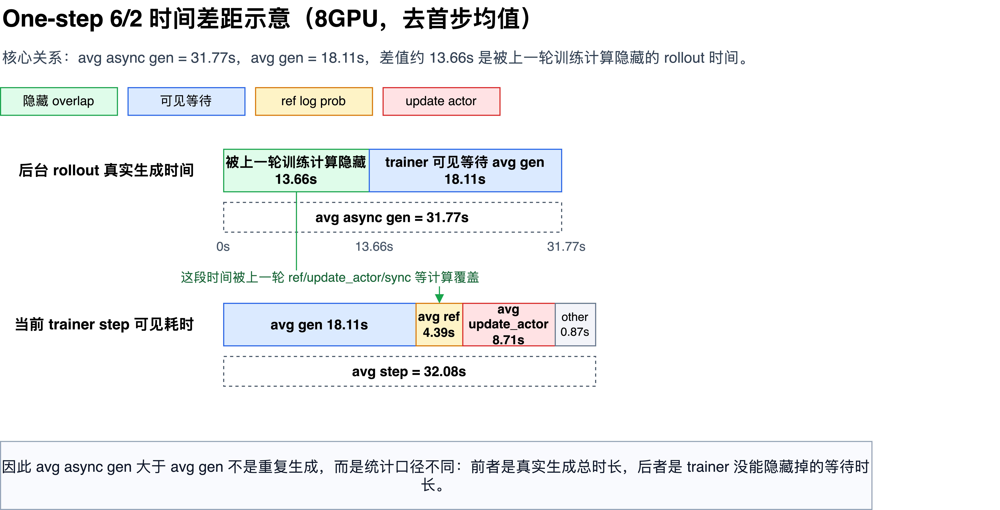

# Step 级并行调研

## 1. 背景与目标

当前 UEnv Adapter 的主线是 VeRL pre-rollout 接管：VeRL 在 AgentLoop 阶段把 batch 发给 Adapter，Adapter 经 Rust adapter core 交给 Server/Worker，Server/Worker 完成 rollout、reward，并把 EpisodeResult 返回给 VeRL，随后 VeRL 计算 advantage、loss 并更新 actor。

当前长程训练日志显示，每个 step 的主要耗时集中在 `timing_s/gen`，也就是外部 rollout/generation 阶段。典型同步流程如下：

```text
step t rollout -> reward -> advantage -> actor update -> update rollout weights -> step t+1 rollout
```

如果 rollout 远慢于 actor update，同步 step 会导致训练吞吐受限。因此下一阶段需要系统调研 step 级并行：让 rollout、Server/Worker 计算和 trainer update 尽量重叠。

本调研面向四个框架：

| 框架 | 本文定位 |
|---|---|
| VeRL | 当前 UEnv Adapter 已接入的训练框架，也是现有实验基线 |
| ROLL | 重点调研对象，官方定位是面向大模型 RL 的分布式训练框架 |
| ROCK | 重点看环境、sandbox、GEM 协议和调度层能力，判断它是否影响 rollout 并行 |
| NexRL | 重点看服务化、松耦合 post-training 架构，以及它对训练、推理、trajectory pool 和权重同步解耦的启发 |

复杂流程图见：


## 2. Step 级并行技术谱系

Step 级并行不是单一技术，而是一组围绕“rollout 与 update 是否重叠”的调度方式。

| 技术形态 | 核心思想 | 数据新鲜度 | 吞吐潜力 | 实现复杂度 | 主要风险 |
|---|---|---:|---:|---:|---|
| 同步 step | 当前 step 全部完成后再进入下一 step | 最新 | 低 | 低 | rollout 慢时 trainer 等待 |
| One-step off-policy | rollout 和 update 做一拍流水线，训练数据最多旧一轮 | 轻微 stale | 中 | 中 | old log prob、policy version、weight sync 语义要对齐 |
| Fully async | rollout producer、result queue、trainer consumer 全解耦 | 可能 stale 多轮 | 高 | 高 | stale sample、队列回压、debug 难度高 |
| Partial overlap | 训练 GPU 和 rollout GPU 部分重叠或独立调度 | 取决于实现 | 中高 | 中高 | 资源切分不合理时可能更慢 |
| Environment-level async | 环境/工具调用并发执行，trainer 仍可能同步消费结果 | 样本层面新鲜 | 中 | 中 | 只能解决环境慢，不一定解决 trainer 等待 |

对 UEnv Adapter 来说，最关键的是区分两类并行：

| 类型 | 说明 | 对 Adapter 的影响 |
|---|---|---|
| rollout 内部并发 | 多个 worker、多个环境、多个 vLLM endpoint 并行完成同一个 step 的 rollout | Adapter 仍可以同步等待当前 batch，但需要 batch、gateway、负载均衡 |
| training step 级并行 | step t 的 update 与 step t+1 的 rollout 重叠 | Adapter 需要处理 policy version、乱序 result、staleness、request/result buffer |

## 3. 四框架静态调研与能力矩阵

### 3.1 框架定位

| 框架 | 静态调研判断 | 对 step 级并行的关系 |
|---|---|---|
| VeRL | 已接入当前项目，提供同步 GRPO/PPO；experimental 中提供 one-step off-policy 和 fully async 相关能力 | 可以作为当前基线和第一轮对照实验 |
| ROLL | 官方介绍为基于 Ray 的大模型 RL 训练框架，支持 PPO/GRPO、vLLM/SGLang、异步 rollout/training、AutoDeviceMapping 等能力 | 是重点调研对象，需验证其异步训练和 rollout/train overlap 的真实效果 |
| ROCK | 官方定位更偏 RL environment development framework，关注环境、sandbox、GEM 协议和与训练框架集成 | 不一定直接负责 trainer step 并行，但可能影响环境侧 rollout 并发和 Server/Worker 组织方式 |
| NexRL | 官方定位是 ultra-loosely-coupled LLM post-training framework，强调 Training-as-a-Service、Rollout-as-a-Service、TrajectoryPool、WeightSyncController 和服务化接口 | 对 UEnv 的启发主要是模块边界和服务化调度，不是当前已复现的 step 并行 baseline |

参考资料：

- ROCK overview: https://alibaba.github.io/ROCK/docs/overview/
- ROLL docs: https://alibaba.github.io/ROLL/
- ROLL GitHub: https://github.com/alibaba/ROLL
- NexRL GitHub: https://github.com/nex-agi/NexRL
- VeRL one-step off-policy: https://github.com/verl-project/verl/blob/main/docs/advance/one_step_off.md
- VeRL fully async: https://github.com/verl-project/verl/blob/main/docs/advance/fully_async.md
- AReaL paper: https://arxiv.org/abs/2505.24298
- AReaL GitHub: https://github.com/areal-project/AReaL
- RealHF/ReaLHF related placement paper: https://arxiv.org/abs/2312.11819

### 3.2 同一技术在四个框架中的差异

| 技术 | VeRL | ROLL | ROCK | NexRL |
|---|---|---|---|---|
| 同步 step | 当前主线，语义清楚，rollout 完成后再 update | 预计支持同步 PPO/GRPO，可作为对照基线 | 不直接负责 trainer，同步语义取决于上层训练框架 | 可通过服务化 Trainer/Rollout 组织同步链路，但不是本文实测 baseline |
| One-step off-policy | experimental；一拍流水线，下一批 rollout 与当前 update 重叠 | 需要确认是否有等价配置，重点看 off-policy loss、IS correction、parameter sync | ROCK 本身不承担 trainer update，若与 ROLL 组合则由 ROLL 控制 | 公开材料更强调服务解耦和 trajectory pool，未看到明确 one-step off-policy 实现说明 |
| Fully async | experimental；rollouter 和 trainer 通过 queue 解耦，有 staleness/queue 指标 | 重点调研对象，官方特性中提到 asynchronous rollout/training | ROCK 可能提供 environment/sandbox 并发，但 trainer consumer 仍依赖 ROLL 等训练框架 | 架构上具备 rollout service、train service、trajectory pool、weight sync 的解耦形态，适合借鉴服务边界 |
| Rollout 多 endpoint | VeRL 可启动多个 vLLM endpoint；当前 UEnv 需要 model gateway 做统一入口 | ROLL 需要看 rollout scheduler 和 AutoDeviceMapping 如何管理 endpoint | ROCK 更可能管理环境 worker，而不是 vLLM endpoint | Inference Service 抽象统一 vLLM、SGLang、TGI 等后端，和 UEnv model gateway 思路接近 |
| Policy version | VeRL async/one-step 需要关注 `global_steps`、rollout log prob、权重同步 | 需要确认是否显式记录 policy version、staleness、IS 权重 | ROCK 层应透传 metadata，不应丢失 request/result 归属 | WeightSyncController 是直接相关组件，值得作为 UEnv 后续 policy version / sync 设计参考 |
| Environment 并发 | AgentLoop 内可并发，但当前 UEnv 主要瓶颈在外部 Worker/model generation | 可能支持 environment-level async rollout | ROCK 的优势可能在这里：环境、sandbox、GEM 调度 | Agent Service 允许 agent 直接推 trajectory 到 TrajectoryPool，适合参考 agent/worker 接入方式 |

### 3.3 能力矩阵

| 维度 | VeRL | ROLL | ROCK | NexRL |
|---|---|---|---|---|
| 是否是训练框架 | 是 | 是 | 不是主训练框架，更偏环境框架 | 是，偏服务化 post-training 框架 |
| 是否支持 GRPO/PPO | 是 | 是 | 依赖外部训练框架 | 公开材料强调 post-training/agent training，具体算法需看 recipe |
| 是否支持 rollout/train overlap | experimental 支持 | 需要通过脚本验证 | 不是主职责 | 架构支持服务解耦，但本文未实测 step overlap |
| 是否支持 fully async | experimental 支持 | 重点验证 | 不是主职责 | 更像可承载异步的服务化架构，未作为本文实测对象 |
| 是否支持 environment async | AgentLoop/rollout 侧可扩展 | 需要验证 | 是重点能力方向 | Agent Service + TrajectoryPool 对 agent rollout 接入有启发 |
| 是否管理 vLLM/SGLang endpoint | 是，VeRL rollout 侧启动 endpoint | 是，需看 scheduler 和 device mapping | 通常不直接管理模型 endpoint | Inference Service 统一接入 vLLM、SGLang、TGI 等后端 |
| 是否需要 staleness 控制 | one-step/fully async 需要 | 重点验证 | 应透传 metadata | 若做异步训练，需要结合 WeightSyncController 和 trajectory metadata |
| 是否需要 IS/off-policy correction | one-step/async 下需要关注 | 重点验证 | 不直接处理 | 取决于具体异步算法实现，公开架构材料未作为重点 |
| 对 UEnv Adapter 的直接启发 | policy version、batch、gateway、异步 result buffer | rollout scheduler、AutoDeviceMapping、异步训练策略 | environment/GEM 协议和 sandbox 调度 | 服务边界、trajectory pool、统一 inference API、weight sync controller |

## 4. 最小复现实验设计

### 4.1 统一实验原则

为了比较 VeRL、ROLL、ROCK，必须先保证实验条件尽量一致：

| 项目 | 建议配置 |
|---|---|
| 数据集 | GSM8K sample |
| 模型 | Qwen2.5-0.5B-Instruct 或同级小模型 |
| 算法 | GRPO 优先，PPO 作为补充 |
| 训练步数 | smoke test 先 5 steps，稳定后 20 steps |
| batch | 固定 `TRAIN_BATCH_SIZE`、`PPO_MINI_BATCH_SIZE`、`ROLLOUT_N` |
| response length | 固定 `DATA_MAX_RESPONSE_LENGTH` |
| GPU | 先 4GPU，再 8GPU |
| 日志 | 必须记录 step time、gen time、update time、reward、throughput、GPU 利用率 |

### 4.2 对照组

| 组别 | 目的 |
|---|---|
| VeRL sync | 当前基线，确认同步 step 下 rollout 瓶颈 |
| VeRL one-step off-policy | 验证一拍流水线是否能隐藏 rollout 时间 |
| VeRL fully async | 验证 queue 解耦是否能降低 trainer idle |
| ROLL sync | 建立 ROLL 同步训练基线 |
| ROLL async rollout/training | 验证 ROLL 的异步能力是否优于 VeRL experimental |
| ROCK + ROLL | 验证 ROCK 环境层是否能改善 environment/worker 并发，不把 ROCK 单独当 trainer |
| NexRL static design | 对比服务化 post-training 架构中的 Trainer、RolloutWorker、TrajectoryPool、Inference Service 和 WeightSyncController |

### 4.3 指标

| 指标 | 目的 |
|---|---|
| `step wall time` | 判断端到端是否加速 |
| `rollout/generation time` | 判断 rollout 是否仍是瓶颈 |
| `update_actor/train time` | 判断训练侧是否被资源切分拖慢 |
| `trainer idle ratio` | 判断 trainer 是否仍在等样本 |
| `rollouter idle ratio` | 判断 rollout 侧是否被 trainer 或队列阻塞 |
| queue size | 判断 fully async 是否有足够样本积压 |
| stale sample count | 判断异步样本是否过旧 |
| policy version gap | 判断 rollout policy 和 trainer policy 差距 |
| reward/score curve | 判断加速是否牺牲训练效果 |
| GPU util | 判断资源切分是否符合预期 |

### 4.4 实验阶段

| 阶段 | 内容 | 输出 |
|---|---|---|
| Stage 1 | 纯 VeRL 同步、one-step、fully async 对照 | 当前已有初步结果，作为基线 |
| Stage 2 | ROLL 原生同步训练 smoke test | ROLL baseline 指标 |
| Stage 3 | ROLL 异步 rollout/training 配置 smoke test | ROLL async 指标 |
| Stage 4 | ROCK + ROLL 环境侧并发验证 | ROCK 是否改善环境/worker 并发 |
| Stage 5 | NexRL 服务化架构对照 | 判断 UEnv 是否需要引入类似 TrajectoryPool / WeightSyncController 的模块边界 |
| Stage 6 | 统一资源切分对照：4GPU、8GPU | 多框架对比结论 |

## 5. 对 UEnv Adapter 的设计影响

如果后续采用 step 级并行，Adapter 不能只做同步 RPC 转发，需要明确以下字段和状态：

| 能力 | 说明 |
|---|---|
| `run_id` | 区分不同训练任务 |
| `global_step` | 标记 trainer 当前 step |
| `rollout_step` | 标记 request 属于哪个 rollout step |
| `policy_version` | 标记生成 request 时使用的 policy |
| `request_id` | 单条 episode 的唯一 ID |
| `batch_id` | batch 或 chunk 级别 ID |
| result buffer | 支持乱序 result 回来后按 request_id 回填 |
| staleness check | result 回来时检查是否过旧 |
| gateway 日志 | 记录每个 model endpoint 的请求量、延迟和失败 |

对当前 UEnv 方案来说，短期优先级仍是：

1. 保持同步 pre-rollout 主链路稳定。
2. 用 model gateway 提高多 endpoint 利用率。
3. 用 batch 接入减少逐条 episode 调度开销。
4. 再评估 one-step 或 fully async 是否值得接入。

## 6. VeRL 当前机制说明

### 6.1 当前同步 step

同步模式的语义最清楚：

```text
1. VeRL 用当前 policy v_t 发起 rollout。
2. Adapter 把 batch 转成 EpisodeRequest。
3. Server/Worker 返回 EpisodeResult。
4. VeRL 基于这个 batch 计算 reward、advantage、loss。
5. actor 从 v_t 更新到 v_t+1。
6. rollout/vLLM 同步到 v_t+1。
7. 下一 step 开始。
```

优点是训练语义清楚、debug 简单、Adapter 要求低。缺点是吞吐受 rollout 限制，`timing_s/gen` 大时整体 step time 高。

### 6.2 One-step off-policy

One-step off-policy 的目标是让 rollout 和 actor update 重叠，但限制数据最多只旧一轮。

```text
time 0:
  rollout batch t with policy v_t

time 1:
  trainer updates actor with batch t: v_t -> v_t+1
  rollout side starts batch t+1, using policy v_t or v_t+1

time 2:
  trainer updates actor with batch t+1: v_t+1 -> v_t+2
  rollout side starts batch t+2
```

VeRL 的 one-step off-policy 不是让任意旧样本进入训练，而是把异步范围限制在“一拍流水线”里。实现上，`OneStepOffRayTrainer.fit()` 先启动下一批数据的异步 rollout task，然后 `fit_step()` 等上一批 rollout 结果进入训练；在当前 batch 做 reward、log prob、advantage、actor update 的同时，下一批 rollout 已经在后台生成。

关键约束：

| 机制 | 作用 |
|---|---|
| batch 独立 future | 避免不同 batch 的 response 混在一起 |
| `uid` | 保证 advantage 按样本归属聚合 |
| `global_steps` | trace 当前样本由哪个训练 step 发起 |
| rollout log prob | old log prob 来自生成 response 的 rollout policy |
| 权重同步位置 | 控制 rollout policy 与 trainer policy 的距离 |

### 6.3 Fully async

Fully async 是更彻底的生产者-消费者模式：

```text
Rollout Producers -> Server/Worker -> Result Queue -> Trainer Consumer
```

rollout worker 持续生成 episode，Server/Worker 持续计算，trainer 持续从 result queue 里取可用 batch 更新 actor。它不再严格等待某个 step 的完整 batch。

关键组件：

| 组件 | 作用 |
|---|---|
| Request Queue | 保存待处理 EpisodeRequest |
| Result Queue | 保存已完成 EpisodeResult |
| Policy Version Manager | 记录 rollout policy 和 trainer policy 的版本关系 |
| Backpressure | 队列过长时限制继续发 request |
| Expiration | 丢弃过旧 result |
| Retry/Failure Handling | 处理 Server/Worker 超时、失败、重复返回 |

Fully async 的准确性依赖“样本携带生成时的 log prob + 队列按样本聚合 + 参数版本与 staleness 控制”。它允许 rollout producer 和 trainer consumer 解耦，但不能把没有边界的旧样本无限制送入训练。

## 7. 已有 VeRL 基线实测

本节重新整理原第 9 章和第 10 章内容。它们都是纯 VeRL 实验，不经过 UEnv Server/Worker，也不经过 Adapter model gateway。作用是给后续 ROLL、ROCK + ROLL 对比提供基线。

### 7.1 4GPU / 10step 三种 VeRL 调度对比

测试对象：

| 项目 | 脚本 | 说明 |
|---|---|---|
| 同步 VeRL baseline | `scripts/onestep_offpolicy/run_verl_grpo_sync_native.sh` | 标准同步 GRPO |
| VeRL one-step off-policy | `scripts/onestep_offpolicy/run_verl_grpo_onestep_offpolicy.sh` | `verl.experimental.one_step_off_policy.main_ppo` |
| VeRL fully async policy | `scripts/fully_async_policy/run_verl_grpo_fully_async.sh` | VeRL fully async experimental |

统一配置：

| 配置项 | 值 |
|---|---|
| GPU | 4 张 |
| `TRAINING_STEPS` | 10 |
| `TRAIN_BATCH_SIZE` | 4 |
| `PPO_MINI_BATCH_SIZE` | 4 |
| `ROLLOUT_N` | 5 |
| `ROLLOUT_TP` | 2 |
| 数据集 | GSM8K |
| 模型 | Qwen2.5-0.5B-Instruct |

日志路径：

| 项目 | 日志 |
|---|---|
| 同步 VeRL baseline | `temp/logs/verl_sync_native/sync_native_10step_20260621_211205.log` |
| VeRL one-step off-policy | `temp/logs/verl_onestep_offpolicy/onestep_layer4_aligned_10step_20260621_204955.log` |
| VeRL fully async policy | `temp/logs/verl_fully_async/fully_async_layer4_aligned_10step_20260621_222641.log` |

指标对比：

| 指标 | 同步去首条 | One-step 去首条 | Fully async 去首条 |
|---|---:|---:|---:|
| `timing_s/step` | 16.215s | 21.617s | 27.175s |
| `timing_s/gen` | 12.712s | 17.493s | 23.109s |
| `timing_s/update_actor` | 1.212s | 2.209s | 2.154s |
| `timing_s/ref` | 0.456s | 1.192s | 1.191s |
| `perf/throughput` | 121.35 | 186.58 | 76.30 |
| `critic/rewards/mean` | 0.0056 | 0.0056 | 0.0063 |
| `response_length/mean` | 282.19 | 286.92 | 301.58 |

结论：

在 `4GPU / TRAIN_BATCH_SIZE=4 / ROLLOUT_N=5 / ROLLOUT_TP=2 / 10step` 配置下，纯 VeRL 同步 baseline 的 wall-clock step time 最短。原因不是 one-step 或 fully async 机制不可用，而是当前小规模配置不适合发挥异步优势：GPU 被拆分后 rollout 侧资源变少，batch 太小，队列没有足够积压来隐藏 rollout 长尾。

### 7.2 8GPU 资源切分实验

本节记录 2026-06-22 至 2026-06-25 的 8GPU 资源切分实验。实验目标是验证在 rollout 是瓶颈的前提下，是否应该把更多 GPU 分给 rollout 侧，并对比三类 VeRL 执行模式：完全同步、one-step off-policy、fully async。

统一配置：

| 配置项 | 值 |
|---|---|
| GPU | 8 张，`0,1,2,3,4,5,6,7` |
| `TRAINING_STEPS` | 5 |
| `TRAIN_BATCH_SIZE` | 16 |
| `PPO_MINI_BATCH_SIZE` | 16 |
| `PPO_MICRO_BATCH_SIZE_PER_GPU` | 1 |
| `ROLLOUT_N` | 5 |
| `ROLLOUT_TP` | 2 |
| `DATA_MAX_RESPONSE_LENGTH` | 1024 |
| `TEST_FREQ` | -1 |
| 数据集 | GSM8K |
| 模型 | Qwen2.5-0.5B-Instruct |

资源切分：

| 方案 | trainer/update | rollout | vLLM endpoint 形态 |
|---|---:|---:|---|
| 完全同步 | 8 GPU 共享 | 8 GPU 共享 | 4 个 TP=2 rollout endpoint |
| one-step off-policy 6/2 | 2 GPU | 6 GPU | 3 个 TP=2 rollout endpoint |
| one-step off-policy 4/4 | 4 GPU | 4 GPU | 2 个 TP=2 rollout endpoint |
| fully async 6/2 | 2 GPU | 6 GPU | 3 个 TP=2 rollout endpoint |
| fully async 4/4 | 4 GPU | 4 GPU | 2 个 TP=2 rollout endpoint |

结果表：

| 方案 | 是否完成 | avg step(s) | avg gen(s) | avg async gen(s) | avg ref(s) | avg update_actor(s) | trainer idle | 备注 |
|---|---|---:|---:|---:|---:|---:|---:|---|
| 完全同步 | 完成 5/5 | 30.19 | 24.71 | - | 0.69 | 2.45 | - | 同步基线，8 GPU 同时参与训练与 rollout |
| one-step 6/2 | 完成 5/5 | 32.08 | 18.11 | 31.77 | 4.39 | 8.71 | - | rollout 变快，但 2 GPU trainer 让 ref/update 变慢 |
| one-step 4/4 | 完成 5/5 | 46.88 | 40.22 | 46.68 | 1.56 | 4.29 | - | trainer 更快，但 rollout endpoint 从 3 个降到 2 个，整体明显变慢 |
| fully async 6/2 | 完成 5/5 | 30.19 | 15.85 | - | 4.47 | 9.07 | 0.53 | step 时间接近同步基线，但 trainer 仍在等待 rollout |
| fully async 4/4 | 完成 5/5 | 32.73 | 25.70 | - | 1.59 | 4.54 | 0.78 | trainer 侧更快，但 rollout endpoint 从 3 个降到 2 个，trainer 等样本比例升高 |

时间差距图：

图 10-1 展示 one-step off-policy 6/2 配置下几个核心时间的关系。这里 `avg async gen=31.77s` 表示后台 rollout 的真实生成总时长，`avg gen=18.11s` 表示 trainer 当前 step 实际等待 rollout 结果的可见阻塞时间，两者差值约 `13.66s`，对应被上一轮训练计算覆盖掉的生成时间。

图文件：

日志位置：

| 方案 | 日志 |
|---|---|
| 完全同步 | `temp/logs/verl_sync_native/sync_native_8gpu_b16_5step_20260622_135613.log` |
| one-step 6/2 | `temp/logs/verl_onestep_offpolicy/onestep_8gpu_t2r6_b16_5step_20260622_140249.log` |
| one-step 4/4 | `temp/logs/verl_onestep_offpolicy/onestep_8gpu_t4r4_b16_5step_20260622_141728.log` |
| fully async 6/2 | `temp/logs/verl_fully_async/fully_async_8gpu_t2r6_b16_5step_20260622_140928.log` |
| fully async 4/4 | `temp/logs/verl_fully_async/fully_async_8gpu_t4r4_b16_5step_patched_logprobs_20260625_230757.log` |

fully async 4/4 的 2026-06-22 首次运行停在 1/5，原因是 VeRL experimental fully async 的 agent-loop 路径在本地依赖组合下遇到 `tokenizer.pad` 返回 list、空 response、缺失 rollout logprobs 以及 CPU Ray actor 导入 CUDA capability 等兼容问题。2026-06-25 复跑时没有修改 VeRL 源码，而是在 `uenv-bridge/src/sitecustomize.py` 中通过环境变量开启本地兼容补丁，最终完成 5/5。

8GPU 实验结论：

本轮实验不支持“4 rollout + 4 update 更合适”。在 one-step off-policy 中，4/4 的 trainer 计算确实更快，但 rollout endpoint 从 3 个降到 2 个后，生成阶段显著变慢，steady-state step 从 32.08s 退化到 46.88s。因此在当前 `TRAIN_BATCH_SIZE=16`、`ROLLOUT_TP=2`、rollout 明显偏慢的配置下，6 rollout + 2 update 比 4/4 更合理。

6/2 fully async 的 steady-state step 约 30.19s，已经接近完全同步基线，但 trainer idle ratio 仍约 0.53，说明 trainer 仍有一半左右时间在等 rollout sample。它没有明显超过同步基线，主要是因为 trainer 侧只有 2 张 GPU，`ref` 和 `update_actor` 变慢，同时 async queue 的 staleness 阈值会让 rollouter 暂停。

4/4 fully async 补测完成后，steady-state step 约 32.73s，慢于 6/2 fully async。它的 `ref` 和 `update_actor` 分别降到约 1.59s 和 4.54s，但 `gen` 升到约 25.70s，trainer idle ratio 也升到约 0.78。这个结果进一步说明当前瓶颈主要在 rollout/generation，而不是 trainer update；在 `ROLLOUT_TP=2` 且 batch 较小的短测配置下，增加 rollout endpoint 数量比增加 trainer GPU 更有效。

## 8. ROLL 统一配置复现实验

本节记录 2026-06-24 对 ROLL 的最小复现实验。目标是先确认 ROLL 在当前镜像和本机资源下能跑通 RLVR sync / async training。此前还额外做过一次 FrozenLake 的 Agentic async rollout 1-step smoke，但它只用于验证 ROLL Agentic pipeline 可以启动，不纳入本节的 GSM8K/RLVR step 并行正式对比。

本次没有修改 `/data/zhangzhiyuan/codes/ROLL-main`，复现脚本和配置都放在 `uenv-bridge/scripts/roll_step_parallel/` 下，通过只读挂载 ROLL 源码运行。

### 8.1 复现脚本

| 文件 | 作用 |
|---|---|
| `scripts/roll_step_parallel/run_roll_reproduction.sh` | 用 podman 启动 ROLL 复现实验，统一挂载模型、ROLL 源码和当前项目目录 |
| `scripts/roll_step_parallel/start_roll_pipeline.py` | 从 `uenv-bridge` 下的 Hydra 配置启动 ROLL pipeline，避免修改 ROLL 源码目录 |
| `scripts/roll_step_parallel/summarize_roll_metrics.py` | 从 ROLL stdout 日志中提取 `metrics_tag` 和 JSON metrics |
| `scripts/roll_step_parallel/configs/roll_rlvr_sync.yaml` | ROLL RLVR 同步训练 smoke 配置 |
| `scripts/roll_step_parallel/configs/roll_rlvr_async_training.yaml` | ROLL RLVR async training smoke 配置 |
| `scripts/roll_step_parallel/configs/roll_agentic_async_rollout.yaml` | ROLL Atropos/GSM8K async rollout 尝试配置；当前缺少 Atropos 依赖，未作为成功结果 |
| `scripts/roll_step_parallel/configs/roll_agentic_async_rollout_frozenlake.yaml` | 历史 FrozenLake 1-step smoke 配置；仅验证 Agentic pipeline 启动，不纳入 RLVR/8GPU 资源切分主线对比 |
| `scripts/roll_step_parallel/gem/` | 本地 GEM compatibility shim，用于补齐当前 ROLL 源码中 `gem.tools` 和 `gem.Env` 兼容问题 |

### 8.2 统一配置

| 配置项 | 值 |
|---|---|
| 镜像 | `localhost/uenv-bridge-verl:layer4-build` |
| ROLL 源码 | `/data/zhangzhiyuan/codes/ROLL-main`，只读挂载 |
| 模型 | `/data/ronghao/models/modelscope/Qwen/Qwen2___5-0___5B-Instruct` |
| GPU | 2 张，容器内 `CUDA_VISIBLE_DEVICES=0,1` |
| `ROLL_MAX_STEPS` | 1 |
| `ROLL_ROLLOUT_BATCH_SIZE` | 4 |
| `ROLL_RESPONSE_LENGTH` | 128 |
| `ROLL_GRAD_ACCUM_STEPS` | 1 |
| actor train | FSDP2，1 GPU |
| reference | FSDP2，1 GPU |
| actor infer | vLLM，1 GPU |
| RLVR reward worker | 1 个 |

说明：

| 项目 | 说明 |
|---|---|
| sync / async training | 使用 ROLL RLVR pipeline 和 math rule reward，任务数据为 ROLL 自带 math benchmark |
| Agentic async rollout | 仅做过 ROLL Agentic pipeline + FrozenLake 内置环境的 1-step smoke，用于验证 pipeline 启动；没有作为 GSM8K/RLVR step 并行正式对比 |
| Atropos/GSM8K async rollout | 当前没有完成，阻塞在缺少 `atroposlib` / `environments.gsm8k_server` 依赖 |
| 指标可比性 | 本节正式对比只覆盖 RLVR sync / async training；FrozenLake Agentic smoke 与 RLVR pipeline、任务和 reward 均不同，不直接比较训练效果和吞吐 |

### 8.3 运行命令

ROLL sync：

```bash
cd /data/ronghao/uenv/uenv-bridge
ROLL_MODE=sync \
ROLL_MAX_STEPS=1 \
ROLL_RESPONSE_LENGTH=128 \
ROLL_ROLLOUT_BATCH_SIZE=4 \
ROLL_NUM_RETURN_SEQUENCES=1 \
ROLL_GRAD_ACCUM_STEPS=1 \
ROLL_ACTOR_TRAIN_WORLD_SIZE=1 \
ROLL_REFERENCE_WORLD_SIZE=1 \
ROLL_REWARD_WORLD_SIZE=1 \
ROLL_ACTOR_INFER_START_GPU=1 \
ROLL_ACTOR_INFER_END_GPU=2 \
ROLL_NUM_GPUS_PER_NODE=2 \
PODMAN_GPU_ARGS="nvidia.com/gpu=0,1" \
CUDA_VISIBLE_DEVICES_IN_CONTAINER=0,1 \
./scripts/roll_step_parallel/run_roll_reproduction.sh
```

ROLL async training：

```bash
cd /data/ronghao/uenv/uenv-bridge
ROLL_MODE=async_training \
ROLL_MAX_STEPS=1 \
ROLL_RESPONSE_LENGTH=128 \
ROLL_ROLLOUT_BATCH_SIZE=4 \
ROLL_NUM_RETURN_SEQUENCES=1 \
ROLL_GRAD_ACCUM_STEPS=1 \
ROLL_ACTOR_TRAIN_WORLD_SIZE=1 \
ROLL_REFERENCE_WORLD_SIZE=1 \
ROLL_REWARD_WORLD_SIZE=1 \
ROLL_ACTOR_INFER_START_GPU=1 \
ROLL_ACTOR_INFER_END_GPU=2 \
ROLL_NUM_GPUS_PER_NODE=2 \
PODMAN_GPU_ARGS="nvidia.com/gpu=0,1" \
CUDA_VISIBLE_DEVICES_IN_CONTAINER=0,1 \
./scripts/roll_step_parallel/run_roll_reproduction.sh
```

ROLL Agentic async rollout 历史 smoke（FrozenLake，仅验证 pipeline 启动）：

```bash
cd /data/ronghao/uenv/uenv-bridge
ROLL_MODE=agentic_async_rollout_frozenlake \
ROLL_MAX_STEPS=1 \
ROLL_RESPONSE_LENGTH=128 \
ROLL_ROLLOUT_BATCH_SIZE=4 \
ROLL_GRAD_ACCUM_STEPS=1 \
ROLL_ACTOR_TRAIN_WORLD_SIZE=1 \
ROLL_REFERENCE_WORLD_SIZE=1 \
ROLL_ACTOR_TRAIN_START_GPU=1 \
ROLL_ACTOR_TRAIN_END_GPU=2 \
ROLL_REFERENCE_START_GPU=1 \
ROLL_REFERENCE_END_GPU=2 \
PODMAN_GPU_ARGS="nvidia.com/gpu=0,1" \
CUDA_VISIBLE_DEVICES_IN_CONTAINER=0,1 \
./scripts/roll_step_parallel/run_roll_reproduction.sh
```

指标汇总命令：

```bash
python3 scripts/roll_step_parallel/summarize_roll_metrics.py \
  temp/logs/roll_step_parallel/sync/roll_sync_fsdp2_2gpu_aligned_20260624_140715.log \
  temp/logs/roll_step_parallel/async_training/roll_async_training_fsdp2_2gpu_aligned_20260624_141458.log \
  temp/logs/roll_step_parallel/agentic_async_rollout_frozenlake/roll_agentic_async_rollout_frozenlake_fsdp2_20260624_135901.log
```

### 8.4 复现结果

| 模式 | pipeline | 任务/环境 | 是否完成 | 日志 |
|---|---|---|---|---|
| ROLL sync | RLVR | math rule | 完成 | `temp/logs/roll_step_parallel/sync/roll_sync_fsdp2_2gpu_aligned_20260624_140715.log` |
| ROLL async training | RLVR | math rule | 完成 | `temp/logs/roll_step_parallel/async_training/roll_async_training_fsdp2_2gpu_aligned_20260624_141458.log` |
| ROLL Agentic FrozenLake smoke | Agentic | FrozenLake | 完成，但不纳入主线对比 | `temp/logs/roll_step_parallel/agentic_async_rollout_frozenlake/roll_agentic_async_rollout_frozenlake_fsdp2_20260624_135901.log` |

关键指标：

| 指标 | 说明 |
|---|---|
| `pipeline complete!` | RLVR sync / async training 与 FrozenLake smoke 均出现 |
| `metrics_tag` | RLVR sync / async training 与 FrozenLake smoke 均输出 |
| ROLL sync `time/step_generate` | 4.7053s |
| ROLL async training `time/step_generate` | 3.7912s |
| ROLL sync `time/step_model_update` | 1.2141s |
| ROLL async training `time/step_model_update` | 1.2780s |
| FrozenLake Agentic smoke `time/step_rollout` | 4.1615s |
| FrozenLake Agentic smoke `time/step_train` | 5.1104s |
| FrozenLake Agentic smoke `time/step_total` | 15.5759s |

注意事项：

| 现象 | 解释 |
|---|---|
| RLVR sync / async training 的 `time/step_total=0` | 该 step 的 `final_response_mask.sum()==0`，ROLL 仍完成 rollout、reward、ref log prob、old log prob 和 metrics 输出，但没有有效样本进入 actor update |
| RLVR async training `step_generate` 比 sync 更低 | 1-step smoke 中能看到异步配置可运行，但样本太少、步数太短，不能据此断言吞吐更优 |
| FrozenLake Agentic smoke reward 为 0 | FrozenLake smoke 中模型没有输出有效动作，环境给出 format penalty；该实验只验证 Agentic async rollout 链路启动，不作为本周 ROLL RLVR step 并行结论 |
| 冷启动耗时很长 | actor/reference/vLLM 初始化远大于单 step 计算时间，后续性能对比必须跑多 step 并剔除首步或单独统计 warmup |

### 8.5 兼容性问题

| 问题 | 处理 |
|---|---|
| ROLL 自带 `gem` stub 缺少 `gem.tools.tool_env_wrapper` | 在 `scripts/roll_step_parallel/gem/` 中提供本地 shim，并通过 `PYTHONPATH` 优先加载 |
| `gem.Env` 继承 `gymnasium.Env` 会导致 FrozenLake 多继承 MRO 冲突 | 本地 shim 将 `gem.Env` 改成轻量基类，并补齐 `reset()` |
| Atropos/GSM8K async rollout 缺依赖 | 已确认缺 `atroposlib` / `environments.gsm8k_server`，因此本轮只用 ROLL 内置 FrozenLake 做 Agentic pipeline 启动 smoke |
| 当前镜像优先使用 FSDP2 | 本轮 ROLL 复现实验采用 `fsdp2_train` / `fsdp2_infer`，避免引入额外 Megatron/DeepSpeed 兼容变量 |

### 8.6 ROCK 后续实验

ROCK 不应先按完整 trainer 框架评估，而应按 environment/sandbox 层评估。

| 实验 | 目标 |
|---|---|
| ROCK standalone environment smoke | 确认 ROCK 环境、sandbox、GEM 协议基本运行方式 |
| ROCK + ROLL environment rollout | 确认 ROLL trainer 是否可以通过 ROCK 环境侧并发提高 rollout 吞吐 |
| ROCK metadata passthrough | 确认 `run_id/request_id/policy_version` 等 metadata 是否能透传 |
| ROCK worker 并发 | 观察环境 worker 数量增加是否改善 rollout 长尾 |

对 UEnv 的关键问题是：ROCK 能否改善 Server/Worker 环境侧并发。如果它只解决 environment sandbox，不解决 trainer/rollout overlap，那么它对 step 级并行的作用应归类为“rollout 内部并发优化”，而不是“training step 级流水线”。

### 8.7 8GPU RLVR 结果补充

2026-06-25 又跑了一轮 8GPU RLVR smoke，用来和同步模式做直接对比。该轮保持 `TRAIN_BATCH_SIZE=16`、`PPO_MINI_BATCH_SIZE=16`、`PPO_MICRO_BATCH_SIZE_PER_GPU=1`、`ROLLOUT_N=5`、`DATA_MAX_RESPONSE_LENGTH=512` 不变，只比较同步和 async training。

结果表：

| 方案 | 是否完成 | avg step(s) | avg gen(s) | avg async gen(s) | avg ref(s) | avg update_actor(s) | trainer idle | 备注 |
|---|---|---:|---:|---:|---:|---:|---:|---|
| 完全同步 | 完成 5/5 | 21.64 | 8.08 | - | 1.27 | 0.94 | - | 8 GPU 同步基线 |
| async_training 1x | 完成 5/5 | 29.38 | 2.78 | - | 1.25 | 0.98 | - | `ROLL_ASYNC_GENERATION_RATIO=1` |
| async_training 2x | 完成 5/5 | 17.86 | 1.57 | - | 1.25 | 0.92 | - | `ROLL_ASYNC_GENERATION_RATIO=2`，`off_policy_ratio mean=1.4 / last=2.0` |

日志位置：

| 方案 | 日志 |
|---|---|
| 完全同步 | `temp/logs/roll_step_parallel/sync/roll_sync_8gpu_b16_r512_5step_20260625_160336.log` |
| async_training 1x | `temp/logs/roll_step_parallel/async_training/roll_async_training_8gpu_b16_r512_5step_20260625_171639.log` |
| async_training 2x | `temp/logs/roll_step_parallel/async_training/roll_async_training_8gpu_b16_r512_5step_20260625_175750.log` |

当前可确认的结论是：在这一轮 8GPU RLVR 短程实验里，`ROLL_ASYNC_GENERATION_RATIO=1` 仍然没有把 `avg step` 压到同步以下，说明异步窗口还不足以覆盖训练侧成本；但 `ROLL_ASYNC_GENERATION_RATIO=2` 已经把 `avg step` 压到 `17.86s`，低于同步基线 `21.64s`，说明更大的异步窗口开始真正覆盖 trainer 侧开销。

这意味着如果后续要追求 step 级并行收益，不能只看 rollout 变快，还要同时压低 reference / checkpoint / update 侧的开销，并继续验证更大异步窗口下的稳定收益与多 step 行为。

### 8.8 ROLL 8GPU 资源切分对照

在 `async_training 2x` 跑通后，又继续测试了几组真正用满 8 张 GPU 的资源切分。记号 `train/ref + rollout` 表示前一段 GPU 同时给 actor train 和 reference 使用，后一段 GPU 给 actor infer / vLLM rollout 使用。例如 `4x4` 表示 GPU `0,1,2,3` 给 train/ref，GPU `4,5,6,7` 给 rollout。

这里需要注意一个约束：ROLL 的 batch 不只要能被 rollout worker 数整除，也要满足 actor train 的 mini-batch / micro-batch / rank 切分约束。因此 `batch=16` 能跑通 `1x7/2x6/4x4`，但不能跑通 `6x2`；`batch=24` 能跑通 `2x6/6x2`，但 `4x4` 会因为 actor train 侧切分不合法失败；`batch=48` 能同时覆盖 `1x7/2x6/4x4/6x2`，因此作为本节主要可比结果。

早期探索配置：

| 配置项 | 值 |
|---|---|
| 模式 | ROLL `async_training` |
| `ROLL_ASYNC_GENERATION_RATIO` | 2 |
| `ROLL_MAX_STEPS` | 5 |
| `ROLL_RESPONSE_LENGTH` | 512 |
| GPU | 8 张，`0,1,2,3,4,5,6,7` |

早期探索结果：

| 方案 | train/ref GPU | rollout GPU | 是否完成 | 说明 |
|---|---|---|---|---|
| `1x7` | `0` | `1,2,3,4,5,6,7` | 完成 5/5 | rollout worker 最多，但 trainer 只有 1 GPU |
| `2x6` | `0,1` | `2,3,4,5,6,7` | 完成 5/5 | rollout 资源多，trainer 资源中等 |
| `4x4` | `0,1,2,3` | `4,5,6,7` | 完成 5/5 | trainer 与 rollout 均衡 |
| `6x2` | `0,1,2,3,4,5` | `6,7` | 未完成 | `ROLL_ROLLOUT_BATCH_SIZE=16` 不能被 `dp_size=6` 整除，报 `AssertionError: 16 % 6 != 0` |

`batch=16` 结果表：

| 方案 | 是否完成 | avg step(s) | avg gen(s) | avg ref(s) | avg update_actor(s) | step 2-4 avg step(s) | step 2-4 avg train(s) | 备注 |
|---|---|---:|---:|---:|---:|---:|---:|---|
| `1x7` | 完成 5/5 | 19.09 | 1.44 | 1.66 | 1.19 | 9.87 | 4.03 | rollout GPU 最多，但 trainer/update 明显变慢 |
| `2x6` | 完成 5/5 | 16.83 | 1.39 | 1.29 | 0.99 | 7.16 | 2.34 | 整体最稳，rollout 与 trainer 较均衡 |
| `4x4` | 完成 5/5 | 17.62 | 1.49 | 1.60 | 0.85 | 6.69 | 1.67 | 稳态最快，但 step 1 有较大异步队列长尾 |
| `6x2` | 未完成 | - | - | - | - | - | - | 当前 batch 下不合法，需改 batch 到 6 的倍数才可比较 |

日志位置：

| 方案 | 日志 |
|---|---|
| `1x7` | `temp/logs/roll_step_parallel/async_training/roll_async_training_8gpu_1x7_b16_r512_5step_20260625_203648.log` |
| `2x6` | `temp/logs/roll_step_parallel/async_training/roll_async_training_8gpu_2x6_b16_r512_5step_20260625_201033.log` |
| `4x4` | `temp/logs/roll_step_parallel/async_training/roll_async_training_8gpu_4x4_b16_r512_5step_20260625_201848.log` |
| `6x2` | `temp/logs/roll_step_parallel/async_training/roll_async_training_8gpu_6x2_b16_r512_5step_20260625_202731.log` |

`batch=16` 的直接结论是：不能简单把更多 GPU 都给 rollout。`1x7` 虽然 rollout worker 最多，但 trainer/update 只有 1 GPU，稳态 step 反而最慢；`4x4` 的稳态 step 2-4 最短，说明 trainer 侧在当前配置下仍然是重要瓶颈；`2x6` 的全量均值最低，整体更稳。不过这组实验不能覆盖 `6x2`，因此只能作为早期探索结果。

公共可比配置：

| 配置项 | 值 |
|---|---|
| 模式 | ROLL `async_training` |
| `ROLL_ASYNC_GENERATION_RATIO` | 2 |
| `ROLL_MAX_STEPS` | 5 |
| `ROLL_ROLLOUT_BATCH_SIZE` | 48 |
| `ROLL_RESPONSE_LENGTH` | 512 |
| GPU | 8 张，`0,1,2,3,4,5,6,7` |

公共可比结果：

| 方案 | train/ref GPU | rollout GPU | 是否完成 | avg step(s) | drop-first step(s) | avg generate(s) | avg train(s) | avg model update(s) | avg ref(s) | 备注 |
|---|---|---|---|---:|---:|---:|---:|---:|---:|---|
| `1x7` | `0` | `1,2,3,4,5,6,7` | 完成 5/5 | 28.09 | 35.11 | 1.87 | 11.30 | 1.30 | 2.10 | trainer 只有 1 GPU，训练侧成为明显瓶颈 |
| `2x6` | `0,1` | `2,3,4,5,6,7` | 完成 5/5 | 23.20 | 29.00 | 1.90 | 6.45 | 0.99 | 1.73 | 相比 `1x7` 明显缓解训练瓶颈 |
| `4x4` | `0,1,2,3` | `4,5,6,7` | 完成 5/5 | 20.82 | 26.03 | 1.86 | 3.72 | 0.97 | 2.06 | train/ref 与 rollout 较均衡，综合最快之一 |
| `6x2` | `0,1,2,3,4,5` | `6,7` | 完成 5/5 | 20.81 | 26.01 | 1.92 | 3.11 | 0.85 | 2.55 | 训练侧更快，但 rollout/ref 侧变慢 |

公共可比日志：

| 方案 | 日志 |
|---|---|
| `1x7` | `temp/logs/roll_step_parallel/async_training/roll_async_training_8gpu_1x7_b48_r512_5step_20260625_213237.log` |
| `2x6` | `temp/logs/roll_step_parallel/async_training/roll_async_training_8gpu_2x6_b48_r512_5step_20260625_213922.log` |
| `4x4` | `temp/logs/roll_step_parallel/async_training/roll_async_training_8gpu_4x4_b48_r512_5step_20260625_214627.log` |
| `6x2` | `temp/logs/roll_step_parallel/async_training/roll_async_training_8gpu_6x2_b48_r512_5step_20260625_215319.log` |

`batch=48` 的主要结论是：`4x4` 和 `6x2` 的 step 总时长几乎并列，分别为 `20.82s` 和 `20.81s`；剔除首步后分别为 `26.03s` 和 `26.01s`。`6x2` 的训练和 model update 更快，但 reference log prob 与 rollout 侧生成统计更慢；`4x4` 更均衡，资源风险更低。短 5-step 结果不足以证明 `6x2` 稳定优于 `4x4`，后续长步数实验建议优先比较 `4x4` 与 `6x2`，并继续记录 GPU 利用率、off-policy ratio、samples used ratio 和 checkpoint 开销。

补充实验中还验证了两类合法性边界：

| 配置 | 结果 | 说明 |
|---|---|---|
| `6x2 / batch=24` | 完成 5/5，avg step `17.63s` | 能满足 rollout `dp_size=6` 的整除约束，但 batch 不同，不能和 batch=16 直接比较 |
| `4x4 / batch=24` | 失败 | actor train 侧有效 batch / micro-batch / rank 切分不合法，报 `AssertionError: 6 % 4 != 0` |
| `4x4 / batch=32` | 完成 5/5，avg step `18.83s` | 可作为 `4x4` 的补充参考，但不能和 batch=24/48 直接混比 |

## 9. NexRL 与服务化训练架构补充

NexRL 本轮没有做本地复现实验，主要作为服务化架构参考。它和 VeRL/ROLL 的差别在于：本文对 VeRL 和 ROLL 更关注“某个训练框架内部如何做 step overlap”，而 NexRL 更强调 post-training 系统拆成多个长期运行的服务。

NexRL 对 UEnv 有直接参考价值的模块如下：

| NexRL 模块/概念 | 作用 | 对 UEnv 的启发 |
|---|---|---|
| Training-as-a-Service | 将 Trainer 作为可独立部署的训练服务 | UEnv 后续可把 VeRL/ROLL Trainer 视为可替换训练后端 |
| Rollout-as-a-Service | 将 rollout worker 和 trainer 解耦 | 对应 UEnv 当前 Server/Worker 承担 rollout 的方向 |
| TrajectoryPool | 存放 rollout 产生的 trajectory，供 trainer 消费 | 如果后续做 fully async，需要从同步 RPC 走向 result buffer / trajectory pool |
| Inference Service | 统一接入 vLLM、SGLang、TGI 等推理后端 | 和 Adapter model gateway / 中转站设计一致 |
| WeightSyncController | 管理训练权重同步到推理服务 | 对 UEnv 后续 policy version、staleness、模型 endpoint 更新有参考价值 |

和当前 UEnv Adapter 的关系：

| 维度 | 当前 UEnv Adapter | NexRL 启发 |
|---|---|---|
| 接入方式 | VeRL pre-rollout AgentLoop 同步接出 | 可演进为 rollout service 与 trainer service 解耦 |
| 结果返回 | EpisodeResult 直接回填 AgentLoopOutput | 可演进为 TrajectoryPool 中按 request_id / policy_version 消费 |
| 模型入口 | Adapter gateway 统一多个 vLLM endpoint | Inference Service 可作为更标准的服务边界 |
| 权重同步 | 目前依赖 VeRL 自己同步 vLLM 权重 | 后续异步训练需要显式 WeightSyncController / policy version |
| 调度目标 | 当前手动设置 rollout/trainer GPU 切分 | 可进一步和 GPU 调度器结合，自动选择 worker、endpoint、资源切分 |

因此，NexRL 更适合作为 UEnv 下一阶段“服务边界和异步结果池”的设计参考，而不是直接替代当前 VeRL/ROLL 的 step 级并行实验。

## 10. GPU 调度与自动资源切分调研补充

在 VeRL 和 ROLL 的 8GPU 实验中，资源切分需要手动指定，例如 VeRL 的 `6 rollout + 2 update`、ROLL 的 `4x4` 或 `6x2`。这引出一个问题：能否根据训练规模、batch、模型大小和阶段耗时，自动决定每个阶段使用多少 GPU。

本轮补充调研了 AReaL、ReaLHF/RealHF 和 FlexRLHF 等方向：

| 工作 | 关注点 | 和本文 step 级并行的关系 |
|---|---|---|
| AReaL | fully asynchronous RL for LLMs，关注 rollout 与 learning 的异步解耦、staleness 和吞吐 | 与本文 fully async 方向直接相关，但重点更偏异步算法/系统整体设计 |
| ReaLHF / RealHF | RLHF 执行计划、模型 colocate、参数重分布和不同模型阶段的调度 | 与“自动决定 GPU 资源如何分给不同阶段”最接近 |
| FlexRLHF | 自动模型放置和并行策略，优化 RLHF 训练吞吐和显存约束 | 更偏 GPU 放置/并行策略搜索，对 UEnv 资源调度有参考价值 |

目前的判断：

| 判断 | 说明 |
|---|---|
| RealHF/ReaLHF 方向最接近自动 GPU 调度 | 它关注 RLHF 中 actor、reference、reward、critic 等模型如何 colocate、切分和调度 |
| 现有工作不完全覆盖本文问题 | 它们更多关注单次 RLHF step 内多个模型/阶段的资源放置，不一定覆盖 step t rollout 与 step t+1 update 的流水线并行 |
| 异构资源是下一步增量 | UEnv 场景下 Server/Worker、训练 GPU、推理 GPU、外部环境可能处在不同机器或不同性能 GPU 上，需要比单机同构 GPU 更复杂的调度 |
| 调度目标不应只看 GPU 数量 | 需要同时看 `gen time`、`ref time`、`update_actor/train time`、queue size、policy staleness、GPU utilization 和失败率 |

一个可能的后续方向是：在 UEnv Adapter / Server 层记录每个阶段的真实耗时和资源占用，然后由调度器根据训练规模自动调整：

```text
metrics collector
  -> step time / gen time / update time / queue / GPU util
  -> resource scheduler
  -> train GPU split / rollout GPU split / endpoint count
  -> VeRL or ROLL runtime + UEnv Server/Worker
```

这可以概括为“异构计算资源下的 step 级并行 GPU 调度策略”：既考虑 step overlap，也考虑不同机器、不同 GPU、不同服务之间的资源匹配。

## 11. 当前结论与推荐路线

当前结论：

| 结论 | 说明 |
|---|---|
| rollout 是主瓶颈 | 当前长程训练和 VeRL 对照实验都显示 `timing_s/gen` 占比最高 |
| 异步不必然更快 | 4GPU 和 8GPU 实测都说明资源切分不合理时，one-step/fully async 可能不如同步 |
| VeRL 与 ROLL 的最优切分不完全一致 | VeRL 8GPU 中 `6 rollout + 2 update` 更适合当前 `ROLLOUT_TP=2` 配置；ROLL `async_training 2x / batch=48` 下 `4x4` 与 `6x2` 近似并列 |
| ROLL RLVR sync / async training 已能跑通 | 已复现 ROLL RLVR sync 和 async training；Agentic async rollout 仅做过 FrozenLake 1-step smoke，不纳入主线资源切分对比 |
| ROLL 仍需长步数验证 | 8GPU 资源切分目前是 5-step 短测，后续需要更长 step、同 batch、同 checkpoint 策略下复测 |
| ROCK 需要按环境层评估 | 它可能改善环境并发，但不应默认认为它负责 trainer step 级并行 |
| NexRL 更适合作为服务化架构参考 | 它的 TrajectoryPool、Inference Service 和 WeightSyncController 对 UEnv 异步化有启发 |
| GPU 自动调度需要继续研究 | RealHF/ReaLHF 方向接近资源放置问题，但仍需扩展到异构资源与 step 级并行 |

推荐路线：

| 阶段 | 内容 |
|---|---|
| 第一阶段 | 保持 UEnv Adapter 同步主链路稳定，继续优化 batch 和 gateway |
| 第二阶段 | 将 ROLL sync / async training 从 1-step smoke 扩展到多 step，并剔除冷启动统计 |
| 第三阶段 | 验证 ROCK + ROLL 是否能改善 environment/worker 并发 |
| 第四阶段 | 将 VeRL、ROLL、ROCK + ROLL 的 step time、gen time、idle ratio、GPU util 做统一对比 |
| 第五阶段 | 结合 NexRL 重新设计 trajectory pool、weight sync 和 inference service 边界 |
| 第六阶段 | 调研并设计异构计算资源下的 step 级并行 GPU 调度策略 |
