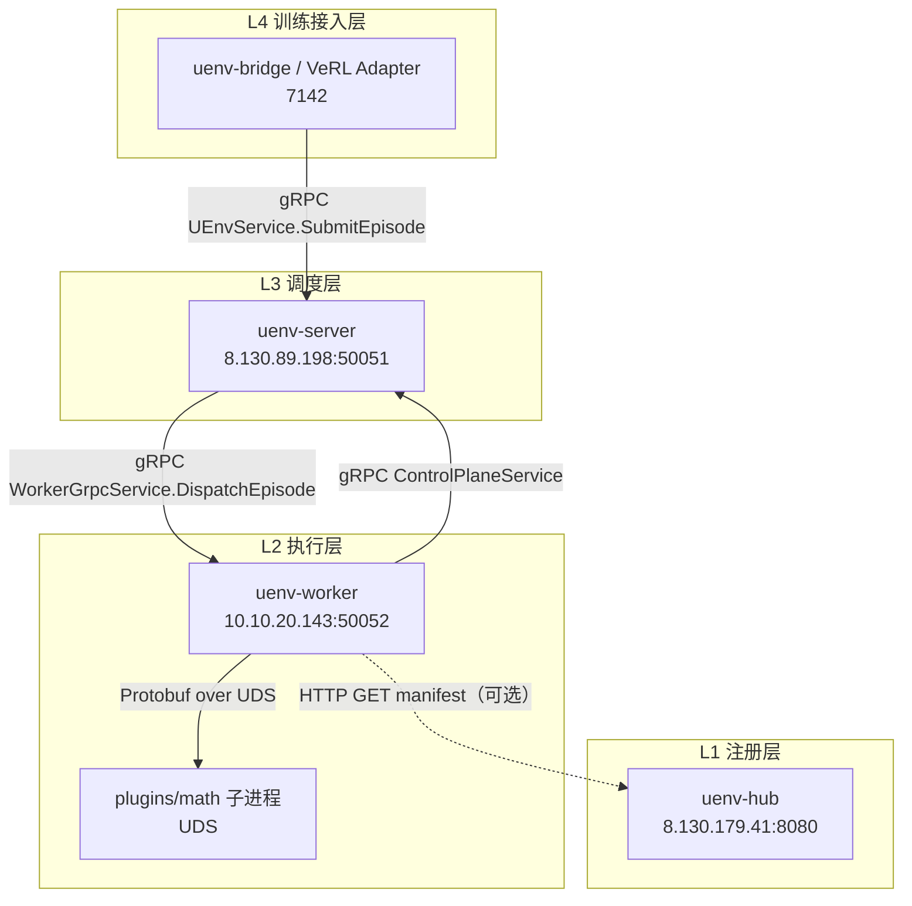
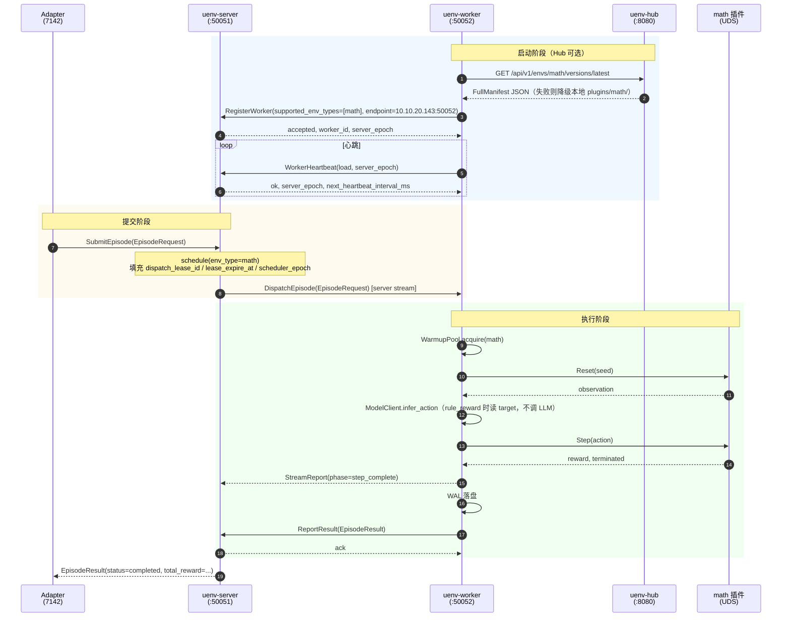
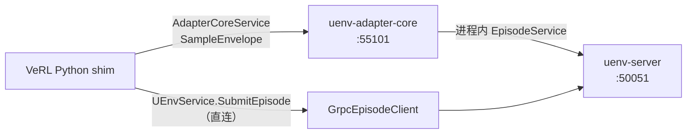

# 全链路联调：各层接口与参数字段

> **版本**：2026-06-09（完整路由参数版）  
> **用途**：四机实机联调时，各端对齐**全部**通信路由、RPC 方法路径与消息字段。  
> **权威来源**：[PROTOCOL.md](../PROTOCOL.md)、[proto/](../proto/)、[uenv-hub/docs/api.md](../uenv-hub/docs/api.md)

---

## 1. 四机部署拓扑与端口

当前联调目标拓扑（各端可独立部署，就绪后按下列地址互通）：

| 层级 | 组件 | 建议部署 | 默认端口 | 协议 |
|------|------|----------|----------|------|
| L4 接入 | `uenv-bridge` / Adapter | A100 **7142** | 进程内 / 本地 | gRPC → Server |
| L3 调度 | `uenv-server` | `8.130.89.198` | **50051** | gRPC |
| L2 执行 | `uenv-worker` | A100 **7143** | **50052**（gRPC）、**19090**（health/metrics） | gRPC |
| L1 注册 | `uenv-hub` | `8.130.179.41` | **8080** | HTTP REST |

**连通方向（联调验收时需放行）**：

| 方向 | 端口 | 用途 |
|------|------|------|
| Adapter → Server | 50051 | `SubmitEpisode` |
| Worker → Server | 50051 | `RegisterWorker` / `WorkerHeartbeat` / `ReportResult` |
| Server → Worker | 50052 | `DispatchEpisode`（**Server 主动回连**） |
| Worker → Hub | 8080 | 拉取 `math` 环境元数据（可选，失败降级本地 manifest） |
| 运维 | 19090 | Worker `/health`、`/metrics` |

> **注意**：Worker 注册时上报的 `endpoint` 必须是 **Server 能回连的地址**（如 `10.10.20.143:50052` 或公网映射地址），不能填 `127.0.0.1` 或 `0.0.0.0`。

---

## 2. 全链路通信流程图

### 2.1 架构总览



### 2.2 一次 Episode 完整时序



### 2.3 消息权威路径说明

| 阶段 | 权威结果载体 | 说明 |
|------|--------------|------|
| 进度 | `StreamReport`（Dispatch 流） | 供日志/监控；**不作为最终 ACK** |
| 最终结果 | `ReportResult` → `EpisodeResult` | Worker → Server 权威回报 |
| 客户端响应 | `SubmitEpisode` 返回的 `EpisodeResult` | Server 收到 ReportResult 后唤醒并返回 |

---

## 3. 共享核心数据结构（L1 Protobuf）

Proto 权威路径：`proto/uenv/v1/`。以下字段为 **Bridge、Server、Worker 三端同构**。

### 3.1 `EpisodeRequest`（Episode 派发载体）

**定义**：`proto/uenv/v1/episode.proto`  
**流向**：Adapter/客户端 → Server → Worker（`DispatchEpisodeRequest.episode`）

| 字段 | 类型 | 填写方 | Phase 0 示例 / 说明 |
|------|------|--------|---------------------|
| `episode_id` | string | Adapter 或 Server 补全 | `"math-e2e-001"` |
| `attempt_id` | uint32 | Adapter 或 Server；重试时 Server 递增 | `1` |
| `env_type` | string | Adapter | **`"math"`**（调度键；GSM8K 不再作为 env_type） |
| `payload` | bytes (UTF-8 JSON) | Adapter | 见 §3.1.1 |
| `mode` | ExecutionMode | Adapter | `MODE_SINGLE` (=1) |
| `max_steps` | int32 | Adapter | `8` |
| `resource_spec` | ResourceSpec | Adapter（可选） | cpu/memory/gpu |
| `model_endpoint` | string | Adapter | `"http://vllm:8000/v1"`（rule_reward 基准路径可省略） |
| `seed` | int32 (optional) | Adapter | `42` |
| `correlation_id` | string | Adapter | 日志 trace_id，如 `"corr-math-001"` |
| `timeout_seconds` | int32 | Adapter | `120` |
| `reward_config` | bytes (UTF-8 JSON) | Adapter | 见 §3.1.2 |
| `dispatch_lease_id` | string | **Server 派发前填充** | `"lease-abc123"` |
| `lease_expire_at` | Timestamp | **Server 派发前填充** | 租约过期时间 |
| `scheduler_epoch` | uint64 | **Server 派发前填充** | 与 `server_epoch` 对齐 |
| `dispatch_token` | bytes | Server（可选） | MVP 可占位 |

#### 3.1.1 `payload` JSON 结构（Phase 0 MathEnv）

```json
{
  "request_id": "req-math-001",
  "question": "If 3 books cost $12, what is the cost of 5 books?",
  "dataset": "gsm8k"
}
```

| 字段 | 必填 | 说明 |
|------|------|------|
| `question` | 是 | 题目文本；插件 reset 后 observation 来源 |
| `dataset` | 否 | benchmark 标识，Phase 0 常用 `"gsm8k"` |
| `request_id` | 否 | 业务请求 ID，便于日志关联 |

> **Worker 侧注意**：非 `rule_reward` 路径下，`ModelClient` 当前从 **payload JSON** 读 `model_endpoint`（非 proto 顶层字段）；联调真实 LLM 时需确认字段位置一致。

#### 3.1.2 `reward_config` JSON 结构（Phase 0 基准）

```json
{
  "type": "rule_reward",
  "target": "20"
}
```

| 字段 | 说明 |
|------|------|
| `type` | `"rule_reward"` 时 Worker 直接将 `target` 作为 action，**不调用 LLM** |
| `target` | 期望答案字符串；`RewardEngine` 与 action 比对给 reward |

### 3.2 `EpisodeResult`（Episode 最终结果）

**流向**：Worker → Server（`ReportResult`）→ Adapter（`SubmitEpisode` 响应）

| 字段 | 类型 | 说明 |
|------|------|------|
| `episode_id` | string | 与 Request 一致 |
| `attempt_id` | uint32 | 与 Request 一致 |
| `status` | string | `"completed"` \| `"failed"` \| `"timeout"` |
| `trajectory` | Trajectory | step 列表 |
| `summary.total_reward` | double | 汇总奖励 |
| `summary.total_steps` | int32 | 总步数 |
| `summary.total_duration_ms` | int64 | 总耗时 |
| `summary.terminate_reason` | string | 如 `"single_round_done"` |
| `error_code` | ErrorCode (optional) | 见 `common.proto` |
| `error_message` | string | 人类可读错误 |
| `trajectory_checksum` | string | SHA-256 hex |
| `integrity_verified` | bool | checksum 校验通过 |

**`EpisodeResult.Summary` 嵌套字段**：

| 字段 | 类型 | 说明 |
|------|------|------|
| `total_reward` | double | |
| `total_steps` | int32 | |
| `total_duration_ms` | int64 | |
| `terminate_reason` | string | |

### 3.3 `StepRecord` / `Trajectory`

| 字段 | 类型 | 说明 |
|------|------|------|
| `step_index` | int32 | 从 1 起 |
| `observation` | bytes | 环境观测（UTF-8 或序列化 blob） |
| `action` | bytes | 模型/规则输出 |
| `reward` | double | 本步奖励 |
| `terminated` / `truncated` | bool | 终止标志 |
| `info` | map<string,string> | 扩展信息 |
| `duration_ms` | int64 | 本步环境耗时 |

### 3.4 `StreamReport`（Dispatch 流式进度）

**流向**：Worker → Server（`DispatchEpisode` server stream）

| 字段 | 类型 | MVP 填充 | 说明 |
|------|------|----------|------|
| `episode_id` | string | 是 | |
| `attempt_id` | uint32 | 是 | |
| `current_step` | int32 | 是 | 当前步序号 |
| `total_steps` | int32 | 是 | 总步数 |
| `current_reward` | double | 是 | 累计/当前奖励 |
| `phase` | string | 是 | MVP 常用 `"step_complete"` / `"running"` |
| `last_step` | StepRecord (optional) | 是 | 最近一步详情 |
| `report_type` | ReportType | 否 | 应填 `STEP_COMPLETE` (=2) |
| `step_latency_ms` | int64 | 否 | 本步环境耗时 |
| `model_latency_ms` | int64 | 否 | 模型回调耗时 |
| `estimated_remaining_seconds` | double | 否 | 步调感知（PACING） |
| `worker_active_episodes` | int32 | 否 | Worker 负载画像 |
| `worker_capacity` | int32 | 否 | Worker 容量 |
| `correlation_id` | string | 否 | 与 EpisodeRequest 对齐 |
| `worker_id` | string | 否 | 执行 Worker ID |

**`ReportType` 枚举**：

| 值 | 名称 | 说明 |
|----|------|------|
| 0 | REPORT_TYPE_UNSPECIFIED | |
| 1 | PROGRESS | 进度 |
| 2 | STEP_COMPLETE | 单步完成 |
| 3 | REWARD_SIGNAL | 奖励信号 |
| 4 | LOG | 日志 |
| 5 | PACING | 步调/backpressure |

### 3.5 公共枚举与结构

**`ExecutionMode`**（`common.proto`）：

| 值 | 名称 | 说明 |
|----|------|------|
| 0 | MODE_UNSPECIFIED | |
| 1 | MODE_SINGLE | Phase 0 单轮 |
| 2 | MODE_MULTI | 多轮 Agent |
| 3 | MODE_MODEL_CALLBACK | Worker 内循环调模型 |
| 4 | MODE_CUSTOM | 自定义 |

**`ResourceSpec`**：

| 字段 | 类型 |
|------|------|
| `cpu_cores` | int32 |
| `memory_mb` | int32 |
| `gpu_count` | int32 |
| `gpu_type` | string |

**`ErrorCode` 完整枚举**（`common.proto`）：

| 值 | 名称 | 分类 |
|----|------|------|
| 0 | ERROR_UNSPECIFIED | — |
| 1 | OK | — |
| 1001 | ERR_INVALID_REQUEST | 客户端 |
| 1002 | ERR_UNKNOWN_ENV_TYPE | 客户端 |
| 1003 | ERR_UNSUPPORTED_MODE | 客户端 |
| 2001 | ERR_NO_AVAILABLE_WORKER | 调度 |
| 2002 | ERR_WORKER_TIMEOUT | 调度 |
| 2003 | ERR_EPISODE_TIMEOUT | 调度 |
| 3001 | ERR_WORKER_CRASHED | Worker |
| 3002 | ERR_ENV_INIT_FAILED | Worker |
| 3003 | ERR_ENV_STEP_FAILED | Worker |
| 3004 | ERR_MODEL_CALL_FAILED | Worker |
| 3005 | ERR_ALREADY_RUNNING | Worker |
| 3006 | ERR_ALREADY_COMPLETED | Worker |
| 3007 | ERR_LEASE_EXPIRED | Worker |
| 3008 | ERR_LEASE_SUPERSEDED | Worker |
| 5001 | ERR_INTERNAL | 内部 |

### 3.6 `Trajectory` 汇总字段

| 字段 | 类型 | 说明 |
|------|------|------|
| `steps` | repeated StepRecord | 逐步记录 |
| `total_reward` | double | 轨迹总奖励 |
| `total_steps` | int32 | 轨迹总步数 |

### 3.7 `WalRecord`（Worker 本地 WAL，断连重放）

**定义**：`proto/uenv/v1/wal.proto`  
**流向**：Worker 内部持久化；重连后经 `ReportResult` 重放

| 字段 | 类型 | 说明 |
|------|------|------|
| `episode_id` | string | |
| `attempt_id` | uint32 | |
| `worker_id` | string | |
| `dispatch_lease_id` | string | |
| `server_epoch` | uint64 | |
| `request_checksum` | string | |
| `result_checksum` | string | |
| `status` | string | |
| `protobuf_payload` | bytes | 序列化 EpisodeResult |
| `created_at` | Timestamp | |
| `replay_state` | ReplayState | PENDING / SENT / ACKED |

**幂等键**（与 `ReportResultRequest.idempotency_key` 一致）：`{episode_id}:{attempt_id}:{worker_id}`

---

## 4. 各层 gRPC 接口详情

### 4.1 L4 → L3：Adapter → Server（`UEnvService`）

**Proto**：`proto/uenv/v1/server.proto`  
**Package**：`uenv.v1`  
**地址**：`<server-host>:50051`

| RPC | 模式 | Phase 0 状态 | 请求 | 响应 |
|-----|------|--------------|------|------|
| `SubmitEpisode` | unary | ✅ 已实现 | `EpisodeRequest` | `EpisodeResult` |
| `SubmitEpisodeStream` | bidi | Phase 2+ | stream `EpisodeRequest` | stream `EpisodeResult` |
| `SubmitBatch` | unary | Phase 2+ | `BatchRequest` | `BatchResult` |
| `SubmitEpisodeAsync` | unary | Phase 2+ | `EpisodeRequest` | `SubmitAck` |
| `GetEpisodeResult` | unary | Phase 2+ | `GetResultRequest` | `EpisodeResult` |
| `WatchEpisodes` | server stream | Phase 2+ | `WatchRequest` | stream `EpisodeResult` |

#### 4.1.1 Phase 2+ 消息字段（已实现 proto，Server 侧多未落地）

**`BatchRequest`**：

| 字段 | 类型 | 说明 |
|------|------|------|
| `batch_id` | string | 批次 ID |
| `episodes` | repeated EpisodeRequest | 批量 Episode |
| `timeout_seconds` | int32 | 批次超时 |
| `partial_results` | bool | 是否允许部分结果 |

**`BatchResult`**：

| 字段 | 类型 | 说明 |
|------|------|------|
| `batch_id` | string | |
| `completed_count` | int32 | |
| `failed_count` | int32 | |
| `total_count` | int32 | |
| `batch_complete` | bool | |
| `results` | repeated EpisodeResult | |

**`SubmitAck`**（`SubmitEpisodeAsync` 响应）：

| 字段 | 类型 | 说明 |
|------|------|------|
| `episode_id` | string | |
| `accepted` | bool | |
| `queue_position` | int32 | 队列位置 |
| `estimated_wait_seconds` | int32 | 预估等待 |

**`GetResultRequest`**：

| 字段 | 类型 | 说明 |
|------|------|------|
| `episode_id` | string | |
| `attempt_id` | uint32 | |

**`WatchRequest`**：

| 字段 | 类型 | 说明 |
|------|------|------|
| `correlation_id` | string | 过滤关联 ID |

#### 4.1.2 `AdminService`（运维 → Server，同端口 :50051）

| RPC | 请求 | 响应 | Phase 0 |
|-----|------|------|---------|
| `ListWorkers` | `ListWorkersRequest` | `ListWorkersResponse` | ✅ |
| `DrainWorker` | `DrainWorkerRequest` | `DrainWorkerResponse` | proto 有 |
| `CancelEpisode` | `CancelEpisodeRequest` | `CancelEpisodeResponse` | proto 有 |
| `GetServerStatus` | `GetServerStatusRequest {}` | `ServerStatus` | proto 有 |

**`DrainWorkerRequest`**：

| 字段 | 类型 | 说明 |
|------|------|------|
| `worker_id` | string | 目标 Worker |
| `grace_period_sec` | int32 | 排空宽限期 |

**`DrainWorkerResponse`**：`accepted` (bool)

**`CancelEpisodeRequest`**：`episode_id` (string), `attempt_id` (uint32)

**`CancelEpisodeResponse`**：

| 字段 | 类型 | 说明 |
|------|------|------|
| `server_cancelled` | bool | server 侧是否已写入取消终态 |
| `worker_cancel_attempted` | bool | server 是否尝试通知原生 worker 停止物理执行 |
| `worker_cancel_accepted` | bool | worker 是否确认接受物理取消请求 |
| `worker_cancel_code` | string | worker 取消结果码，例如 `ACCEPTED`、`RPC_FAILED`、`NOT_DISPATCHED` |
| `worker_cancel_message` | string | worker 取消结果详情 |

旧字段 `cancelled` 已停止作为客户端读取入口；新客户端应读取上面的拆分字段。

**`ServerStatus`**：

| 字段 | 类型 | 说明 |
|------|------|------|
| `server_epoch` | uint64 | 控制面 epoch |
| `worker_count` | int32 | 注册 Worker 数 |
| `active_episode_count` | int32 | 执行中 Episode |
| `pending_episode_count` | int32 | 排队 Episode |

**Adapter 侧映射**（`uenv-bridge/core`）：`SampleEnvelope.payload_json` → `EpisodeRequest`

```json
{
  "correlation_id": "batch-001-sample-0",
  "env_config": {
    "question": "...",
    "dataset": "gsm8k"
  },
  "episode_config": {
    "max_steps": 8,
    "seed": 42
  },
  "reward_config": {
    "type": "rule_reward",
    "target": "20"
  },
  "model_endpoint": {
    "url": "http://vllm:8000/v1"
  },
  "timeout_seconds": 120
}
```

| payload_json 字段 | 映射到 EpisodeRequest |
|-------------------|----------------------|
| `env_config` | `payload` (bytes JSON) |
| `reward_config` | `reward_config` (bytes JSON) |
| `model_endpoint.url` | `model_endpoint` (string) |
| `episode_config.max_steps` | `max_steps` |
| `episode_config.seed` | `seed` |
| `correlation_id` | `correlation_id` |
| `timeout_seconds` | `timeout_seconds` |
| `SampleEnvelope.env_type` | `env_type` |
| `SampleEnvelope.request_id` | `episode_id` |

**grpcurl 探针示例**（不经 Adapter）：

```bash
grpcurl -plaintext -d '{
  "env_type": "math",
  "payload": "{\"question\":\"If 3 books cost $12, what is the cost of 5 books?\",\"dataset\":\"gsm8k\"}",
  "reward_config": "{\"type\":\"rule_reward\",\"target\":\"20\"}",
  "mode": 1,
  "max_steps": 8,
  "correlation_id": "manual-test-001",
  "timeout_seconds": 120
}' <server-host>:50051 uenv.v1.UEnvService/SubmitEpisode
```

---

### 4.2 L2 → L3：Worker → Server（`ControlPlaneService`）

**Proto**：`proto/uenv/v1/scheduler.proto`  
**Package**：`uenv.scheduler.v1`  
**Worker 作为 Client**，连接 `UENV_SERVER_ENDPOINT`（如 `8.130.89.198:50051`）

#### 4.2.1 `RegisterWorker`

**请求 `RegisterWorkerRequest`**：

| 字段 | 类型 | Worker 填写 | 示例 |
|------|------|-------------|------|
| `worker_id` | string | config / `"auto"` | Server 可回写正式 ID |
| `supported_env_types` | repeated string | `UENV_ENV_TYPES` | `["math"]` |
| `resource` | ResourceSpec | MVP 常空 | |
| `endpoint` | string | **对外可达地址** | `"10.10.20.143:50052"` |
| `max_concurrent` | uint32 | config | `4` |

**响应 `RegisterWorkerResponse`**：

| 字段 | 类型 | 说明 |
|------|------|------|
| `accepted` | bool | 是否接受注册 |
| `worker_id` | string | 权威 Worker ID |
| `message` | string | 可读说明 |
| `server_epoch` | uint64 | 控制面 epoch；后续心跳/上报需携带 |

#### 4.2.2 `WorkerHeartbeat`（双向流）

**Worker → Server `HeartbeatRequest`**：

| 字段 | 类型 | 说明 |
|------|------|------|
| `worker_id` | string | |
| `load` | int32 | 当前负载（MVP 恒 0，待完善） |
| `max_load` | int32 | 容量上限 |
| `timestamp_ms` | int64 | Unix 毫秒 |
| `server_epoch` | uint64 | 上次 Server 下发的 epoch |

**Server → Worker `HeartbeatResponse`**：

| 字段 | 类型 | 说明 |
|------|------|------|
| `ok` | bool | 心跳是否有效 |
| `drain` | DrainCommand | 排空指令（见下表） |
| `server_epoch` | uint64 | 若变化需重新注册 |
| `next_heartbeat_interval_ms` | int32 | 建议心跳间隔（毫秒） |

**`DrainCommand`**：

| 字段 | 类型 | 说明 |
|------|------|------|
| `drain` | bool | 是否要求排空 |
| `grace_period_sec` | int32 | 宽限期（秒） |

#### 4.2.3 `ReportResult`

**请求 `ReportResultRequest`**：

| 字段 | 类型 | 说明 |
|------|------|------|
| `idempotency_key` | string | **`{episode_id}:{attempt_id}:{worker_id}`** |
| `worker_id` | string | |
| `server_epoch` | uint64 | |
| `result` | EpisodeResult | 完整结果 |

**响应 `ReportResultResponse`**：

| 字段 | 说明 |
|------|------|
| `ack` | 是否确认 |
| `duplicate` | 重复 key 时为 true（幂等） |

#### 4.2.4 `ListWorkers`（查询；Worker 不调用，Admin/运维使用）

**请求 `ListWorkersRequest`**：

| 字段 | 类型 | 说明 |
|------|------|------|
| `env_types` | repeated string | 过滤，如 `["math"]`；空则全部 |

**响应 `ListWorkersResponse`**：

| 字段 | 类型 | 说明 |
|------|------|------|
| `workers` | repeated WorkerInfo | Worker 列表 |

**`WorkerInfo`**：

| 字段 | 类型 | 说明 |
|------|------|------|
| `worker_id` | string | |
| `supported_env_types` | repeated string | 如 `["math"]` |
| `load` | int32 | 当前负载 |
| `max_load` | int32 | 最大并发 |
| `status` | string | 如 `"ready"` |
| `endpoint` | string | Server 回连地址 |

---

### 4.3 L3 → L2：Server → Worker（`WorkerGrpcService`）

**Proto**：`uenv-worker/proto/worker_service.proto`  
**Package**：`uenv.worker.v1`  
**Server 作为 Client**，连接 Worker 注册时上报的 `endpoint`

| RPC | 模式 | 请求 | 响应 |
|-----|------|------|------|
| `DispatchEpisode` | **server stream** | `DispatchEpisodeRequest { episode: EpisodeRequest }` | stream `StreamReport` |
| `HealthCheck` | unary | `HealthCheckRequest {}` | `HealthCheckResponse { ok: bool, status: string }` |

**`DispatchEpisodeRequest`**：

| 字段 | 类型 | 说明 |
|------|------|------|
| `episode` | EpisodeRequest | 完整派发载体（含租约字段） |

**`HealthCheckResponse`**：

| 字段 | 类型 | 说明 |
|------|------|------|
| `ok` | bool | 探活结果 |
| `status` | string | 如 `"ok"` |

**Worker 侧校验**（派发前）：

- `dispatch_lease_id` 非空
- `lease_expire_at` 未过期
- 并发 `Semaphore` 未超限
- 控制面断连时按 `UENV_DISPATCH_ON_DISCONNECT`（`queue` / `reject`）策略处理

**Worker 本地 HTTP 探活**（不经 gRPC）：

```bash
curl http://<worker-host>:19090/health   # 返回 ok
curl http://<worker-host>:19090/metrics  # Prometheus 文本
```

---

### 4.4 L4 内部：Python ↔ Rust Adapter Core

**Proto**：`proto/uenv/v1/adapter_core.proto`  
**Package**：`uenv.bridge.v1`  
**默认地址**：`127.0.0.1:55101`（`core.endpoint`）  
**用途**：VeRL Python shim → Rust `uenv-adapter-core` →（进程内）UEnv Server API

| RPC | 模式 | 请求 | 响应 |
|-----|------|------|------|
| `ExecuteBatch` | unary | `ExecuteBatchRequest` | `ExecuteBatchResponse` |
| `ExecuteBatchStream` | bidi | stream `SampleEnvelope` | stream `SampleResult` |
| `HealthCheck` | unary | `HealthCheckRequest {}` | `HealthCheckResponse { ok, version }` |

**`ExecuteBatchRequest`**：

| 字段 | 类型 | 说明 |
|------|------|------|
| `request_id` | string | 批次请求 ID |
| `batch_id` | string | 训练批次 ID |
| `samples` | repeated SampleEnvelope | 样本列表 |

**`ExecuteBatchResponse`**：

| 字段 | 类型 | 说明 |
|------|------|------|
| `request_id` | string | |
| `batch_id` | string | |
| `results` | repeated SampleResult | |

**`SampleEnvelope`**：

| 字段 | 类型 | 说明 |
|------|------|------|
| `request_id` | string | → proto `episode_id` |
| `batch_id` | string | 批次 ID |
| `sample_index` | uint32 | 批内序号 |
| `framework` | string | 如 `"verl"` |
| `env_type` | string | 如 `"math"` |
| `payload_json` | bytes | UTF-8 JSON，见 §4.1 映射表 |
| `meta_json` | bytes | 框架扩展元数据（可选 UTF-8 JSON；VeRL tensor/batch 上下文，Core 当前不映射到 L1） |

**`SampleResult`**：

| 字段 | 类型 | 说明 |
|------|------|------|
| `request_id` | string | 对应 `episode_id` |
| `batch_id` | string | |
| `sample_index` | uint32 | |
| `status` | string | `completed` / `failed` / `timeout` |
| `reward` | double | `summary.total_reward` |
| `done` | bool | Episode 是否结束 |
| `termination_reason` | string | `summary.terminate_reason` |
| `trajectory_json` | bytes | 轨迹 JSON（MVP 常为空） |
| `error_code` | string | 错误码字符串 |
| `error_message` | string | |

**`HealthCheckResponse`**：`ok` (bool), `version` (string)

---

### 4.5 Bridge 双路径连接与 YAML 配置

Adapter（7142）到 Server 有 **两条可选路径**：



| 路径 | 客户端类 | 配置键 | 说明 |
|------|----------|--------|------|
| **A：经 Rust Core**（推荐 embedded） | `RustCoreEpisodeClient` | `core.endpoint` | Python → gRPC → Core → 进程内调 Server |
| **B：直连 Server gRPC** | `GrpcEpisodeClient` | `server.endpoint` | Python → gRPC → Server |

**`configs/verl-adapter.yaml` 全量配置项**：

| 配置块 | 字段 | 说明 |
|--------|------|------|
| `adapter` | `name`, `framework`, `protocol_version`, `mode` | 适配器元信息 |
| `core` | `endpoint` | Rust Core gRPC 地址，默认 `127.0.0.1:55101` |
| `core` | `auto_start`, `binary` | 是否自动拉起 Core 二进制 |
| `core` | `timeout_seconds`, `startup_timeout_seconds` | 调用/启动超时 |
| `server` | `endpoint` | Server gRPC 地址，如 `8.130.89.198:50051` |
| `server.tls` | `enabled` | TLS 开关 |
| `server.grpc` | `timeout_seconds`, `max_send_message_mb`, `max_receive_message_mb`, `compression` | gRPC 客户端参数 |
| `mapping` | `default_env_type`, `task_to_env_type` | 任务名 → `env_type`（`gsm8k`→`math`） |
| `mapping` | `default_max_steps`, `math_max_steps`, `default_timeout_seconds`, `seed_base` | 默认 Episode 参数 |
| `model_endpoint` | `endpoint_type`, `url`, `model_name`, `max_retries`, `generation_config` | 写入 SampleEnvelope / Episode 的模型端点 |
| `batch` | `enabled`, `submit_mode`, `max_batch_size`, `max_in_flight`, `stream_results` | 批量提交行为 |
| `logging` | `level`, `file`, `format` | 适配器日志 |

**`GrpcEpisodeClientConfig` 字段**：

| 字段 | 类型 | 默认 | 说明 |
|------|------|------|------|
| `endpoint` | string | 必填 | `server.endpoint` |
| `timeout_seconds` | float | 300 | RPC 超时 |
| `max_send_message_mb` | int | 64 | |
| `max_receive_message_mb` | int | 64 | |
| `compression` | string | null | 如 `gzip` |
| `tls_enabled` | bool | false | |

---

### 4.6 Python `EpisodeRequest` ↔ Proto `EpisodeRequest` 对照

Bridge Python 层（`uenv-bridge/src/uenv/bridge/protocol.py`）与 L1 proto **字段名/范围不完全一致**：

| Python dataclass | Proto `EpisodeRequest` | 说明 |
|------------------|------------------------|------|
| `request_id` | `episode_id` | 名称不同 |
| `env_type` | `env_type` | 一致 |
| `payload` | `payload` | 一致 |
| `mode` | `mode` | 一致 |
| `max_steps` | `max_steps` | 一致 |
| `resource_spec` | `resource_spec` | 一致 |
| `model_endpoint` | `model_endpoint` | 一致 |
| `seed` | `seed` | 一致 |
| — | `attempt_id` | Python 层无；Core/Server 补全 |
| — | `correlation_id` | 经 `payload_json.correlation_id` 映射 |
| — | `timeout_seconds` | 经 `payload_json.timeout_seconds` 映射 |
| — | `reward_config` | 经 `payload_json.reward_config` 映射 |
| — | `dispatch_*` / `lease_*` | 仅 Server 填充 |

Python `EpisodeResult` 使用 `request_id` 对应 proto 的 `episode_id`。

---

## 5. L1 Hub HTTP 接口（完整 REST）

**Base URL**：`http://8.130.179.41:8080`（四机部署示例）  
**Content-Type**：`application/json`  
**鉴权**：`Authorization: Bearer uenvh_xxx` 或 `X-Api-Token: uenvh_xxx`（`auth.require_token=false` 开发模式可跳过）

### 5.1 路由全集

| # | 方法 | 路径 | 角色 | Episode 热路径 |
|---|------|------|------|----------------|
| 1 | GET | `/healthz` | public | 探活 |
| 2 | GET | `/metrics` | public | Prometheus |
| 3 | GET | `/version` | public | 版本信息 |
| 4 | GET | `/api/v1/envs` | reader | 列表 |
| 5 | GET | `/api/v1/envs?since={ts}` | reader | 增量同步 |
| 6 | GET | `/api/v1/envs/{env_type}` | reader | 环境详情 |
| 7 | GET | `/api/v1/envs/{env_type}/versions` | reader | 版本列表 |
| 8 | GET | `/api/v1/envs/{env_type}/versions/{version}` | reader | 指定版本 manifest |
| 9 | GET | `/api/v1/envs/{env_type}/versions/latest` | reader | **Worker 主路径** |
| 10 | GET | `/api/v1/envs/{env_type}/resolve?constraint=` | reader | 语义化版本解析 |
| 11 | GET | `/api/v1/envs/{env_type}/versions/{version}/interface` | reader | interface schema |
| 12 | GET | `/api/v1/envs/{env_type}/versions/{version}/examples` | reader | 示例 |
| 13 | GET | `/api/v1/search` | reader | 搜索 |
| 14 | POST | `/api/v1/envs` | publisher | 创建环境 |
| 15 | POST | `/api/v1/envs/{env_type}/versions` | publisher | 发布版本 |
| 16 | PATCH | `/api/v1/envs/{env_type}` | publisher | 更新元数据 |
| 17 | POST | `/api/v1/envs/{env_type}/versions/{version}/yank` | publisher | 下架版本 |
| 18 | DELETE | `/api/v1/envs/{env_type}` | admin | 删除环境 |
| 19 | GET | `/api/v1/templates` | reader | 模板列表 |
| 20 | GET | `/api/v1/templates/{name}/archive` | reader | 模板 gzip 包 |
| 21 | POST | `/api/v1/admin/tokens` | admin | 创建 Token |
| 22 | DELETE | `/api/v1/admin/tokens/{id}` | admin | 吊销 Token |
| 23 | GET | `/api/v1/admin/audit-log` | admin | 审计日志 |

> **Server 运行时**不依赖 Hub HTTP；Hub 与 Episode 热路径的关系仅为 **Worker 启动/spawn 前 pull manifest**。

### 5.2 常用 Query 参数

| 端点 | 参数 | 说明 |
|------|------|------|
| `GET /api/v1/envs` | `page`, `per_page`, `namespace`, `author`, `tag`, `since` | 列表/同步 |
| `GET .../resolve` | `constraint` | 如 `^1.0`、`1.0.0` |
| `GET /api/v1/search` | `q`, `tag`, `author`, `namespace`, `page`, `per_page` | 搜索 |

### 5.3 响应 DTO 字段

**`GET /healthz`** → `{ "status": "ok", "db": "up", "details": {} }`

**`GET /version`** → `{ "name": "uenv-hub", "version": "0.1.0", "git_sha": null }`

**`EnvSummary`**（列表项）：

| 字段 | 类型 | 说明 |
|------|------|------|
| `env_type` | string | 如 `"math"` |
| `namespace` | string | 默认 `"default"` |
| `description` | string? | |
| `author` | string? | |
| `latest_version` | string? | |
| `tags` | string[] | |
| `created_at`, `updated_at` | int64 | Unix 秒 |

**`EnvDetail`**：`EnvSummary` + `homepage`, `repository`, `license`, `latest_manifest?`

**`FullManifest`**（`GET .../versions/latest` 响应体）：

| 字段 | 类型 | Worker 使用 |
|------|------|-------------|
| `env_type` | string | ✅ |
| `version` | string | ✅ |
| `changelog` | string? | 参考 |
| `entrypoint` | string? | 参考（spawn 优先本地 `./run.sh`） |
| `supported_backends` | string[] | ✅ |
| `dependencies` | object? | Hub/CI |
| `min_uenv_version` | string? | |
| `base_image` | string? | |
| `health_check_path` | string? | |
| `image` | ImageSpec? | 制品索引 |
| `config_schema` | JSON? | payload 约束 |
| `default_config` | JSON? | |
| `resources` | Hub ResourceSpec | cpu/memory/gpu |
| `interface` | InterfaceSchema | action/observation/state JSON Schema |
| `examples` | Example[] | |
| `is_yanked` | bool | |
| `yank_reason` | string? | |
| `published_at` | int64 | Unix 秒 |

**`ImageSpec`**：`url`, `digest?`, `size_bytes?`, `arch?`, `base_image_ref?`

**`InterfaceSchema`**：`action?`, `observation?`, `state?`（均为 JSON Schema Value）

**`PublishVersionRequest`**（POST 发布）：`version`, `changelog`, `image`, `base_image`, `health_check_path`, `entrypoint`, `supported_backends`, `config_schema`, `default_config`, `resources`, `interface`, `examples`, `dependencies`, `min_uenv_version`

**`PublishVersionResponse`**：`env_type`, `version`, `published_at`, `manifest_url`

**`YankRequest`**：`reason` (string)

**`CreateEnvRequest`**：`env_type`, `namespace?`, `description?`, `author?`, `homepage?`, `repository?`, `license?`, `tags[]`

**`EnvPatchRequest`**：`description?`, `author?`, `homepage?`, `repository?`, `license?`, `tags?`

**`SearchResponse`**：`results[]` (EnvSummary), `total`, `page`, `per_page`

**`VersionSummary`**（`GET .../versions` 列表项）：`version`, `changelog?`, `is_yanked`, `published_at`

**`CreateTokenRequest`**：`name`, `owner?`, `role` (admin/publisher/reader), `namespaces[]`, `expires_at?`

**`CreateTokenResponse`**：`id`, `name`, `role`, `token`（明文仅返回一次）

**`TemplateSummary`**：`name`, `description?`, `version`, `archive_sha256?`, `updated_at`

**`AuditEntryDto`**：`id`, `timestamp`, `actor?`, `action`, `resource_type`, `resource_id?`, `details?`

**错误响应**（非 2xx）：

```json
{
  "error": { "code": "NOT_FOUND", "message": "...", "details": {} },
  "request_id": "req_..."
}
```

**Hub 拉取失败时**：Worker 记录 `hub_pull_failed_using_local_manifest`，继续使用 `plugins/math/manifest.yaml`。

### 5.3 本地插件 manifest（YAML，非 Hub 协议）

路径：`plugins/math/manifest.yaml`

```yaml
env_type: math
version: "0.1.0"
supported_backends: [process]
ipc: proto-uds
entry: ./run.sh
datasets: [gsm8k]
```

---

## 6. L2 内部：Worker ↔ 插件（UDS，不对外暴露）

**Proto**：`plugin_proto/uenv/plugin/v1/plugin.proto`  
**Package**：`uenv.plugin.v1`  
**传输**：Protobuf over Unix Domain Socket（仅 Linux）

| RPC | 请求字段 | 响应字段 |
|-----|----------|----------|
| `Reset` | `seed` (optional int32) | `observation` (bytes), `info` (map) |
| `Step` | `action` (bytes) | `observation`, `reward`, `terminated`, `truncated`, `info` |
| `Close` | — | `ok` (bool) |
| `HealthCheck` | — | `ok` (bool), `message` (string) |

**`ResetResponse.info` / `StepResponse.info`**：`map<string, string>` 扩展键值。

> L2 消息 **不得** 出现在 L1 gRPC proto 中。

---

## 7. Worker → 外部 LLM（HTTP，非 gRPC）

**触发条件**：`reward_config.type != "rule_reward"`（或无 `target`）  
**实现**：`uenv-worker/src/episode/model_client.rs`  
**不经 Server 转发**

| 项 | 值 |
|----|-----|
| 方法 | `POST` |
| URL | `{model_endpoint}/chat/completions` |
| Content-Type | `application/json` |

**请求体**（OpenAI 兼容）：

```json
{
  "model": "policy-model",
  "messages": [{"role": "user", "content": "<question from payload>"}],
  "temperature": 1.0,
  "max_tokens": 512,
  "stream": false
}
```

**payload JSON 读取字段**（非 proto 顶层 `model_endpoint`）：

| 字段 | 必填 | 默认 |
|------|------|------|
| `model_endpoint` | 是 | — |
| `question` | 是 | — |
| `model_name` | 否 | `"policy-model"` |
| `generation_config.temperature` | 否 | `1.0` |
| `generation_config.max_new_tokens` | 否 | `512` |

**响应读取**：`choices[0].message.content` → action bytes

**重试**：最多 30 次，间隔 2s

---

## 8. uenv-mock-scheduler（开发替代控制面）

与 `uenv-server` **同 proto**（`ControlPlaneService`），Worker 侧无差异；差异仅在 Episode 来源。

| 项 | uenv-server | uenv-mock-scheduler |
|----|-------------|-------------------|
| Episode 来源 | `SubmitEpisode` | fixture / 内存队列 |
| 默认端口 | 50051 | 50051 |
| Worker 配置 | `UENV_SERVER_ENDPOINT=<server>:50051` | 同上（指向 mock 地址） |
| 派发 | schedule + Dispatch | 主动读 `fixtures/math/` 派发 |

> 生产/四机联调使用真实 `uenv-server`；mock 仅本机混沌测试。

---

## 9. gRPC 完整方法路径速查（grpcurl）

| Package | Service | RPC | 完整路径 |
|---------|---------|-----|----------|
| `uenv.v1` | `UEnvService` | SubmitEpisode | `uenv.v1.UEnvService/SubmitEpisode` |
| `uenv.v1` | `UEnvService` | SubmitEpisodeStream | `uenv.v1.UEnvService/SubmitEpisodeStream` |
| `uenv.v1` | `UEnvService` | SubmitBatch | `uenv.v1.UEnvService/SubmitBatch` |
| `uenv.v1` | `UEnvService` | SubmitEpisodeAsync | `uenv.v1.UEnvService/SubmitEpisodeAsync` |
| `uenv.v1` | `UEnvService` | GetEpisodeResult | `uenv.v1.UEnvService/GetEpisodeResult` |
| `uenv.v1` | `UEnvService` | WatchEpisodes | `uenv.v1.UEnvService/WatchEpisodes` |
| `uenv.v1` | `AdminService` | ListWorkers | `uenv.v1.AdminService/ListWorkers` |
| `uenv.v1` | `AdminService` | DrainWorker | `uenv.v1.AdminService/DrainWorker` |
| `uenv.v1` | `AdminService` | CancelEpisode | `uenv.v1.AdminService/CancelEpisode` |
| `uenv.v1` | `AdminService` | GetServerStatus | `uenv.v1.AdminService/GetServerStatus` |
| `uenv.scheduler.v1` | `ControlPlaneService` | RegisterWorker | `uenv.scheduler.v1.ControlPlaneService/RegisterWorker` |
| `uenv.scheduler.v1` | `ControlPlaneService` | WorkerHeartbeat | `uenv.scheduler.v1.ControlPlaneService/WorkerHeartbeat` |
| `uenv.scheduler.v1` | `ControlPlaneService` | ReportResult | `uenv.scheduler.v1.ControlPlaneService/ReportResult` |
| `uenv.scheduler.v1` | `ControlPlaneService` | ListWorkers | `uenv.scheduler.v1.ControlPlaneService/ListWorkers` |
| `uenv.worker.v1` | `WorkerGrpcService` | DispatchEpisode | `uenv.worker.v1.WorkerGrpcService/DispatchEpisode` |
| `uenv.worker.v1` | `WorkerGrpcService` | HealthCheck | `uenv.worker.v1.WorkerGrpcService/HealthCheck` |
| `uenv.bridge.v1` | `AdapterCoreService` | ExecuteBatch | `uenv.bridge.v1.AdapterCoreService/ExecuteBatch` |
| `uenv.bridge.v1` | `AdapterCoreService` | ExecuteBatchStream | `uenv.bridge.v1.AdapterCoreService/ExecuteBatchStream` |
| `uenv.bridge.v1` | `AdapterCoreService` | HealthCheck | `uenv.bridge.v1.AdapterCoreService/HealthCheck` |
| `uenv.plugin.v1` | `PluginService` | Reset / Step / Close / HealthCheck | 仅 UDS，无 TCP 路径 |

**Proto 反射**（若启用）：

```bash
grpcurl -plaintext <host>:50051 list
grpcurl -plaintext <host>:50052 list
```

---

## 10. 各层环境变量与配置项

### 10.1 Adapter（7142）

| 变量 / 配置 | 说明 |
|-------------|------|
| `verl-adapter.yaml` → `server.endpoint` | Server gRPC 地址 |
| `core.endpoint` | Rust Core 地址（默认 `:55101`） |
| `UENV_ADAPTER_CORE_ADDR` | Core 进程监听地址 |
| `mapping.task_to_env_type` | 任务 → env_type 映射 |

### 10.2 Server（8.130.89.198）

| 变量 / 参数 | 说明 |
|-------------|------|
| 监听 | `-b 0.0.0.0:50051` 或 `UENV_LISTEN` |
| `UEnvService` + `ControlPlaneService` + `AdminService` | **同端口** |

### 10.3 Worker（7143）

| 变量 | 说明 |
|------|------|
| `UENV_SERVER_ENDPOINT` | ControlPlane 地址 |
| `UENV_WORKER_LISTEN` | 注册 endpoint + bind 地址（同一字段，须为 Server 可达 IP） |
| `UENV_ENV_TYPES` | 如 `math` |
| `UENV_PLUGIN_DIR` | 插件根目录 |
| `UENV_MATH_PLUGIN_BIN` | math 插件二进制路径 |
| `UENV_HUB_ENDPOINT` | Hub HTTP 基址（设置后启用 pull） |
| `UENV_HUB_ENABLED` | 显式开关 Hub |
| `UENV_SCHEDULER_MODE` | 仅支持 `remote` |
| `UENV_MAX_CONCURRENT` | 最大并发 Episode |
| `UENV_WARMUP_POOL_SIZE` | 预热池目标水位 |
| `UENV_PREWARM_ON_STARTUP` | 启动是否 prewarm |
| `UENV_WAL_DIR` | WAL 目录 |
| `UENV_METRICS_LISTEN` / `UENV_HEALTH_LISTEN` | 默认 `:19090` |
| `UENV_LOG_FILE` / `UENV_LOG_LEVEL` | 日志 |
| `UENV_DISPATCH_ON_DISCONNECT` | `queue`（默认）或 `reject` |

**CLI**：`uenv-worker --config <path> serve`（`--config` 在 `serve` **之前**）

### 10.4 Hub（8.130.179.41）

| 变量 | 说明 |
|------|------|
| bind | 默认 `:8080` |
| `UENV_HUB_AUTH__REQUIRE_TOKEN` | `false` 开发免鉴权 |

---

## 11. 字段填写责任速查

| 字段 | Adapter | Server | Worker |
|------|---------|--------|--------|
| `episode_id`, `attempt_id` | 提供或留空 | 空则补全 | — |
| `env_type`, `payload`, `reward_config` | ✅ | — | 消费 |
| `dispatch_lease_id`, `lease_expire_at`, `scheduler_epoch` | — | ✅ 派发前填充 | 校验 |
| `RegisterWorker.endpoint` | — | — | ✅ 填对外可达地址 |
| `ReportResult.idempotency_key` | — | — | ✅ 生成 |
| `EpisodeResult` | — | 转发给客户端 | ✅ 生成 |
| Hub manifest | — | — | pull 合并（可选） |

---

## 12. 模块间通信矩阵（路由一览）

| 源 | 目标 | 协议 | 路由 / RPC | 请求体 | 响应体 |
|----|------|------|------------|--------|--------|
| Adapter | Server | gRPC | `UEnvService/SubmitEpisode` | EpisodeRequest | EpisodeResult |
| Adapter | Core | gRPC | `AdapterCoreService/ExecuteBatch*` | SampleEnvelope[] | SampleResult[] |
| Core | Server | 进程内 | EpisodeService API | EpisodeRequest | EpisodeResult |
| Worker | Server | gRPC | `ControlPlaneService/RegisterWorker` | RegisterWorkerRequest | RegisterWorkerResponse |
| Worker | Server | gRPC stream | `ControlPlaneService/WorkerHeartbeat` | HeartbeatRequest ↔ | HeartbeatResponse ↔ |
| Worker | Server | gRPC | `ControlPlaneService/ReportResult` | ReportResultRequest | ReportResultResponse |
| Server | Worker | gRPC stream | `WorkerGrpcService/DispatchEpisode` | DispatchEpisodeRequest | stream StreamReport |
| Server | Worker | gRPC | `WorkerGrpcService/HealthCheck` | {} | HealthCheckResponse |
| Worker | Hub | HTTP GET | `/api/v1/envs/{env}/versions/latest` | — | FullManifest JSON |
| Worker | 插件 | UDS | PluginService/Reset,Step,... | plugin proto | plugin proto |
| Worker | LLM | HTTP POST | `/chat/completions` | OpenAI JSON | OpenAI JSON |
| 运维 | Server | gRPC | `AdminService/*` | 见 §4.1.2 | 见 §4.1.2 |
| CLI/运维 | Hub | HTTP | `/api/v1/*` | 见 §5 | JSON DTO |

---

## 13. 联调检查清单

### 13.1 Worker（7143）

- [ ] `uenv-worker --config ... serve` 进程运行
- [ ] 监听 `:50052`、`:19090`（register 成功后）
- [ ] 日志：`plugin_host_loaded`、`register`、`heartbeat`

### 13.2 Server（8.130.89.198）

- [ ] 监听 `:50051`
- [ ] `ListWorkers` 可见 `math` Worker
- [ ] `SubmitEpisode` 可触发 Dispatch

### 13.3 Hub（8.130.179.41）

- [ ] `GET /healthz` ok
- [ ] `GET /api/v1/envs/math/versions/latest` 返回 manifest

### 13.4 Adapter（7142）

- [ ] `core.endpoint` 或 `server.endpoint` 指向正确
- [ ] `mapping` 中 `gsm8k` → `math`

### 13.5 全链路

- [ ] Worker：`dispatch_received` → `dispatch_completed`
- [ ] Server：收到 `ReportResult`
- [ ] Adapter：收到 `EpisodeResult`，`total_reward` 符合预期

---

## 14. 已知边界

| 项 | 说明 |
|----|------|
| Worker 启动 | `register()` 成功后才监听 `:50052` |
| Hub 制品 | 不下载镜像；仍需本地 `plugins/math/` |
| `rule_reward` | 不调 LLM |
| `model_endpoint` | Bridge 写 proto 顶层；Worker 非 rule 路径读 payload |
| Phase 2+ RPC | proto 已定义，Server 多未实现 |
| `UENV_SCHEDULER_MODE=mock` | Worker 代码仅支持 `remote` |

---

## 15. 参考文件索引

| 路径 | 内容 |
|------|------|
| [PROTOCOL.md](../PROTOCOL.md) | L1 协议规范 |
| [proto/uenv/v1/episode.proto](../proto/uenv/v1/episode.proto) | Episode 消息 |
| [proto/uenv/v1/scheduler.proto](../proto/uenv/v1/scheduler.proto) | 控制面 |
| [proto/uenv/v1/server.proto](../proto/uenv/v1/server.proto) | UEnvService / Admin |
| [proto/uenv/v1/adapter_core.proto](../proto/uenv/v1/adapter_core.proto) | Adapter Core |
| [proto/uenv/v1/wal.proto](../proto/uenv/v1/wal.proto) | WAL |
| [uenv-worker/proto/worker_service.proto](../uenv-worker/proto/worker_service.proto) | Worker 派发 |
| [plugin_proto/uenv/plugin/v1/plugin.proto](../plugin_proto/uenv/plugin/v1/plugin.proto) | L2 插件 |
| [uenv-hub/docs/api.md](../uenv-hub/docs/api.md) | Hub REST 详解 |
| [uenv-bridge/configs/verl-adapter.yaml](../uenv-bridge/configs/verl-adapter.yaml) | Adapter 配置样例 |
| [fixtures/math/episode_001.textproto](../fixtures/math/episode_001.textproto) | Phase 0 样例 |

---

## 变更记录

| 日期 | 变更 |
|------|------|
| 2026-06-09 | 初版：四机拓扑与主链路字段 |
| 2026-06-09 | 完整版：补全全部 gRPC/HTTP 路由、消息字段、Bridge 双路径、Hub REST、WAL、LLM HTTP、Admin、Phase 2+ proto |

---
